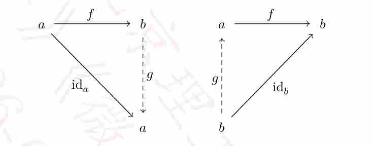

# 2 Topology in mathematical analysis
## 2.1 Intervals | 区间

In this section we review subsets of the real line $\mathbb{R}$.

### 2.1.1 Intervals of the real line | 实直线的区间

Denote by $\overline{\mathbb{R}} = \mathbb{R} \cup \{\pm\infty\}$ the *extended real line*.

[点击展开翻译]
用 $\overline{\mathbb{R}} = \mathbb{R} \cup \{\pm\infty\}$ 表示*扩展实直线*。

::: {.callout-note appearance="simple"}
#### 2.1.1.1 Definition | 定义

An interval of $\mathbb{R}$ is a subset $I$ such that for any $x, y \in I$ we have $z \in I$ whenever $x < z < y$ or $y < z < x$. Let $\overline{a}, \overline{b} \in \overline{\mathbb{R}}$, an interval $I$ is one of the four types of sets:
(1) $]\overline{a}, \overline{b}[ = \{x \in \mathbb{R} : \overline{a} < x < \overline{b}\}$;
(2) $[\overline{a}, \overline{b}] = \{x \in \mathbb{R} : \overline{a} \leq x \leq \overline{b}\}$;
(3) $[\overline{a}, \overline{b}[ = \{x \in \mathbb{R} : \overline{a} \leq x < \overline{b}\}$;
(4) $]\overline{a}, \overline{b}] = \{x \in \mathbb{R} : \overline{a} < x \leq \overline{b}\}$.

[点击展开翻译 - 浅绿定义块]
$\mathbb{R}$ 的区间是指一个子集 $I$，满足对于任何 $x, y \in I$，只要 $x < z < y$ 或 $y < z < x$，就有 $z \in I$。设 $\overline{a}, \overline{b} \in \overline{\mathbb{R}}$，区间 $I$ 是以下四类集合之一：
(1) $]\overline{a}, \overline{b}[ = \{x \in \mathbb{R} : \overline{a} < x < \overline{b}\}$;
(2) $[\overline{a}, \overline{b}] = \{x \in \mathbb{R} : \overline{a} \leq x \leq \overline{b}\}$;
(3) $[\overline{a}, \overline{b}[ = \{x \in \mathbb{R} : \overline{a} \leq x < \overline{b}\}$;
(4) $]\overline{a}, \overline{b}] = \{x \in \mathbb{R} : \overline{a} < x \leq \overline{b}\}$。

:::

For $\overline{a}, \overline{b} \in \overline{\mathbb{R}}$, we have:
* $]\overline{a}, \overline{b}[ = [\overline{a}, \overline{b}[ = ]\overline{a}, \overline{b}] = \emptyset$ if $\overline{a} \geq \overline{b}$, and $[\overline{a}, \overline{b}] = \emptyset$ if $\overline{a} > \overline{b}$ or $\overline{a} = \overline{b} = \pm\infty$;
* $[\overline{a}, \overline{b}] = \{\overline{a}\}$ if $\overline{a} = \overline{b} \in \mathbb{R}$.

::: {.callout-note appearance="simple"}
#### 2.1.1.2 Definition | 定义

An interval $I$ of $\mathbb{R}$ is *empty* if it is an emptyset; it is *degenerate* if it has a single element; it is *proper* if it is neither empty nor degenerate.

[点击展开翻译 - 浅绿定义块]
$\mathbb{R}$ 的区间 $I$ 如果是空集，则称为*空的*；如果它只包含单个元素，则称为*退化的*；如果它既非空也非退化，则称为*适当的*。

:::

::: {.callout-important appearance="simple"}
#### 2.1.1.3 Proposition | 命题

Any *proper* interval $I$ of $\mathbb{R}$ is in one of the following forms for some $a, b \in \mathbb{R}$ with $a < b$:
(1) $]a, b[$, $]a, \infty[$, $]-\infty, b[$, $]-\infty, \infty[ = \mathbb{R}$;
(2) $[a, b]$;
(3) $[a, b[$, $[a, \infty[$;
(4) $]a, b]$, $]-\infty, b]$.
The numbers $a$ and $b$ are called the *endpoints* of the interval $I$, with $a$ the *left endpoint* and $b$ the *right endpoint*. The empty interval $\emptyset$ has no endpoint while the degenerate interval $\{a\}$ has $a$ as both the left and the right endpoints.

[点击展开翻译 - 浅红命题块]
$\mathbb{R}$ 的任何*适当*区间 $I$ 对于某些满足 $a < b$ 的 $a, b \in \mathbb{R}$，必为以下形式之一：
(1) $]a, b[$, $]a, \infty[$, $]-\infty, b[$, $]-\infty, \infty[ = \mathbb{R}$;
(2) $[a, b]$;
(3) $[a, b[$, $[a, \infty[$;
(4) $]a, b]$, $]-\infty, b]$。
数值 $a$ 和 $b$ 称为区间 $I$ 的*端点*，其中 $a$ 为*左端点*，$b$ 为*右端点*。空区间 $\emptyset$ 没有端点，而退化区间 $\{a\}$ 的左、右端点均为 $a$。

:::

We can use endpoints to classify intervals.

::: {.callout-note appearance="simple"}
#### 2.1.1.4 Definition | 定义

An interval $I$ of $\mathbb{R}$ is *open* iff it contains none of its endpoints, is *closed* iff it contains all of its endpoints.

[点击展开翻译 - 浅绿定义块]
$\mathbb{R}$ 的区间 $I$ 是*开*的，当且仅当它不包含任何端点；是*闭*的，当且仅当它包含其所有端点。

:::

::: {.callout-caution appearance="simple"}
#### 2.1.1.5 Remark | 备注

**Remark:** Being closed is not the negation of being open! The intervals $\emptyset$ and $\mathbb{R}$ are both open and closed. The intervals $]a, b]$ and $[a, b[$ are neither open nor closed.

[点击展开翻译 - 浅黄备注块]
**备注：** 闭并不是开的否定！区间 $\emptyset$ 和 $\mathbb{R}$ 既是开的也是闭的。区间 $]a, b]$ 和 $[a, b[$ 既不是开的也不是闭的。

:::

### 2.1.2 Open and closed intervals | 开区间与闭区间

The union and intersection of finitely many open/closed intervals, if still an interval, is open/closed. This also holds for the union of infinitely many open intervals and the intersection of infinitely many closed intervals. However, $\bigcap_{n=1}^{\infty}]-\frac{1}{n}, 1 + \frac{1}{n}[ = [0, 1]$ is a closed (not open) interval as the intersection of open intervals, while $\bigcup_{n=1}^{\infty}[\frac{1}{n}, 1 - \frac{1}{n}] = ]0, 1[$ is an open (not closed) interval as the union of closed intervals.
There is a characterizing property for open intervals.

::: {.callout-important appearance="simple"}
#### 2.1.2.1 Proposition | 命题

**Proposition:** An interval $I$ of $\mathbb{R}$ is open iff for any $x \in I$ there is an $\varepsilon > 0$ such that $]x - \varepsilon, x + \varepsilon[ \subseteq I$.

[点击展开翻译 - 浅红命题块]
**命题：** $\mathbb{R}$ 的区间 $I$ 是开的，当且仅当对于任何 $x \in I$，存在一个 $\varepsilon > 0$，使得 $]x - \varepsilon, x + \varepsilon[ \subseteq I$。

:::

This could be used to define open sets.

::: {.callout-note appearance="simple"}
#### 2.1.2.2 Definition | 定义

**Definition:** A subset $U$ is *open* in $\mathbb{R}$ iff for any $x \in U$ there is an $\varepsilon > 0$ such that $]x - \varepsilon, x + \varepsilon[ \subseteq U$.

[点击展开翻译 - 浅绿定义块]
**定义：** 子集 $U$ 在 $\mathbb{R}$ 中是*开*的，当且仅当对于任何 $x \in U$，存在一个 $\varepsilon > 0$，使得 $]x - \varepsilon, x + \varepsilon[ \subseteq U$。

:::

A straightforward property seen from the definition is the closedness under union.

::: {.callout-important appearance="simple"}
#### 2.1.2.3 Proposition | 命题

**Proposition:** The union of open subsets of $\mathbb{R}$ is open.

[点击展开翻译 - 浅红命题块]
**命题：** $\mathbb{R}$ 的开子集的并集是开的。

:::

::: {.callout-tip appearance="simple"}
#### 2.1.2.4 Theorem | 定理

**Theorem:** Any open subset $U$ of $\mathbb{R}$ is the disjoint union of countably many open intervals.

[点击展开翻译 - 浅紫定理块]
**定理：** $\mathbb{R}$ 的任何开子集 $U$ 都是可数个不相交开区间的并集。

:::

*Proof:* An open interval is open by definition, and then the disjoint union of countably many open intervals is open.
Suppose $U$ is an open subset of $\mathbb{R}$. For any $x \in U$ let $]a_x, b_x[$ be the maximal open interval in $U$ containing $x$. Then for any $x, y \in U$ the intervals $]a_x, b_x[$ and $]a_y, b_y[$ either coincide or are disjoint: if $z \in ]a_x, b_x[ \cap ]a_y, b_y[$, then by maximality $]a_z, b_z[ = ]a_x, b_x[ = ]a_y, b_y[$. Then $U = \bigcup_{i \in A} I_i$ where $A$ is a countable index set and each $I_i$ is an open interval. Since $\mathbb{Q}$ is dense in $\mathbb{R}$, by axiom of choice, there is an injection $q : A \to \mathbb{Q}$ such that $q(i) \in I_i$. Therefore, $A$ is countable. ■

The collection of open subsets is also closed under finite intersections.

::: {.callout-important appearance="simple"}
#### 2.1.2.5 Proposition | 命题

**Proposition:** The intersection of finitely many open subsets of $\mathbb{R}$ is open.

[点击展开翻译 - 浅红命题块]
**命题：** $\mathbb{R}$ 的有限个开子集的交集是开的。

:::

::: {.callout-note appearance="simple"}
#### 2.1.2.6 Definition | 定义

**Definition:** Let $A$ be a subset of $\mathbb{R}$. A point $x \in \mathbb{R}$ is an *adherent point* of $A$ iff $A \cap ]x - \varepsilon, x + \varepsilon[ \neq \emptyset$ for any $\varepsilon > 0$.

[点击展开翻译 - 浅绿定义块]
**定义：** 设 $A$ 是 $\mathbb{R}$ 的一个子集。点 $x \in \mathbb{R}$ 是 $A$ 的一个*粘附点*（触点），当且仅当对于任何 $\varepsilon > 0$，都有 $A \cap ]x - \varepsilon, x + \varepsilon[ \neq \emptyset$。

:::

::: {.callout-note appearance="simple"}
#### 2.1.2.7 Definition | 定义

**Definition:** A subset $C$ is *closed* in $\mathbb{R}$ iff it contains all of its adherent points.

[点击展开翻译 - 浅绿定义块]
**定义：** $\mathbb{R}$ 的子集 $C$ 是*闭*的，当且仅当它包含其所有的粘附点。

:::

::: {.callout-important appearance="simple"}
#### 2.1.2.8 Proposition | 命题

**Proposition:** The intersection of closed subsets of $\mathbb{R}$ is closed.

[点击展开翻译 - 浅红命题块]
**命题：** $\mathbb{R}$ 的闭子集的交集是闭的。

:::

*Proof:* Let $C = \bigcap_{i \in A} C_i$ be the intersection of closed subsets $C_i$ of $\mathbb{R}$. For any adherent point $x$ of $C$, we have $C \cap ]x - \varepsilon, x + \varepsilon[ \neq \emptyset$ for any $\varepsilon > 0$. This implies that $C_i \cap ]x - \varepsilon, x + \varepsilon[ \neq \emptyset$ for any $\varepsilon > 0$ and $x \in C_i$ since $C_i$ is closed for any $i \in A$. Therefore, $x \in C$ and $C$ is closed. ■

::: {.callout-important appearance="simple"}
#### 2.1.2.9 Proposition | 命题

**Proposition:** The union of finitely many closed subsets of $\mathbb{R}$ is closed.

[点击展开翻译 - 浅红命题块]
**命题：** $\mathbb{R}$ 的有限个闭子集的并集是闭的。

:::

::: {.callout-important appearance="simple"}
#### 2.1.2.10 Proposition | 命题

**Proposition:** A subset of $\mathbb{R}$ is closed iff its complement is open.

**命题：** $\mathbb{R}$ 的子集是闭的，当且仅当它的补集是开的。

:::

Being closed is not the negation of being open! In particular, examples of subsets in the real line $\mathbb{R}$ include
(1) open but not closed: open intervals $]a, b[$ for $-\infty \leq a < b \leq \infty$;
(2) closed but not open: closed intervals $[a, b]$ for $-\infty \leq a \leq b \leq \infty$;
(3) clopen: $\emptyset$ and $\mathbb{R}$;
(4) neither open nor closed: half-closed intervals $[a, b[$ and $]a, b]$ for $-\infty \leq a < b \leq \infty$.
Are there other clopen subsets? No.

## 2.2 Continuous functions | 连续函数
### 2.2.1 Definition of continuous functions by open subsets
::: {.callout-tip appearance="simple"}
#### 2.2.1.2 Theorem | 定理

**Theorem:** A function $f: \mathbb{R} \to \mathbb{R}$ is continuous iff for any $V \in \mathscr{T}_{\mathbb{R}}$ we have $U = f^{-1}(V) \in \mathscr{T}_{\mathbb{R}}$.

[点击展开翻译 - 浅紫定理块]
**定理：** 函数 $f: \mathbb{R} \to \mathbb{R}$ 是连续的，当且仅当对于任何 $V \in \mathscr{T}_{\mathbb{R}}$，其原像 $U = f^{-1}(V) \in \mathscr{T}_{\mathbb{R}}$。

:::

Recall of the definition of continuous vector-valued functions of multiple real variables by the epsilon-delta language in An3.

::: {.callout-note appearance="simple"}
#### 2.2.1.3 Epsilon-delta language | ε-δ 语言

**Epsilon-delta language for continuous vector-valued functions of multiple real variables:** A function $f: \mathbb{R}^n \to \mathbb{R}^m$ is continuous at $x \in \mathbb{R}^n$ iff $(\forall \varepsilon > 0)(\exists \delta > 0)(\|y - x\|_2 < \delta \implies \|f(y) - f(x)\|_2 < \varepsilon)$; it is continuous iff it is continuous at all $x \in \mathbb{R}^n$.

[点击展开翻译 - 浅绿定义块]
**多元实值连续向量函数的 ε-δ 语言：** 函数 $f: \mathbb{R}^n \to \mathbb{R}^m$ 在 $x \in \mathbb{R}^n$ 处连续，当且仅当 $(\forall \varepsilon > 0)(\exists \delta > 0)(\|y - x\|_2 < \delta \implies \|f(y) - f(x)\|_2 < \varepsilon)$；该函数是连续的，当且仅当它在所有 $x \in \mathbb{R}^n$ 处均连续。

:::

We wish to give a definition of a collection $\mathscr{T}_{\mathbb{R}^n}$ of subsets of $\mathbb{R}^n$ for $n \in \mathbb{N}_0$, so that a multiple variable version of Theorem 2.2.1.2 would hold. Recall that the *open ball* $\mathbb{B}^n(x, r)$ centered at $x \in \mathbb{R}^n$ of radius $r > 0$ in the Euclidean space $\mathbb{R}^n$ for $n \in \mathbb{N}_0$ is defined as $\mathbb{B}^n(x, r) = \{y \in \mathbb{R}^n : \|y - x\|_2 < r\}$.

::: {.callout-note appearance="simple"}
#### 2.2.1.4 Definition | 定义

**Definition:** A subset $U$ is *open* in $\mathbb{R}^n$ for $n \in \mathbb{N}_0$ iff for any $x \in U$ there is an $\varepsilon > 0$ such that $\mathbb{B}^n(x, \varepsilon) \subseteq U$.

[点击展开翻译 - 浅绿定义块]
**定义：** 对于 $n \in \mathbb{N}_0$，$\mathbb{R}^n$ 的子集 $U$ 是*开*的，当且仅当对于任何 $x \in U$，存在一个 $\varepsilon > 0$，使得 $\mathbb{B}^n(x, \varepsilon) \subseteq U$。

:::

::: {.callout-tip appearance="simple"}
#### 2.2.1.5 Theorem | 定理

**Theorem:** Any open subset $U$ of $\mathbb{R}^n$ is the union of countably many open balls which may overlap.

[点击展开翻译 - 浅紫定理块]
**定理：** $\mathbb{R}^n$ 的任何开子集 $U$ 都是可数个（可能重叠的）开球的并集。

:::

Now let
$$
\begin{aligned}
\mathscr{T}_{\mathbb{R}^n} &= \{\text{open subsets of } \mathbb{R}^n\} = \{\text{union of arbitrarily many open balls}\} \\
&= \{\text{union of countably many open balls}\}.
\end{aligned} \tag{10}
$$
as in Definition 2.2.1.4. Then we have the following Theorem 2.2.1.6.

::: {.callout-tip appearance="simple"}
#### 2.2.1.6 Theorem | 定理

**Theorem:** A function $f: \mathbb{R}^n \to \mathbb{R}^m$ is continuous iff for any $V \in \mathscr{T}_{\mathbb{R}^m}$ we have $U = f^{-1}(V) \in \mathscr{T}_{\mathbb{R}^n}$.

[点击展开翻译 - 浅紫定理块]
**定理：** 函数 $f: \mathbb{R}^n \to \mathbb{R}^m$ 是连续的，当且仅当对于任何 $V \in \mathscr{T}_{\mathbb{R}^m}$，其原像 $U = f^{-1}(V) \in \mathscr{T}_{\mathbb{R}^n}$。

:::

### 2.2.2 Open subsets and open balls | 开子集与开球

We have seen that open balls plays a central role in continuous functions between Euclidean spaces. In the epsilon-delta language Definition 2.2.1.3, we use open balls to characterize continuity of functions. Let
$$
\mathscr{B}_{\mathbb{R}^n} = \{\mathbb{B}^n(x, r) : x \in \mathbb{R}^n, r > 0\} \tag{11}
$$

be the collection of all open balls in $\mathbb{R}^n$ and for any $x \in \mathbb{R}^n$ let
$$
\mathscr{B}_x = \{\mathbb{B}^n(x, r) : r > 0\} \tag{12}
$$
be the collection of all open balls in $\mathbb{R}^n$ centered at $x$.
We say that $\mathscr{B}_{\mathbb{R}^n}$ *generates* $\mathscr{T}_{\mathbb{R}^n}$ in the sense that
$$
\mathscr{T}_{\mathbb{R}^n} = \left\{ \bigcup_{B \in \mathscr{A}} B : \mathscr{A} \subseteq \mathscr{B}_{\mathbb{R}^n} \right\}. \tag{13}
$$
We say that $\mathscr{B}_{\mathbb{R}^n, x}$ *locally generates* $\mathscr{T}_{\mathbb{R}^n}$ at $x \in \mathbb{R}^n$ in the sense that for any $U \in \mathscr{T}_{\mathbb{R}^n}$ with $x \in U$ there is $V \in \mathscr{B}_{\mathbb{R}^n, x}$ such that $x \in V \subseteq U$.
Definition 2.2.1.3 can now be written equivalently as the following corollaries.

::: {.callout-important appearance="simple"}
#### 2.2.2.1 Corollary | 推论

**Corollary:** A function $f: \mathbb{R}^n \to \mathbb{R}^m$ is continuous iff for any $V \in \mathscr{B}_{\mathbb{R}^m}$ we have $U = f^{-1}(V) \in \mathscr{T}_{\mathbb{R}^n}$.

[点击展开翻译 - 浅红推论块]
**推论：** 函数 $f: \mathbb{R}^n \to \mathbb{R}^m$ 是连续的，当且仅当对于任何开球 $V \in \mathscr{B}_{\mathbb{R}^m}$，其原像 $U = f^{-1}(V) \in \mathscr{T}_{\mathbb{R}^n}$。

:::

::: {.callout-important appearance="simple"}
#### 2.2.2.2 Corollary | 推论

**Corollary:** A function $f: \mathbb{R}^n \to \mathbb{R}^m$ is continuous at $x \in \mathbb{R}^n$ iff for any $V \in \mathscr{B}_{\mathbb{R}^m, f(x)}$ we have $U = f^{-1}(V) \in \mathscr{B}_{\mathbb{R}^n, x}$.

[点击展开翻译 - 浅红推论块]
**推论：** 函数 $f: \mathbb{R}^n \to \mathbb{R}^m$ 在 $x \in \mathbb{R}^n$ 处连续，当且仅当对于任何以 $f(x)$ 为中心的开球 $V \in \mathscr{B}_{\mathbb{R}^m, f(x)}$，其原像 $U = f^{-1}(V)$ 包含一个以 $x$ 为中心的开球（即属于 $\mathscr{B}_{\mathbb{R}^n, x}$）。

:::

There are many different collections of open sets that generates $\mathscr{T}_{\mathbb{R}^n}$, for instance,
$$
\mathscr{B}_{\mathbb{R}^n}^{\text{cube}} = \left\{ \prod_{i=1}^n ]x_i - r, x_i + r[ : x \in \mathbb{R}^n, r > 0 \right\}, \tag{14}
$$
and many different collections of open sets that locally generates $\mathscr{T}_{\mathbb{R}^n}$ at any $x \in \mathbb{R}^n$, for instance,
$$
\mathscr{B}_{\mathbb{R}^n, x}^{\text{cube}} = \left\{ \prod_{i=1}^n ]x_i - r, x_i + r[ : r > 0 \right\}. \tag{15}
$$

### 2.2.3 Constructing continuous functions | 构造连续函数

Using the new definition Theorem 2.2.1.6 of continuous functions, we immediately know that the composition of continuous functions is continuous.

::: {.callout-tip appearance="simple"}
#### 2.2.3.1 Theorem | 定理

**Theorem:** If $f: \mathbb{R}^n \to \mathbb{R}^m$ and $g: \mathbb{R}^m \to \mathbb{R}^k$ be continuous functions, then $g \circ f: \mathbb{R}^n \to \mathbb{R}^k$ is also continuous.

[点击展开翻译 - 浅紫定理块]
**定理：** 若 $f: \mathbb{R}^n \to \mathbb{R}^m$ 和 $g: \mathbb{R}^m \to \mathbb{R}^k$ 是连续函数，则复合函数 $g \circ f: \mathbb{R}^n \to \mathbb{R}^k$ 也是连续的。

:::

We recall a lemma for the preimage of maps to product sets.

::: {.callout-important appearance="simple"}
#### 2.2.3.2 Lemma | 引理

**Lemma:** For sets $X, Y$ let $f = (f_1, \dots, f_m): X \to Y^m$ be given by $f(p) = (f_1(p), \dots, f_m(p))$ where $f_j: X \to Y$ are maps for $j \in \{1, \dots, m\}$. Then for any subsets $B_j$ of $Y$, $j \in \{1, \dots, m\}$, we have
$$
f^{-1} \left( \prod_{j=1}^m B_j \right) = \bigcap_{j=1}^m f_j^{-1}(B_j). \tag{16}
$$

[点击展开翻译 - 浅红引理块]
**引理：** 对于集合 $X, Y$，设 $f = (f_1, \dots, f_m): X \to Y^m$ 由 $f(p) = (f_1(p), \dots, f_m(p))$ 给出，其中 $f_j: X \to Y$ 是 $j \in \{1, \dots, m\}$ 的映射。则对于 $Y$ 的任何子集 $B_j$ ($j \in \{1, \dots, m\}$)，我们有：
$$f^{-1} \left( \prod_{j=1}^m B_j \right) = \bigcap_{j=1}^m f_j^{-1}(B_j) \text{。}$$

:::

::: {.callout-important appearance="simple"}
#### 2.2.3.3 Lemma | 引理

**Lemma:** A vector-valued function $f = (f_1, \dots, f_m): \mathbb{R}^n \to \mathbb{R}^m$ is continuous iff the component function $f_j$ is continuous for any $j \in \{1, \dots, m\}$.

[点击展开翻译 - 浅红引理块]
**引理：** 向量值函数 $f = (f_1, \dots, f_m): \mathbb{R}^n \to \mathbb{R}^m$ 是连续的，当且仅当对每个 $j \in \{1, \dots, m\}$，其分量函数 $f_j$ 都是连续的。

:::

*Proof:* If $f$ is continuous, then $f_i^{-1}(V) = f^{-1}(\mathbb{R}^{i-1} \times V \times \mathbb{R}^{n-i}) \in \mathscr{B}_{\mathbb{R}^n}^{\text{cube}}$ for any $i \in \{1, \dots, n\}$ and $V \in \mathscr{B}_{\mathbb{R}}$, and $f_i$ is continuous. If $f_i$ is continuous for all $i \in \{1, \dots, n\}$, then for any $V = \prod_{i=1}^n V_i$ in $\mathscr{B}_{\mathbb{R}^n}^{\text{cube}}$ where $V_i \in \mathscr{B}_{\mathbb{R}}$ for any $i \in \{1, \dots, n\}$, $f^{-1}(V) = \bigcap_{i=1}^n f_i^{-1}(V_i) \in \mathscr{T}$, and $f$ is continuous. ■

::: {.callout-important appearance="simple"}
#### 2.2.3.4 Lemma | 引理

**Lemma:** The functions
* add: $\mathbb{R}^n \to \mathbb{R}, (x_1, \dots, x_n) \mapsto x_1 + \dots + x_n$;
* subtract: $\mathbb{R}^2 \to \mathbb{R}, (x_1, x_2) \mapsto x_1 - x_2$;
* multiply: $\mathbb{R}^n \to \mathbb{R}, (x_1, \dots, x_n) \mapsto x_1 \dots x_n$;
* divide: $\mathbb{R} \times (\mathbb{R} \setminus \{0\}) \to \mathbb{R}, (x_1, x_2) \mapsto x_1 / x_2$;
* abs: $\mathbb{R} \to \mathbb{R}, x \mapsto |x|$;
* max: $\mathbb{R}^n \to \mathbb{R}$, taking the maximum of $(x_1, \dots, x_n)$;
* min: $\mathbb{R}^n \to \mathbb{R}$, taking the minimum of $(x_1, \dots, x_n)$
are continuous under the standard topologies.

[点击展开翻译 - 浅红引理块]
**引理：** 以下函数在标准拓扑下是连续的：
* 加法 (add)：$\mathbb{R}^n \to \mathbb{R}, (x_1, \dots, x_n) \mapsto x_1 + \dots + x_n$；
* 减法 (subtract)：$\mathbb{R}^2 \to \mathbb{R}, (x_1, x_2) \mapsto x_1 - x_2$；
* 乘法 (multiply)：$\mathbb{R}^n \to \mathbb{R}, (x_1, \dots, x_n) \mapsto x_1 \dots x_n$；
* 除法 (divide)：$\mathbb{R} \times (\mathbb{R} \setminus \{0\}) \to \mathbb{R}, (x_1, x_2) \mapsto x_1 / x_2$；
* 绝对值 (abs)：$\mathbb{R} \to \mathbb{R}, x \mapsto |x|$；
* 最大值 (max)：$\mathbb{R}^n \to \mathbb{R}$，取 $(x_1, \dots, x_n)$ 的最大值；
* 最小值 (min)：$\mathbb{R}^n \to \mathbb{R}$，取 $(x_1, \dots, x_n)$ 的最小值。

:::

*Proof:* We justify the continuity of add at $x = (x_1, \dots, x_n) \in \mathbb{R}^n$ as an example. Then for any $\varepsilon > 0$ whenever $y = (y_1, \dots, y_n) \in \prod_{i=1}^n (x_i - \frac{\varepsilon}{n}, x_i + \frac{\varepsilon}{n}) \in \mathscr{B}_x^{\text{cube}}$ we have
$$
|\text{add}(y) - \text{add}(x)| \leq \sum_{i=1}^n |y_i - x_i| \leq \varepsilon, \tag{17}
$$
and therefore add is continuous at $x$.
Note that for continuity of divide we need the notion of open subsets of $\mathbb{R} \times (\mathbb{R} \setminus \{0\})$, which are elements of $\mathscr{T}_{\mathbb{R}^n}$ intersecting $\mathbb{R} \times (\mathbb{R} \setminus \{0\})$; see Definition 6.1.1.1. ■

::: {.callout-tip appearance="simple"}
#### 2.2.3.5 Theorem | 定理

**Theorem:** If $f, g: \mathbb{R}^n \to \mathbb{R}$ are continuous functions, then
* $f + g: \mathbb{R}^n \to \mathbb{R}, p \mapsto f(p) + g(p)$ is continuous;
* $f - g: \mathbb{R}^n \to \mathbb{R}, p \mapsto f(p) - g(p)$ is continuous;
* $f \cdot g: \mathbb{R}^n \to \mathbb{R}, p \mapsto f(p) \cdot g(p)$ is continuous;
* $f/g: \mathbb{R}^n \to \mathbb{R}, p \mapsto f(p)/g(p)$ is continuous if $0 \notin g(X)$;
* $|f|: \mathbb{R}^n \to \mathbb{R}, p \mapsto |f(p)|$ is continuous;
* $\max(f, g): \mathbb{R}^n \to \mathbb{R}, p \mapsto \max(f(p), g(p))$ is continuous;
* $\min(f, g): \mathbb{R}^n \to \mathbb{R}, p \mapsto \min(f(p), g(p))$ is continuous
where the continuities are relative to the topology $\mathscr{T}$ on $X$ and the standard topology on $\mathbb{R}$.

[点击展开翻译 - 浅紫定理块]
**定理：** 若 $f, g: \mathbb{R}^n \to \mathbb{R}$ 是连续函数，则：
* $f + g$ 是连续的；
* $f - g$ 是连续的；
* $f \cdot g$ 是连续的；
* 若 $0 \notin g(X)$，则 $f/g$ 是连续的；
* $|f|$ 是连续的；
* $\max(f, g)$ 是连续的；
* $\min(f, g)$ 是连续的。
其中连续性是相对于 $X$ 上的拓扑 $\mathscr{T}$ 和 $\mathbb{R}$ 上的标准拓扑而言的。

:::

*Proof:* By Lemma 2.2.3.3, $(f, g): \mathbb{R}^n \to \mathbb{R}^2$ is continuous. Then the functions $f + g = \text{add} \circ (f, g)$, $f - g = \text{subtract} \circ (f, g)$, $f \cdot g = \text{multiply} \circ (f, g)$, $f/g = \text{divide} \circ (f, g)$, $|f| = \text{abs} \circ (f)$, $\max(f, g) = \text{max} \circ (f, g)$, and $\min(f, g) = \text{min} \circ (f, g)$ are continuous on $\mathbb{R}^n \to \mathbb{R}$, since the composed maps on the left are continuous by Lemma 2.2.3.4. ■

::: {.callout-important appearance="simple"}
#### 2.2.3.6 Corollary | 推论

**Corollary:** In particular, the set $C(\mathbb{R}^n; \mathbb{R})$ of continuous functions $\mathbb{R}^n \to \mathbb{R}$ with addition, scalar multiplication, and product is an $\mathbb{R}$-algebra.

[点击展开翻译 - 浅红推论块]
**推论：** 特别地，由所有连续函数组成的集合 $C(\mathbb{R}^n; \mathbb{R})$ 在函数加法、标量乘法和乘积运算下构成一个 $\mathbb{R}$-代数。

:::

# 3 TOPOLOGICAL SPACES | 拓扑空间

## 3.1 Topology | 拓扑

### 3.1.1 Definition of topological spaces | 拓扑空间的定义

Generalizing Proposition 2.1.2.3 and Proposition 2.1.2.5 for $\mathscr{T}_{\mathbb{R}}$ on $\mathbb{R}$, we give the definition of a topology on any set.

::: {.callout-note appearance="simple"}
#### 3.1.1.1 Definition | 定义

**Definition:** A *topology* $\mathscr{T}$ on a set $X$ is a collection $\mathscr{T} \subseteq \mathscr{P}(X)$,
* $\mathbf{O}_1$: $(\forall \mathscr{A} \subseteq \mathscr{T}) \left( \bigcup_{O \in \mathscr{A}} O \in \mathscr{T} \right)$, and
* $\mathbf{O}_2$: $(\forall \mathscr{A} \subseteq \mathscr{T}) \left( |\mathscr{A}| < \infty \implies \bigcap_{O \in \mathscr{A}} O \in \mathscr{T} \right)$,
then the pair $(X, \mathscr{T})$ is a *topological space*.

[点击展开翻译 - 浅绿定义块]
**定义：** 集合 $X$ 上的一个*拓扑* $\mathscr{T}$ 是幂集 $\mathscr{P}(X)$ 的一个子集，满足：
* $\mathbf{O}_1$：$\mathscr{T}$ 中任意族元素的并集仍在 $\mathscr{T}$ 中；
* $\mathbf{O}_2$：$\mathscr{T}$ 中有限个元素的交集仍在 $\mathscr{T}$ 中。
则二元组 $(X, \mathscr{T})$ 称为一个*拓扑空间*。

:::

::: {.callout-note appearance="simple"}
#### 3.1.1.2 Definition | 定义

**Definition:** A subset $A$ of a topological space $(X, \mathscr{T})$ is *open* iff $A \in \mathscr{T}$, is *closed* iff $A^c \in \mathscr{T}$, and is *clopen* iff it is both closed and open.

[点击展开翻译 - 浅绿定义块]
**定义：** 拓扑空间 $(X, \mathscr{T})$ 的子集 $A$ 是*开*的，当且仅当 $A \in \mathscr{T}$；是*闭*的，当且仅当其补集 $A^c \in \mathscr{T}$；如果它既是开的又是闭的，则称其为*开闭集*（clopen）。

:::

::: {.callout-caution appearance="simple"}
#### 3.1.1.3 Remark | 备注

**Remark:** If $\mathscr{T}$ is a topology on a set $X$ then
* $\mathbf{O}_3$: $\emptyset, X \in \mathscr{T}$,
since $\emptyset = \bigcup_{O \in \emptyset} O \in \mathscr{T}$ and $X = \bigcap_{O \in \emptyset} O \in \mathscr{T}$. In some books $\mathbf{O}_3$ is included in the definition of topology. One also note that $\mathbf{O}_2$ is equivalent to $X \in \mathscr{T}$ and
* $\mathbf{O}_2'$: $(\forall O_1, O_2 \in \mathscr{T})(O_1 \cap O_2 \in \mathscr{T})$.

[点击展开翻译 - 浅黄备注块]
**备注：** 若 $\mathscr{T}$ 是集合 $X$ 上的一个拓扑，则：
* $\mathbf{O}_3$：$\emptyset, X \in \mathscr{T}$。
这是因为空并集为 $\emptyset$，空交集为 $X$。在某些书籍中，$\mathbf{O}_3$ 被包含在拓扑的定义内。还需注意 $\mathbf{O}_2$ 等价于 $X \in \mathscr{T}$ 且任意两个元的交集仍在其中（$\mathbf{O}_2'$）。

:::

Of course, given a topology $\mathscr{T}$ the underlying space $X$ is known immediately — nothing but the largest member of $\mathscr{T}$!

::: {.callout-caution appearance="simple"}
#### 3.1.1.4 Remark | 备注

**Remark:** In the future when we refer to a topological space $(X, \mathscr{T}_X)$ we may omit the topology $\mathscr{T}_X$ in the notation and uses $X$ solely. In this case, $X$ is equipped with a default topology $\mathscr{T}_X$.

[点击展开翻译 - 浅黄备注块]
**备注：** 今后在提到拓扑空间 $(X, \mathscr{T}_X)$ 时，我们可能会在记号中省略拓扑 $\mathscr{T}_X$ 而仅使用 $X$。在这种情况下，$X$ 被假定配备了一个默认拓扑 $\mathscr{T}_X$。

:::

A topological space can be defined equivalently by specifying its closed subsets through Kuratowski closure axioms.

::: {.callout-important appearance="simple"}
#### 3.1.1.5 Proposition | 命题

**Proposition:** A collection $\mathscr{C} \subseteq \mathscr{P}(X)$ is the collection of closed subsets of a topology on $X$ iff
* $\mathbf{C}_1$: $(\forall \mathscr{A} \subseteq \mathscr{C}) \left( |\mathscr{A}| < \infty \implies \bigcup_{F \in \mathscr{A}} F \in \mathscr{C} \right)$; and
* $\mathbf{C}_2$: $(\forall \mathscr{A} \subseteq \mathscr{C}) \left( \bigcap_{F \in \mathscr{A}} F \in \mathscr{C} \right)$;
and in which case that
* $\mathbf{C}_3$: $\emptyset, X \in \mathscr{C}$
is automatic, and the topology is given as $\mathscr{T} = \{U \subseteq X : U^c \in \mathscr{C}\}$.

[点击展开翻译 - 浅红命题块]
**命题：** 集合族 $\mathscr{C} \subseteq \mathscr{P}(X)$ 是 $X$ 上某个拓扑的闭集族，当且仅当：
* $\mathbf{C}_1$：$\mathscr{C}$ 中有限个元素的并集仍在 $\mathscr{C}$ 中；
* $\mathbf{C}_2$：$\mathscr{C}$ 中任意族元素的交集仍在 $\mathscr{C}$ 中。
在这种情况下，$\mathbf{C}_3$（$\emptyset, X \in \mathscr{C}$）是自动成立的，且该拓扑由 $\mathscr{T} = \{U \subseteq X : U^c \in \mathscr{C}\}$ 给出。

:::

::: {.callout-important appearance="simple"}
#### 3.1.2.1 Proposition | 命题

The collection $\mathscr{T}_{\mathbb{R}}$ in Definition 2.1.2.2 is a topology on $\mathbb{R}$.

[点击展开翻译 - 浅红命题块]
**命题：** 定义 2.1.2.2 中的集合族 $\mathscr{T}_{\mathbb{R}}$ 是 $\mathbb{R}$ 上的一个拓扑。

:::

**3.1.2.2 Example:** The *standard topology* on $\mathbb{R}$ is the collection $\mathscr{T}_{\mathbb{R}}$ of open subsets as in Definition 2.1.2.2.

The default topology on $\mathbb{R}$ is the standard topology $\mathscr{T}_{\mathbb{R}}$ (Remark 3.1.1.4).

**3.1.2.3 Example:** The *lower limit topology* on $\mathbb{R}$ is the collection $\mathscr{T}_{\text{lower}} = \{ \text{unions of } [a, b[ \text{ for } a, b \in \mathbb{R} \} \cup \{\emptyset, \mathbb{R}\}$.

**3.1.2.4 Question:** Are the following $\mathscr{T}$ topologies on $\mathbb{R}$?
(1) $\mathscr{T} = \{ |A| = \infty \} \cup \{\emptyset\}$;
(2) $\mathscr{T} = \{ ]-r, r[ : r > 0 \} \cup \{\emptyset, \mathbb{R}\}$.

::: {.callout-important appearance="simple"}
#### 3.1.2.5 Proposition | 命题

The collection $\mathscr{T}_{\mathbb{R}^n}$ as in Definition 2.2.1.4 is a topology on $\mathbb{R}^n$.

[点击展开翻译 - 浅红命题块]
**命题：** 定义 2.2.1.4 中的集合族 $\mathscr{T}_{\mathbb{R}^n}$ 是 $\mathbb{R}^n$ 上的一个拓扑。

:::

**3.1.2.6 Example:** The *standard topology* on $\mathbb{R}^n$ for $n \in \mathbb{N}_0$ is the collection $\mathscr{T}_{\mathbb{R}^n}$ of open subsets as in Definition 2.2.1.4.

The default topology on $\mathbb{R}^n$ is the standard topology $\mathscr{T}_{\mathbb{R}^n}$ (Remark 3.1.1.4).

### 3.1.3 Examples of topologies on a finite set

From Definition 3.1.1.1 on a set of at most one elements there is a unique topology.

**3.1.3.1 Example:** The *empty (topological) space* $(\emptyset, \{\emptyset\})$ is the empty set $\emptyset$ equipped with the unique topology, usually denoted by $\emptyset$.

**3.1.3.2 Example:** A *point (topological) space* $(\{a\}, \{\emptyset, \{a\}\})$ is a singleton $\{a\}$ equipped with the unique topology, (the class of which) usually denoted by $*$.

**3.1.3.3 Example:** There are exactly four topologies on $\{a, b\}$:
(1) $\mathscr{T}_{\text{triv}} = \{\emptyset, \{a, b\}\}$ is the *trivial topology*
(2) $\mathscr{T}_{\text{Sier}} = \{\emptyset, \{a\}, \{a, b\}\}$ is the *Sierpiński topology*
(3) $\mathscr{T}'_{\text{Sier}} = \{\emptyset, \{b\}, \{a, b\}\}$ is the *Sierpiński topology* swapping $a$ and $b$;
(4) $\mathscr{T}_{\text{disc}} = \{\emptyset, \{a\}, \{b\}, \{a, b\}\}$ is the *discrete topology*.

We call $(\{a, b\}, \mathscr{T}_{\text{Sier}})$ the *Sierpiński space*.

**3.1.3.4 Question:** How many topologies are there on $\{a, b, c\}$?

The trivial and discrete topologies can be generalized onto any set.

**Example:** The *trivial topology* on $X$ is the collection $\mathscr{T}_{triv}=\{\emptyset, \mathbb{R} \}$, which is the coarest topology on $X$.

### 3.1.5 Comparing topologies | 拓扑的比较

We compare two topologies as subcollections of $\mathscr{P}(X)$.

::: {.callout-note appearance="simple"}
#### 3.1.5.1 Definition | 定义

**Definition:** Let $\mathscr{T}_1$ and $\mathscr{T}_2$ be two topologies on $X$ such that $\mathscr{T}_1 \subseteq \mathscr{T}_2$, then $\mathscr{T}_1$ is *coarser* than $\mathscr{T}_2$ and $\mathscr{T}_2$ is *finer* than $\mathscr{T}_1$.

[点击展开翻译 - 浅绿定义块]
**定义：** 设 $\mathscr{T}_1$ 和 $\mathscr{T}_2$ 为集合 $X$ 上的两个拓扑。若 $\mathscr{T}_1 \subseteq \mathscr{T}_2$，则称 $\mathscr{T}_1$ 比 $\mathscr{T}_2$ 更*粗*（coarser），$\mathscr{T}_2$ 比 $\mathscr{T}_1$ 更*细*（finer）。

:::

::: {.callout-important appearance="simple"}
#### 3.1.5.2 Proposition | 命题

**Proposition:** For any set $X$, the trivial topology $\mathscr{T}_{\text{triv}}$ is the coarsest topology on $X$, while the discrete topology $\mathscr{T}_{\text{disc}}$ is the finest topology on $X$.

[点击展开翻译 - 浅红命题块]
**命题：** 对于任何集合 $X$，平凡拓扑 $\mathscr{T}_{\text{triv}}$ 是 $X$ 上最粗的拓扑，而离散拓扑 $\mathscr{T}_{\text{disc}}$ 是 $X$ 上最细的拓扑。

:::

From a family of topologies one can construct new topologies, analogous to the supremum and infernum of subsets of the reals.

::: {.callout-tip appearance="simple"}
#### 3.1.5.3 Theorem | 定理

**Theorem:** Let $\{\mathscr{T}_i\}_{i \in I}$ be a family of topologies on a set $X$. Then
(1) $\mathscr{T}_{\text{inf}} = \bigcap_{i \in I} \mathscr{T}_i$ is a topology on $X$, which is the *greatest lower bound* of the family;
(2) $\mathscr{T}_{i_1} \cup \mathscr{T}_{i_2}$ may not be a topology on $X$ for some $i_0, i_1 \in I$;
(3) $\mathscr{T}_{\text{sup}} = \bigcap \{ \mathscr{T} \text{ is a topology on } X : \mathscr{T} \supseteq \bigcup_{i \in I} \mathscr{T}_i \}$ is a topology on $X$, which is the *least upper bound* of the family.

[点击展开翻译 - 浅紫定理块]
**定理：** 设 $\{\mathscr{T}_i\}_{i \in I}$ 是集合 $X$ 上的一个拓扑族。则：
(1) $\mathscr{T}_{\text{inf}} = \bigcap_{i \in I} \mathscr{T}_i$ 是 $X$ 上的一个拓扑，且是该族拓扑的*最大下界*；
(2) 对于某些 $i_0, i_1 \in I$，$\mathscr{T}_{i_1} \cup \mathscr{T}_{i_2}$ 可能不是 $X$ 上的拓扑；
(3) $\mathscr{T}_{\text{sup}} = \bigcap \{ \mathscr{T} \text{ 是 } X \text{ 上的拓扑} : \mathscr{T} \supseteq \bigcup_{i \in I} \mathscr{T}_i \}$ 是 $X$ 上的一个拓扑，且是该族拓扑的*最小上界*。

:::

## 3.2 Bases and neighborhood bases. | 基与邻域基

In the definition of the real line we have used the collection of unions of open intervals. This is not very convenient and we want to start with the collection $\mathscr{B}$ of open intervals which is not a topology, but we shall generate a topology out of $\mathscr{B}$ by taking unions of its members. Actually $\mathscr{B}$ is a base of the standard topology.
There have been two equivalent definitions for open subsets of $\mathbb{R}$.
(1) A subset $U$ is open in $\mathbb{R}$ iff for any $x \in U$ there is an open interval $]a, b[$ such that $x \in I \subseteq U$.
(2) A subset $U$ is open in $\mathbb{R}$ iff $U$ is the union of open intervals.
In the first definition it is important open interval $]a, b[$ containing $x$, which we call an open neighborhood of $x$. In the second definition the open intervals are special.

### 3.2.1 Bases | 基

::: {.callout-note appearance="simple"}
#### 3.2.1.1 Definition | 定义

**Definition:** A subcollection $\mathscr{B} \subseteq \mathscr{P}(X)$ is a *base* for a topology $\mathscr{T}$ on $X$ iff $\mathscr{T} = \left\{ \bigcup_{W \in \mathscr{A}} W : \mathscr{A} \subseteq \mathscr{B} \right\}$ and then $\mathscr{B}$ is called a *topological base*.

[点击展开翻译 - 浅绿定义块]
**定义：** 子集合族 $\mathscr{B} \subseteq \mathscr{P}(X)$ 是 $X$ 上拓扑 $\mathscr{T}$ 的一个*基*（base），当且仅当 $\mathscr{T} = \left\{ \bigcup_{W \in \mathscr{A}} W : \mathscr{A} \subseteq \mathscr{B} \right\}$，此时 $\mathscr{B}$ 被称为一个*拓扑基*。

:::

::: {.callout-tip appearance="simple"}
#### 3.2.1.2 Theorem | 定理

**Theorem:** Let $\mathscr{B} \subseteq \mathscr{P}(X)$ be a base for the topology $\mathscr{T}$. Then $U \in \mathscr{T}$ iff $(\forall p \in U)(\exists W \in \mathscr{B})(p \in W \subseteq U)$.

[点击展开翻译 - 浅紫定理块]
**定理：** 设 $\mathscr{B} \subseteq \mathscr{P}(X)$ 为拓扑 $\mathscr{T}$ 的一个基。则 $U \in \mathscr{T}$ 当且仅当 $(\forall p \in U)(\exists W \in \mathscr{B})(p \in W \subseteq U)$。

:::

*Proof:* If $(\forall p \in U)(\exists W_p \in \mathscr{B})(p \in W_p \subseteq U)$, then $U = \bigcup_{p \in U} W_p \in \mathscr{T}$. If $U = \bigcup_{W \in \mathscr{A}} W \in \mathscr{T}$ for some $\mathscr{A} \subseteq \mathscr{B}$ then for any $p \in U$ there is a $W \in \mathscr{A}$ with $p \in W$ and $W \subseteq U$ as required. ■

### 3.2.2 Neighborhood bases. | 邻域基

::: {.callout-note appearance="simple"}
#### 3.2.2.1 Definition | 定义

**Definition:** Let $X$ be a topological space with $p \in X$. A subset $N$ is a *neighborhood* of $p$ in $X$ if there is an open subset $U$ of $X$ such that $x \in U \subseteq N$. We denote by $\mathscr{N}_{X,p}$ the collection of neighborhoods of $p$ in $X$.

[点击展开翻译 - 浅绿定义块]
**定义：** 设 $X$ 是一个拓扑空间且 $p \in X$。如果存在 $X$ 的一个开子集 $U$ 使得 $x \in U \subseteq N$，则称子集 $N$ 是 $p$ 在 $X$ 中的一个*邻域*。我们用 $\mathscr{N}_{X,p}$ 表示 $p$ 在 $X$ 中的所有邻域构成的族。

:::

::: {.callout-note appearance="simple"}
#### 3.2.2.2 Definition | 定义

**Definition:** A subcollection $\mathscr{B}_{X,p} \subseteq \mathscr{N}_{X,p}$ is a *neighborhood base* for $p \in X$ in topological space $X$ iff for any $N \in \mathscr{N}_{X,p}$ there is $W \in \mathscr{B}_{X,p}$ contained in $N$.

[点击展开翻译 - 浅绿定义块]
**定义：** 拓扑空间 $X$ 中的子族 $\mathscr{B}_{X,p} \subseteq \mathscr{N}_{X,p}$ 是 $p \in X$ 的一个*邻域基*，当且仅当对于任何 $N \in \mathscr{N}_{X,p}$，都存在包含于 $N$ 中的 $W \in \mathscr{B}_{X,p}$。

:::

::: {.callout-tip appearance="simple"}
#### 3.2.2.3 Theorem | 定理

**Theorem:** Let $\mathscr{B}_{X,p} \subseteq \mathscr{P}(X)$ be a neighborhood base for $p \in X$ in topological space $(X, \mathscr{T})$. Then $U \in \mathscr{T}$ iff $(\forall p \in U)(\exists W \in \mathscr{B}_{X,p})(W \subseteq U)$.

[点击展开翻译 - 浅紫定理块]
**定理：** 设 $\mathscr{B}_{X,p} \subseteq \mathscr{P}(X)$ 是拓扑空间 $(X, \mathscr{T})$ 中 $p \in X$ 的一个邻域基。则 $U \in \mathscr{T}$ 当且仅当 $(\forall p \in U)(\exists W \in \mathscr{B}_{X,p})(W \subseteq U)$。

:::

::: {.callout-tip appearance="simple"}
#### 3.2.2.4 Theorem | 定理

**Theorem:** Let $X$ be a topological space. A collection $\mathscr{B}$ is a base for $\mathscr{T}$ iff it is a neighborhood base for any $p \in X$ in $X$.

[点击展开翻译 - 浅紫定理块]
**定理：** 设 $X$ 是一个拓扑空间。集合族 $\mathscr{B}$ 是 $\mathscr{T}$ 的基，当且仅当它是 $X$ 中任何 $p \in X$ 的邻域基。

:::

*Proof:* If $(\forall p \in U)(\exists W_p \in \mathscr{B})(p \in W_p \subseteq U)$, then $U = \bigcup_{p \in U} W_p \in \mathscr{T}$. If $U = \bigcup_{W \in \mathscr{A}} W \in \mathscr{T}$ for some $\mathscr{A} \subseteq \mathscr{B}$ then for any $p \in U$ there is a $W \in \mathscr{A}$ with $p \in W$ and $W \subseteq U$ as required. ■

**3.2.2.5 Example:** The collection $\mathscr{B}_{\mathbb{R}^n, x}$ is a neighborhood base for any $x \in \mathbb{R}^n$ in $\mathbb{R}^n$ equipped with the standard topology $\mathscr{T}_{\mathbb{R}^n}$.

**3.2.2.6 Example:** The collection $\mathscr{B}_{\mathbb{R}^n, x}^{\text{cube}}$ is a neighborhood base for any $x \in \mathbb{R}^n$ in $\mathbb{R}^n$ equipped with the standard topology $\mathscr{T}_{\mathbb{R}^n}$.

## 3.3 Continuous maps | 连续映射

::: {.callout-note appearance="simple"}
#### 3.3.0.1 Definition | 定义

**Definition:** A map 
$$f: (X, \mathscr{T}_X) \to (Y, \mathscr{T}_Y)$$
is *continuous* iff $(\forall V \in \mathscr{T}_Y)(f^{-1}(V) \in \mathscr{T}_X)$.

[点击展开翻译 - 浅绿定义块]
**定义：** 映射 $f: (X, \mathscr{T}_X) \to (Y, \mathscr{T}_Y)$ 是*连续的*，当且仅当对于 $Y$ 中的任意开集 $V$，其原像 $f^{-1}(V)$ 都是 $X$ 中的开集。

:::

::: {.callout-tip appearance="simple"}
#### 3.3.0.2 Theorem | 定理

**Theorem:** A map $f: X \to Y$ between topological spaces is continuous iff $(\forall \text{ closed } B \subseteq Y)(f^{-1}(B) \text{ is closed in } X)$.

[点击展开翻译 - 浅紫定理块]
**定理：** 拓扑空间之间的映射 $f: X \to Y$ 是连续的，当且仅当对于 $Y$ 中的任意闭集 $B$，其原像 $f^{-1}(B)$ 都是 $X$ 中的闭集。

:::

::: {.callout-important appearance="simple"}
#### 3.3.0.3 Proposition | 命题

**Proposition:**
(1) The *identity map* $\text{id}_X : X \to X, p \mapsto p$, is continuous;
(2) The *empty map* $e : \emptyset \to X$ is continuous;
(3) For any $q \in Y$, the *constant map* $c_q : X \to Y, p \mapsto q$, is continuous;
(4) The composition of continuous maps are continuous.

$$X \xrightarrow{f} Y \xrightarrow{g} Z$$

[点击展开翻译 - 浅红命题块]
**命题：**
(1) *恒等映射* $\text{id}_X : X \to X, p \mapsto p$ 是连续的；
(2) *空映射* $e : \emptyset \to X$ 是连续的；
(3) 对于任何 $q \in Y$，*常数映射* $c_q : X \to Y, p \mapsto q$ 是连续的；
(4) 连续映射的复合仍是连续的。

:::

::: {.callout-tip appearance="simple"}
#### 3.3.0.4 Theorem | 定理

**Theorem:** Let $\mathscr{T}_1$ and $\mathscr{T}_2$ be two topologies on a set $X$. Then $\mathscr{T}_1$ is finer than $\mathscr{T}_2$ iff the identity map $\text{id}_X : (X, \mathscr{T}_1) \to (X, \mathscr{T}_2)$ is continuous.

[点击展开翻译 - 浅紫定理块]
**定理：** 设 $\mathscr{T}_1$ 和 $\mathscr{T}_2$ 是集合 $X$ 上的两个拓扑。则 $\mathscr{T}_1$ 比 $\mathscr{T}_2$ 更细，当且仅当恒等映射 $\text{id}_X : (X, \mathscr{T}_1) \to (X, \mathscr{T}_2)$ 是连续的。

:::

::: {.callout-tip appearance="simple"}
#### 3.3.0.5 Corollary | 推论

**Corollary:** Let $\mathscr{T}_1$ and $\mathscr{T}_2$ be two topologies on a set $X$, and $\mathscr{B}_{i,p}$ be a neighborhood base at $p$ for $\mathscr{T}_i, p \in X, i \in I$. Then $\mathscr{T}_1$ is finer than $\mathscr{T}_2$ iff for any $p \in X$ and for any $U_2 \in \mathscr{B}_{2,p}$ there is an $U_1 \in \mathscr{B}_{1,p}$ such that $U_1 \subseteq U_2$.

[点击展开翻译 - 浅橙推论块]
**推论：** 设 $\mathscr{T}_1$ 和 $\mathscr{T}_2$ 是集合 $X$ 上的两个拓扑，$\mathscr{B}_{i,p}$ 是 $p$ 点关于 $\mathscr{T}_i$ 的邻域基。则 $\mathscr{T}_1$ 比 $\mathscr{T}_2$ 更细，当且仅当对于任何 $p \in X$ 及任何 $U_2 \in \mathscr{B}_{2,p}$，都存在 $U_1 \in \mathscr{B}_{1,p}$ 使得 $U_1 \subseteq U_2$。

:::

::: {.callout-important appearance="simple"}
#### 3.3.0.6 Proposition | 命题

**Proposition:** A map $f: (X, \mathscr{T}_X) \to (Y, \mathscr{T}_Y)$ is continuous at $p \in X$ iff $(\forall V_q \in \mathscr{B}_q)(\exists U_p \in \mathscr{N}_{X,p})(f(U_p) \subseteq V_q)$, where $\mathscr{B}_q$ is a neighborhood base of $\mathscr{T}_Y$ at $q = f(p) \in Y$.

[点击展开翻译 - 浅红命题块]
**命题：** 映射 $f: (X, \mathscr{T}_X) \to (Y, \mathscr{T}_Y)$ 在 $p \in X$ 点连续，当且仅当对于 $q = f(p)$ 的任一邻域基元素 $V_q \in \mathscr{B}_q$，都存在 $p$ 的一个邻域 $U_p \in \mathscr{N}_{X,p}$ 使得 $f(U_p) \subseteq V_q$。

:::

::: {.callout-tip appearance="simple"}
#### 3.3.0.7 Corollary | 推论

**Corollary:** Let $X$ be a topological space with a neighborhood base $\mathscr{B}_{X,p}$ for $p \in X$. A function $f: X \to \mathbb{R}^n$ is continuous at $p \in X$ iff $(\forall \varepsilon > 0)(\exists U_p \in \mathscr{B}_{X,p})(f(U_p) \subseteq \mathbb{B}^n(f(p), \varepsilon))$.

[点击展开翻译 - 浅橙推论块]
**推论：** 设 $X$ 是一个在 $p \in X$ 处具有邻域基 $\mathscr{B}_{X,p}$ 的拓扑空间。函数 $f: X \to \mathbb{R}^n$ 在 $p$ 点连续，当且仅当对于任意 $\varepsilon > 0$，都存在 $U_p \in \mathscr{B}_{X,p}$ 使得 $f(U_p) \subseteq \mathbb{B}^n(f(p), \varepsilon)$。

:::

::: {.callout-caution appearance="simple"}
#### 3.3.0.8 Remark | 备注

**Remark:** We could define sequential convergence in topological spaces. A sequence $(p_n)_{n \in \mathbb{N}}$ in a topological space $X$ converges to $p \in X$, denoted by $p_n \to p$, iff for any $U \in \mathscr{N}_{X,p}$ there is $N \in \mathbb{N}$ such that $p_n \in U$ for any $n \geq N$. However, the sequential convergence lacks important properties it has in $\mathbb{R}$, and is less fundamental. For instance, under the cofinite topology, a sequence may converge to any element in $X$; under the cocountable topology, an uncountable proper subset $A$ is dense but no sequence in $A$ converges to any $p \in X \setminus A$ being an accumulation point of $A$.

[点击展开翻译 - 浅黄备注块]
**备注：** 我们可以在拓扑空间中定义序列收敛。拓扑空间 $X$ 中的序列 $(p_n)_{n \in \mathbb{N}}$ 收敛于 $p \in X$（记作 $p_n \to p$），当且仅当对于 $p$ 的任何邻域 $U \in \mathscr{N}_{X,p}$，都存在 $N \in \mathbb{N}$ 使得当 $n \geq N$ 时有 $p_n \in U$。然而，序列收敛在拓扑空间中缺乏其在 $\mathbb{R}$ 中所具有的重要性质，且不够基础。例如，在余有限拓扑下，一个序列可能收敛于 $X$ 中的任何元素；在余可数拓扑下，一个不可数的真子集 $A$ 可以是稠密的，但 $A$ 中没有任何序列能收敛于 $A$ 的聚点 $p \in X \setminus A$。

:::

::: {.callout-caution appearance="simple"}
#### 3.3.0.9 Remark | 备注

**Remark:** The sequential convergence is not good to define continuous maps in topological spaces. If $f: (X, \mathscr{T}_X) \to (Y, \mathscr{T}_Y)$ is continuous at $p \in X$, then $p_n \to p$ implies $f(p_n) \to f(p)$. The converse is not true. For instance, let $f$ be injective, $X$ is uncountable and $\mathscr{T}_X$ is the cocountable topology, and $\mathscr{T}_Y$ is discrete.

[点击展开翻译 - 浅黄备注块]
**备注：** 在拓扑空间中，序列收敛并不适合用来定义连续映射。如果 $f: (X, \mathscr{T}_X) \to (Y, \mathscr{T}_Y)$ 在 $p \in X$ 处连续，那么 $p_n \to p$ 可以推导出 $f(p_n) \to f(p)$。但其逆命题并不成立。例如，设 $f$ 是单射，$X$ 是不可数集，$\mathscr{T}_X$ 是余可数拓扑，而 $\mathscr{T}_Y$ 是离散拓扑。

:::

::: {.callout-caution appearance="simple"}
#### 3.3.0.10 Remark | 备注

**Remark:** Recall that in Section 1.2 we stated that in topology we study properties invariant under operations such as thickening, stretching, bending and twisting, but not identifying and tearing. However, a continuous map may identify points but cannot tear points apart. The operations that make topological properties invariant are homeomorphisms.

[点击展开翻译 - 浅黄备注块]
**备注：** 回想我们在 1.2 节中提到的，拓扑学研究的是在诸如加厚、拉伸、弯曲和扭转等操作下保持不变的性质，但不包括粘合（identifying）和撕裂（tearing）。然而，连续映射可能会将点粘合在一起，但不能将点撕裂。使拓扑性质保持不变的操作是同胚（homeomorphisms）。

:::

## 3.4 Homeomorphisms | 同胚

::: {.callout-note appearance="simple"}
#### 3.4.0.1 Definition | 定义

**Definition:** A *homeomorphism* is an isomorphism in $\mathsf{Top}$. A topological space $X$ is *homeomorphic* to $Y$, denoted by $X \simeq Y$ iff there is a homeomorphism $f: X \to Y$.

[点击展开翻译 - 浅绿定义块]
**定义：** *同胚*（homeomorphism）是 $\mathsf{Top}$ 范畴中的同构。若存在同胚映射 $f: X \to Y$，则称拓扑空间 $X$ 与 $Y$ *同胚*，记作 $X \simeq Y$。

:::

::: {.callout-important appearance="simple"}
#### 3.4.0.2 Proposition | 命题

**Proposition:** A map $f: (X, \mathscr{T}_X) \to (Y, \mathscr{T}_Y)$ is a homeomorphism iff $f$ is bijective and both $f$ and $f^{-1}$ are continuous.

[点击展开翻译 - 浅红命题块]
**命题：** 映射 $f: (X, \mathscr{T}_X) \to (Y, \mathscr{T}_Y)$ 是同胚，当且仅当 $f$ 是双射且 $f$ 与 $f^{-1}$ 均连续。

:::

::: {.callout-important appearance="simple"}
#### 3.4.0.3 Proposition | 命题

**Proposition:** A map $f: (X, \mathscr{T}_X) \to (Y, \mathscr{T}_Y)$ is a homeomorphism iff $f: \mathscr{P}(X) \to \mathscr{P}(Y)$ and $f^{-1}: \mathscr{P}(Y) \to \mathscr{P}(X)$ has submaps $f|_{\mathscr{T}_X, \mathscr{T}_Y}$ and $f^{-1}|_{\mathscr{T}_Y, \mathscr{T}_X}$ that are inverse to each other.

[点击展开翻译 - 浅红命题块]
**命题：** 映射 $f: (X, \mathscr{T}_X) \to (Y, \mathscr{T}_Y)$ 是同胚，当且仅当映射 $f: \mathscr{P}(X) \to \mathscr{P}(Y)$ 及其逆 $f^{-1}: \mathscr{P}(Y) \to \mathscr{P}(X)$ 具有相互可逆的子映射 $f|_{\mathscr{T}_X, \mathscr{T}_Y}$ 与 $f^{-1}|_{\mathscr{T}_Y, \mathscr{T}_X}$。

:::

::: {.callout-important appearance="simple"}
#### 3.4.0.4 Proposition | 命题

**Proposition:** Let $\mathrm{Homeo}(X, \mathscr{T}_X)$ be the set of homeomorphisms $(X, \mathscr{T}_X) \to (X, \mathscr{T}_X)$, then $(\mathrm{Homeo}(X, \mathscr{T}_X), \circ)$ is a group, called the *homeomorphism group* of $(X, \mathscr{T}_X)$.

[点击展开翻译 - 浅红命题块]
**命题：** 设 $\mathrm{Homeo}(X, \mathscr{T}_X)$ 为从 $(X, \mathscr{T}_X)$ 到其自身的同胚集合，则 $(\mathrm{Homeo}(X, \mathscr{T}_X), \circ)$ 构成一个群，称为 $(X, \mathscr{T}_X)$ 的*同胚群*。

:::

**3.4.0.5 Question:** Describe the homeomorphism group of

* a space with the discrete topology;

* a space with the trivial topology;

* a space with the cofinite topology;

* a space with the cocountable topology;

* an open interval with the standard topology;

* a closed interval with the standard topology.

::: {.callout-important appearance="simple"}
#### 3.4.0.6 Proposition | 命题

**Proposition:** Let $f: X \to Y$ be a continuous bijection between topological spaces. Then the following are equivalent:
* the map $f$ is a homeomorphism;

* the map $f$ is open;

* the map $f$ is closed;

* $(\forall A \in \mathscr{P}(X))(f(\overline{A}) = \overline{f(A)})$;

* $(\forall A \in \mathscr{P}(X))(f(A^\circ) = f(A)^\circ)$.

**命题：** 设 $f: X \to Y$ 是拓扑空间之间的连续双射。则以下各项是等价的：

* 映射 $f$ 是同胚；
* 映射 $f$ 是开映射；
* 映射 $f$ 是闭映射；
* 对于任意 $A \subseteq X$，有 $f(\overline{A}) = \overline{f(A)}$（即闭包的像是像的闭包）；
* 对于任意 $A \subseteq X$，有 $f(A^\circ) = f(A)^\circ$（即内部的像是像的内部）。

:::

::: {.callout-important appearance="simple"}
#### 3.4.0.7 Proposition | 命题

**Proposition:** Being homeomorphic is an equivalence relation among topological spaces.

[点击展开翻译 - 浅红命题块]
**命题：** “同胚”是拓扑空间之间的一种等价关系。

:::

::: {.callout-important appearance="simple"}
#### 3.4.0.8 Proposition | 命题

**Proposition:** The map $f: [0, 2\pi[ \to \mathbb{S}^1, t \mapsto (\cos t, \sin t)$ is continuous bijective but not open, and therefore is not a homeomorphism.

[点击展开翻译 - 浅红命题块]
**命题：** 映射 $f: [0, 2\pi[ \to \mathbb{S}^1, t \mapsto (\cos t, \sin t)$ 是连续双射但不是开映射，因此它不是同胚。

:::

::: {.callout-important appearance="simple"}
#### 3.4.0.9 Proposition | 命题

**Proposition:** The spaces $\mathbb{Z}, \mathbb{Q}, \mathbb{R} \setminus \mathbb{Q}, \mathbb{R}, \mathbb{R}^2$, the Cantor set $C$, the real numbers with lower limit topology $\mathbb{R}_l = (\mathbb{R}, \mathscr{T}_{\text{lower}})$, the cofinite space $\mathbb{R}_{\text{cof}} = (\mathbb{R}, \mathscr{T}_{\text{cof}})$, the cocountable space $\mathbb{R}_{\text{coc}} = (\mathbb{R}, \mathscr{T}_{\text{coc}})$ are not homeomorphic to any other.

[点击展开翻译 - 浅红命题块]
**命题：** 空间 $\mathbb{Z}, \mathbb{Q}, \mathbb{R} \setminus \mathbb{Q}, \mathbb{R}, \mathbb{R}^2$、康托尔集 $C$、具有下限拓扑的实数集 $\mathbb{R}_l$、余有限空间 $\mathbb{R}_{\text{cof}}$ 以及余可数空间 $\mathbb{R}_{\text{coc}}$ 之中，任意两个空间互不同胚。

:::

::: {.callout-important appearance="simple"}
#### 3.4.0.10 Proposition | 命题

**Proposition:** The following groups of spaces are homeomorphic:

* $\mathbb{Z}$ and $\mathbb{N}$;
* the real line and open intervals;
* the graph of a continuous map and its domain;
* the punctured sphere $\mathbb{S}^n \setminus \{p\}$ and $\mathbb{R}^n$;
* open balls and open boxes in a fixed dimension;
* Riemann mapping theorem.

[点击展开翻译 - 浅红命题块]
**命题：** 以下各组空间是同胚的：
* $\mathbb{Z}$ 与 $\mathbb{N}$；
* 实直线与开区间；
* 连续映射的图像与其定义域；
* 去点球面 $\mathbb{S}^n \setminus \{p\}$ 与 $\mathbb{R}^n$；
* 固定维度下的开球与开框（open boxes）；
* 黎曼映射定理（涉及的空间）。

:::

**3.4.0.11 Question:** Classify intervals of $\mathbb{R}$ with the standard topology by homeomorphisms. What about $\mathbb{R}$ equipped with the lower limit topology?

[点击展开翻译]
**问题：** 按同胚关系对具有标准拓扑的 $\mathbb{R}$ 区间进行分类。对于配备下限拓扑的 $\mathbb{R}$ 又是如何分类的？

**3.4.0.12 Question:** Classify the topologies on $X = \{a, b, c\}$ under homeomorphisms. For each class of topologies, what is its homeomorphism group (up to group isomorphisms)?

[点击展开翻译]
**问题：** 按同胚关系对 $X = \{a, b, c\}$ 上的拓扑进行分类。对于每一类拓扑，其同胚群是什么（在群同构意义下）？

::: {.callout-caution appearance="simple"}
#### 3.4.0.13 Subspaces of $\mathbb{R}^n$ | $\mathbb{R}^n$ 的子空间

**Subspaces of $\mathbb{R}^n$:** All open intervals of $\mathbb{R}$ are homeomorphic, and especially to $\mathbb{R}$ itself. For open domains of $\mathbb{R}^2$ there is Riemann mapping theorem, stating that, any simply connected nonempty proper open subset of $\mathbb{C}$ is biholomorphic to the unit disk $\mathbb{D}$. As a consequence, one shows that, any subset of $\mathbb{R}^2$ is homeomorphic to $\mathbb{R}^2$ iff it is nonempty, simply connected, and open.

[点击展开翻译 - 浅黄块]
**$\mathbb{R}^n$ 的子空间：** $\mathbb{R}$ 的所有开区间都是同胚的，特别是它们都与 $\mathbb{R}$ 自身同胚。 对于 $\mathbb{R}^2$ 的开区域，有黎曼映射定理，该定理指出：$\mathbb{C}$ 的任何单连通非空真开子集都与单位圆盘 $\mathbb{D}$ 双全纯等价。 因此可以证明，$\mathbb{R}^2$ 的任何子集与 $\mathbb{R}^2$ 同胚，当且仅当该子集是非空、单连通且开的。

:::

## 3.5 Topological properties | 拓扑性质

::: {.callout-note appearance="simple"}
#### 3.5.0.1 Definition | 定义

**Definition:** A *topological invariant* is a quantity of a topological space which is invariant under homeomorphisms. A *topological property* is a property of a topological space which is preserved under homeomorphisms.

[点击展开翻译 - 浅绿定义块]
**定义：** *拓扑不变量*是指拓扑空间在同胚映射下保持不变的量。*拓扑性质*是指拓扑空间在同胚映射下保持不变的性质。

:::

::: {.callout-note appearance="simple"}
#### 3.5.0.2 Definition | 定义

**Definition:** The *character* $\chi(\mathscr{T})$ of $\mathscr{T}$ is the supremum of the minimal cardinality of neighborhood bases if $\mathscr{T}$ at all points. The *weight* $w(\mathscr{T})$ of a topology $\mathscr{T}$ is the minimal cardinality of bases of $\mathscr{T}$. The *density* $d(\mathscr{T})$ of a topology $\mathscr{T}$ on $X$ is the minimal cardinality of dense subsets of $X$.

[点击展开翻译 - 浅绿定义块]
**定义：** 拓扑 $\mathscr{T}$ 的*特征*（character） $\chi(\mathscr{T})$ 是指所有点处最小邻域基势的基数上界。拓扑 $\mathscr{T}$ 的*权重*（weight） $w(\mathscr{T})$ 是指 $\mathscr{T}$ 的基的最小基数。拓扑 $\mathscr{T}$ 在 $X$ 上的*稠密度*（density） $d(\mathscr{T})$ 是指 $X$ 的稠密子集的最小基数。

:::

Topological properties and invariants can be used to classify a family of topological spaces, and to distinguish two spaces. What topological properties/invariants do we know? Let $(X, \mathscr{T})$ be a topological space. The set-theoretic invariants, preserved by bijections, are only:

* the cardinality $\mathrm{Card}(X) = |X|$ of $X$.

Other ones include:

* the cardinality $\mathrm{Card}(\mathscr{T}) = |\mathscr{T}|$ of $\mathscr{T}$;
* whether it is homeomorphic to a certain topological space, for instance, whether $\mathscr{T}$ is trivial, discrete, cofinite, cocountable, or Cantor (homeomorphic to the Cantor set);
* the minimum cardinality for subsets of $X$ with accumulation points, for instance, it equals $|\mathbb{N}|$ for $\mathbb{R}$ but is finite for some finite topological spaces;
* the density, weight, and character of $\mathscr{T}$;
* whether $\mathscr{T}$ has a minimal base, for instance, $\mathbb{R}$ is not the case;
* whether there is a surjection from a certain topological space onto $X$, for instance, Peano spaces;
* the isomorphism class of the homeomorphism group $(\mathrm{Homeo}(X), \circ)$ of $X$;
* the isomorphism class of the $\mathbb{R}$-algebra of continuous functions $\mathrm{C}(X; \mathbb{R})$ on $X$;
* whether every continuous self-bijection of $X$ is a homeomorphism;
* whether $X$ is a retract of a certain topological space, or whether a certain topological space is a retract of $X$.

[点击展开翻译 - 列表内容参考]
拓扑性质和不变量可用于对一系列拓扑空间进行分类，以及区分两个空间。我们已知哪些拓扑性质/不变量？设 $(X, \mathscr{T})$ 为一个拓扑空间。仅由双射保持的集合论不变量包括：

* $X$ 的基数 $\mathrm{Card}(X) = |X|$。

其他不变量/性质包括：

* 拓扑 $\mathscr{T}$ 的基数 $\mathrm{Card}(\mathscr{T}) = |\mathscr{T}|$；
* 是否与某个特定拓扑空间同胚，例如 $\mathscr{T}$ 是否为平凡的、离散的、余有限的、余可数的或康托尔空间（与康托尔集同胚）；
* 具有聚点的 $X$ 子集的最小基数。例如 $\mathbb{R}$ 等于 $|\mathbb{N}|$，但对于某些有限拓扑空间则是有限的；
* $\mathscr{T}$ 的稠密度、权重和特征；
* $\mathscr{T}$ 是否具有最小基。例如 $\mathbb{R}$ 则没有；
* 是否存在从某个特定拓扑空间到 $X$ 的满射，例如皮亚诺（Peano）空间；
* $X$ 的同胚群 $(\mathrm{Homeo}(X), \circ)$ 的同构类；
* $X$ 上连续函数构成的 $\mathbb{R}$-代数 $\mathrm{C}(X; \mathbb{R})$ 的同构类；
* $X$ 的每个连续自双射是否都是同胚；
* $X$ 是否是某个特定拓扑空间的收缩核（retract），或者某个特定拓扑空间是否是 $X$ 的收缩核。

::: {.callout-note appearance="simple"}
#### 3.5.0.3 Definition | 定义

**Definition:** A topological property is *hereditary* iff it is inherited by any of its subspaces; it is *closed-hereditary* iff it is inherited by any of its closed subspaces.

[点击展开翻译 - 浅绿定义块]
**定义：** 如果一个拓扑性质被其任何子空间继承，则称该性质是*遗传的*（hereditary）；如果它被其任何闭子空间继承，则称该性质是*闭遗传的*（closed-hereditary）。

:::

**Question:**  Which of the above topological propeties are hereditary? Which are closed-hereditary?

In the future chapters we will focus on various definitions and study a lot of topological properties and invariants and the interactions among them.

# 4 CATEGORY THEORY | 范畴论

## 4.1 Categories | 范畴

Category theory is an appropriate setting where to discuss an age-old question.

**4.1.0.1 Question:** When are two objects really the same?

[点击展开翻译]
**问题：** 两个对象何时才是真正的“相同”？

The concept of "sameness" being a special kind of relationship means that objects are the same if there is a particular morphism between them. How we talk about sameness is at the heart of category theory. We take Wittgenstein's (1922) critique, roughly speaking, to say of two things that they are identical is nonsense, and to say of one thing that it is identical with itself is to say nothing at all as an invitation to ask for less, namely isomorphic (or uniquely isomorphic) objects, rather than identical objects. In this chapter, which is mostly adapted from [9, Chapter I], we will give the formal definition of a category along with several examples.

[点击展开翻译 - 正文部分]
“相同性”的概念作为一种特殊的关系，意味着如果对象之间存在某种特定的态射，那么它们就是相同的。我们如何讨论相同性是范畴论的核心。我们采纳维特根斯坦（1922）的批判，粗略地说，认为两个事物是恒等的是无意义的，而说一个事物与其自身恒等则什么也没表达；这启发我们去追求更弱的条件，即同构（或唯一同构）的对象，而非完全恒等的对象。在本章（主要改编自 [9, 第一章]）中，我们将给出范畴的正规定义以及若干示例。

### 4.1.1 Metacategories | 元范畴

First we describe categories directly by means of axioms, without using any set theory, and call them "metacategories". Actually, we begin with a simpler notion, a metagraph.

[点击展开翻译]
首先，我们直接通过公理而不使用任何集合论来描述范畴，并称之为“元范畴”。实际上，我们从一个更简单的概念——元图（metagraph）开始。

::: {.callout-note appearance="simple"}
#### 4.1.1.1 Metagraphs | 元图

**Metagraphs:** A *metagraph* consists of *objects* $a, b, c, \dots$, *morphisms* (or *arrows*) $f, g, h, \dots$, and two operations, as follows:

* *Domain*, which assigns to each morphism $f$ an object $a = \text{dom } f$;
* *Codomain*, which assigns to each morphism $f$ an object $b = \text{cod } f$.

[点击展开翻译 - 浅绿定义块]
**元图：** 一个*元图*由*对象* $a, b, c, \dots$，*态射*（或称*箭头*） $f, g, h, \dots$ 以及以下两种操作组成：
* *定义域*（Domain）：为每个态射 $f$ 指定一个对象 $a = \text{dom } f$；
* *陪域*（Codomain）：为每个态射 $f$ 指定一个对象 $b = \text{cod } f$。

:::

These operations on $f$ are indicated by displaying $f$ as an actual morphism starting at its *domain* (or *source*) and ending at its *codomain* (or *target*) as
$$f: a \to b \quad \text{or} \quad a \xrightarrow{f} b.$$

[点击展开翻译]
针对 $f$ 的这些操作通过将 $f$ 展示为一个从其*定义域*（或称*源*）开始并终止于其*陪域*（或称*靶*）的实际态射来表示：
$$f: a \to b \quad \text{或} \quad a \xrightarrow{f} b。$$

#### 4.1.1.2 Metacategories | 元范畴

::: {.callout-note appearance="simple"}
**4.1.1.2 Metacategories:** A *metacategory* is a metagraph with two additional operations as:

* *Identity*, which assigns to each object $a$ a morphism $\text{id}_a : a \to a$;
* *Composition*, which assigns to each pair $(g, f)$ of morphisms with $\text{dom } g = \text{cod } f$ a morphism $g \circ f : \text{dom } f \to \text{cod } g$, called their composite.

These operations in a metacategory are subject to the two following axioms as:

* *Associativity.* For given objects and morphisms in the configuration
$$a \xrightarrow{f} b \xrightarrow{g} c \xrightarrow{h} d, \quad $$
one always has the equality $h \circ (g \circ f) = (h \circ g) \circ f$.
* *Unit law.* For all morphisms $f : a \to b$ and $g : b \to c$ composition with the identity morphism $\text{id}_b$ gives $\text{id}_b \circ f = f$ and $g \circ \text{id}_b = g$.

[点击展开翻译]

**4.1.1.2 元范畴：** 一个 *元范畴* 是一个带有如下两种额外运算的元图：
* *恒等运算*：为每个对象 $a$ 指定一个态射 $\text{id}_a : a \to a$；
* *复合运算*：为每一对满足 $\text{dom } g = \text{cod } f$ 的态射 $(g, f)$ 指定一个态射 $g \circ f : \text{dom } f \to \text{cod } g$，称为它们的复合态射。

元范畴中的这些运算须满足以下两条公理：
* *结合律*：对于给定配置中的对象与态射
$$a \xrightarrow{f} b \xrightarrow{g} c \xrightarrow{h} d, \quad $$
恒有等式 $h \circ (g \circ f) = (h \circ g) \circ f$。
* *单位律*：对于所有态射 $f : a \to b$ 与 $g : b \to c$，与恒等态射 $\text{id}_b$ 的复合满足 $\text{id}_b \circ f = f$ 以及 $g \circ \text{id}_b = g$。

:::

::: {.callout-important appearance="simple"}
**4.1.1.3 Proposition:** For any object $a$, the identity morphism $\text{id}_a$ is unique.

*Proof:* If $\text{id}'_a : a \to a$ is another identity morphism, then $\text{id}'_a = \text{id}_a \circ \text{id}'_a = \text{id}_a$. ■

[点击展开翻译]

**4.1.1.3 命题：** 对于任何对象 $a$，恒等态射 $\text{id}_a$ 是唯一的。

*证明：* 若 $\text{id}'_a : a \to a$ 是另一个恒等态射，则有 $\text{id}'_a = \text{id}_a \circ \text{id}'_a = \text{id}_a$。■

:::

::: {.callout-note appearance="simple"}
**4.1.1.4 The metacategory of sets:** The metacategory of sets has all sets as objects and all maps between sets as morphisms. The identity takes the *identity map* $\text{id}_X : X \to X, p \mapsto p$ at each set $X$, and the composition is the composition of maps.

[点击展开翻译]

**4.1.1.4 集合元范畴：** 集合元范畴以所有集合为对象，以集合之间的所有映射为态射。恒等运算在每个集合 $X$ 上取 *恒等映射* $\text{id}_X : X \to X, p \mapsto p$，而复合运算即映射的复合。

:::

Note that, in any compatible set theory, such as Zermelo–Fraenkel set theory, there is no set of all sets, to avoid the Russell’s paradox. Russell found in Frege’s earlier axiomatic system of set theory a paradox that demonstrated an inconsistency in it. In Frege’s system there is an unrestricted comprehension principle that, given any condition expressible by a predicate $P(X)$ on any set $X$, there is a set of all sets meeting that condition, denoted by $\{X : P(X)\}$. This principle is the cause of the inconsistency. Instead, we shall call the *class* of all sets instead. In general, a metacategory has a class of objects and a class of morphisms, not sets.

[点击展开翻译]

请注意，在任何相容的集合论（如 Zermelo–Fraenkel 集合论）中，为了避免罗素悖论，并不存在“所有集合的集合”。罗素在弗雷格早期的集合论公理体系中发现了一个悖论，证明了该体系的不自洽性。在弗雷格的体系中存在一个无限制概括原则，即给定任何可在集合 $X$ 上由谓词 $P(X)$ 表达的条件，都存在一个由满足该条件的所有集合组成的集合，记作 $\{X : P(X)\}$。这一原则是不自洽性的根源。相反，我们应将其称为所有集合的 *类 (class)*。通常情况下，一个元范畴拥有一类对象和一类态射，而非集合。

::: {.callout-important appearance="simple"}
**4.1.1.5 Russell's paradox:** There is no set of all non-self-membered sets.

*Proof:* Suppose there is one, denoted by $\mathcal{R} = \{X \text{ is a set} : X \notin X\}$. Then either $\mathcal{R} \in \mathcal{R}$ or $\mathcal{R} \notin \mathcal{R}$. If $\mathcal{R} \in \mathcal{R}$, then by the construction of $\mathcal{R}$ we have $\mathcal{R} \notin \mathcal{R}$. If $\mathcal{R} \notin \mathcal{R}$ , then by the construction of $\mathcal{R}$ we have $\mathcal{R} \in \mathcal{R}$. Either way leads to a contradiction. ■

[点击展开翻译]

**4.1.1.5 罗素悖论：** 不存在由所有不属于自身的集合构成的集合。

*证明：* 假设存在这样一个集合，记作 $\mathcal{R} = \{X \text{ 是一个集合} : X \notin X\}$。那么要么 $\mathcal{R} \in \mathcal{R}$，要么 $\mathcal{R} \notin \mathcal{R}$。若 $\mathcal{R} \in \mathcal{R}$，根据 $\mathcal{R}$ 的构造可知 $\mathcal{R} \notin \mathcal{R}$。若 $\mathcal{R} \notin \mathcal{R}$，根据 $\mathcal{R}$ 的构造可知 $\mathcal{R} \in \mathcal{R}$。无论哪种情况都会导致矛盾。■

:::

### 4.1.3 Categories | 范畴

A category is meant by any interpretation of the category axioms within set theory, as distinguished from a metacategory. To avoid the foundational problems in set theory, we shall assume that there is a big enough set $\mathcal{U}$, called the universe satisfying certain closedness properties.

[点击展开翻译]

范畴是指在集合论框架内对范畴公理的任何解释，以此与元范畴相区分。为了避免集合论中的基础性问题，我们应当假设存在一个足够大的集合 $\mathcal{U}$，称为宇宙（universe），它满足特定的封闭性性质。

::: {.callout-note appearance="simple"}
**4.1.3.1 Universes:** A universe is a set $\mathcal{U}$ such that
* $x \in u \in \mathcal{U}$ implies $x \in \mathcal{U}$;
* $u \in \mathcal{U}$ and $v \in \mathcal{U}$ imply that $\{u, v\}, (u, v), u \times v \in \mathcal{U}$;
* $x \in \mathcal{U}$ implies $\mathcal{P}x \in \mathcal{U}$ and $\bigcup x \in \mathcal{U}$;
* $\mathbb{N}_0 \in \mathcal{U}$;
* if $f : a \to b$ is a surjection with $a \in \mathcal{U}$ and $b \subseteq \mathcal{U}$, then $b \in \mathcal{U}$.

[点击展开翻译]

**4.1.3.1 宇宙：** 宇宙是一个满足以下条件的集合 $\mathcal{U}$：
* $x \in u \in \mathcal{U}$ 蕴含 $x \in \mathcal{U}$；
* $u \in \mathcal{U}$ 且 $v \in \mathcal{U}$ 蕴含 $\{u, v\}, (u, v), u \times v \in \mathcal{U}$；
* $x \in \mathcal{U}$ 蕴含 $\mathcal{P}x \in \mathcal{U}$ 且 $\bigcup x \in \mathcal{U}$；
* $\mathbb{N}_0 \in \mathcal{U}$；
* 若 $f : a \to b$ 是满射，且 $a \in \mathcal{U}, b \subseteq \mathcal{U}$，则 $b \in \mathcal{U}$。

:::

In particular, if $X, Y \in \mathcal{U}$, then any relation from $X$ to $Y$, including any map $f : X \to Y$, belongs to $\mathcal{U}$.

[点击展开翻译]

特别地，若 $X, Y \in \mathcal{U}$，则从 $X$ 到 $Y$ 的任何关系（包括任何映射 $f : X \to Y$）都属于 $\mathcal{U}$。

::: {.callout-note appearance="simple"}
**4.1.3.2 Small sets:** A set $X$ is *small* if it is a member of the universe $\mathcal{U}$; it is *large* if it is not a member of $\mathcal{U}$.

[点击展开翻译]

**4.1.3.2 小集合：** 若集合 $X$ 是宇宙 $\mathcal{U}$ 的一个元素，则称其为 *小集合*；若它不是 $\mathcal{U}$ 的元素，则称其为 *大集合*。

:::

We use the word class instead of set for the collections of objects and morphisms in a category because in some categories they are “too large” to be considered sets.

[点击展开翻译]

我们对范畴中对象和态射的汇集使用“类（class）”而非“集合”一词，是因为在某些范畴中，它们的规模“太大”以至于不能被视为集合。

::: {.callout-note appearance="simple"}
**4.1.3.3 Directed graphs:** A directed graph is a quadruple $\mathsf{C} = (O, A, \text{dom}, \text{cod})$ where $O$ is a set of objects, $A$ is a set of morphisms, and two functions $\text{dom}, \text{cod} : A \to O$. In this graph, the set of composable pairs of morphisms is the set
$$A \times_O A = \{ (g, f) : g, f \in A \wedge \text{dom } g = \text{cod } f \}. \quad (24)$$

[点击展开翻译]

**4.1.3.3 有向图：** 有向图是一个四元组 $\mathsf{C} = (O, A, \text{dom}, \text{cod})$，其中 $O$ 是对象的集合，$A$ 是态射的集合，以及两个函数 $\text{dom}, \text{cod} : A \to O$。在此图中，可复合态射对的集合为
$$A \times_O A = \{ (g, f) : g, f \in A \wedge \text{dom } g = \text{cod } f \}。 \quad (24)$$

:::

::: {.callout-note appearance="simple"}
**4.1.3.4 Categories:** A *category* is a graph $\mathsf{C} = (O, A, \text{dom}, \text{cod})$ with two maps
$$
\begin{aligned}
\text{id} : O \to A, & \quad \circ : A \times_O A \to A, \\
c \mapsto \text{id}_c, & \quad (g, f) \mapsto g \circ f,
\end{aligned} \quad (25)
$$
called the *identity* and the *composition*, such that
$$\text{dom id}_a = \text{cod id}_a = a, \text{dom}(g \circ f) = \text{dom } f, \text{cod}(g \circ f) = \text{cod } g \quad (26)$$
for all objects $a \in O$ and all composable pairs of morphisms $(g, f) \in A \times_O A$, and such that the associativity and unit axioms in Definition 4.1.1.2 hold.

[点击展开翻译]

**4.1.3.4 范畴：** 一个 *范畴* 是一个图 $\mathsf{C} = (O, A, \text{dom}, \text{cod})$，并带有两个映射：
$$
\begin{aligned}
\text{id} : O \to A, & \quad \circ : A \times_O A \to A, \\
c \mapsto \text{id}_c, & \quad (g, f) \mapsto g \circ f,
\end{aligned} \quad (25)
$$
分别称为 *恒等* 和 *复合*，使得对于所有对象 $a \in O$ 以及所有可复合态射对 $(g, f) \in A \times_O A$，均满足：
$$\text{dom id}_a = \text{cod id}_a = a, \text{dom}(g \circ f) = \text{dom } f, \text{cod}(g \circ f) = \text{cod } g \quad (26)$$
且满足定义 4.1.1.2 中的结合律与单位元公理。

:::

In treating a category $\mathsf{C}$, we usually drop the letters $A$ and $O$, and write $c \in \mathsf{C}$ for $c$ being an object of $\mathsf{C}$ and $f \in \mathsf{C}$ for $f$ being a morphism of $\mathsf{C}$. A category is distinguished from [a metacategory] in that the classes of objects and morphisms are actually **sets**.

[点击展开翻译]

在处理范畴 $\mathsf{C}$ 时，我们通常省略字母 $A$ 和 $O$，用 $c \in \mathsf{C}$ 表示 $c$ 是 $\mathsf{C}$ 的一个对象，用 $f \in \mathsf{C}$ 表示 $f$ 是 $\mathsf{C}$ 的一个态射。范畴与元范畴的区别在于，前者的对象类和态射类实际上是 **集合**。

::: {.callout-note appearance="simple"}
**4.1.3.5 Hom-sets:** For objects $a$ and $b$ in a category $\mathsf{C}$ the *hom-set*
$$\mathsf{C}(a, b) = \{ f \in \mathsf{C} : a \to b \} \quad (27)$$
consists of all morphisms of the category with domain $a$ and codomain $b$.

[点击展开翻译]

**4.1.3.5 Hom-集：** 对于范畴 $\mathsf{C}$ 中的对象 $a$ 和 $b$，*hom-集*
$$\mathsf{C}(a, b) = \{ f \in \mathsf{C} : a \to b \} \quad (27)$$
由该范畴中所有以 $a$ 为定义域、以 $b$ 为陪域的态射组成。

:::

::: {.callout-note appearance="simple"}
**4.1.3.6 Small and locally small categories:** A category is *small* if it has a small set of objects and a small set of morphisms; it is *large* if the set of objects or morphisms is large. A category is *locally small* if all of its hom-sets are small.

[点击展开翻译]

**4.1.3.6 小范畴与局部小范畴：** 若一个范畴的对象集合和态射集合都是小集合，则称其为 *小范畴*；若对象集合或态射集合是大集合，则称其为 *大范畴*。若一个范畴的所有 hom-集都是小集合，则称其为 *局部小范畴*。

:::

---

### 4.1.4 Examples of categories | 范畴示例

We list a few examples of small categories.

[点击展开翻译]

我们列举一些小范畴的例子。

::: {.callout-note appearance="simple"}
**4.1.4.1 Some finite categories:**

* **0** is the empty category (no objects, no morphisms);
* **1** is the category $\circlearrowleft$ with one object and one identity morphism;
* **2** is the category $\circlearrowleft \to \circlearrowleft$ with two objects $a, b$, and just one morphism $a \to b$ not the identity;
* **3** is the category with three objects whose non-identity morphisms are from one to any other;
* $\downdownarrows$ is the category with two objects $a, b$ and just two morphisms $a \to b$ not the identity morphisms. We call two such morphisms *parallel morphisms*.

In each of the cases above there is only one possible definition of composition.

[点击展开翻译]

**4.1.4.1 一些有限范畴：**
* **0** 是空范畴（无对象，无态射）；
* **1** 是只有一个对象和其唯一恒等态射的范畴 $\circlearrowleft$；
* **2** 是具有两个对象 $a, b$ 且只有一个非恒等态射 $a \to b$ 的范畴 $\circlearrowleft \to \circlearrowleft$；
* **3** 是具有三个对象的范畴，其非恒等态射是从其中任意一个指向另一个；
* $\downdownarrows$ 是具有两个对象 $a, b$ 且只有两个非恒等态射 $a \to b$ 的范畴。我们称这两个态射为 *平行态射*。

在上述每种情况下，复合运算的定义都是唯一的。

:::

::: {.callout-note appearance="simple"}
**4.1.4.2 Discrete categories:** A category is *discrete* when every morphism is an identity. Every set $X$ is the set of objects of a discrete category, and every discrete category is determined by its set of objects. Thus, discrete categories are sets.

[点击展开翻译]

**4.1.4.2 离散范畴：** 当一个范畴的每个态射都是恒等态射时，称该范畴是离散的。每个集合 $X$ 都是某个离散范畴的对象集，且每个离散范畴都由其对象集唯一确定。因此，离散范畴即是集合。

:::

::: {.callout-note appearance="simple"}
**4.1.4.3 Monoids:** A *monoid* is a category with one object. Each monoid is determined by the set of all its morphisms with the identity morphism and the composition of morphisms. Since any two morphisms have a composite, a monoid is exactly a semigroup with identity element. For any category $\mathsf{C}$ and any object $a \in \mathsf{C}$, the set $\mathsf{C}(a, a)$ of all morphisms $a \to a$ with the composition is a monoid.

[点击展开翻译]

**4.1.4.3 幺半群：** *幺半群* 是仅有一个对象的范畴。每个幺半群都由其所有态射的集合、恒等态射以及态射的复合运算所确定。由于任意两个态射都可复合，幺半群恰好是具有单位元的半群。对于任何范畴 $\mathsf{C}$ 及其中的任何对象 $a \in \mathsf{C}$，所有态射 $a \to a$ 的集合 $\mathsf{C}(a, a)$ 在复合运算下构成一个幺半群。

:::

::: {.callout-note appearance="simple"}
**4.1.4.4 Groups:** A *group* is a category with one object in which every morphism has an inverse under composition.

[点击展开翻译]

**4.1.4.4 群：** *群* 是仅有一个对象，且其中每个态射在复合运算下都具有逆态射的范畴。

:::

::: {.callout-note appearance="simple"}
**4.1.4.5 Matrices:** For each commutative ring $R$, the set $\text{Mat}_R$ of all $R$-matrices is a category; the set of objects is $\mathbb{N}_0$, and each $m \times n$ matrix $A$ is regarded as a morphism $A : n \to m$, with composition the matrix product.

[点击展开翻译]

**4.1.4.5 矩阵：** 对于每个交换环 $R$，所有 $R$-矩阵的集合 $\text{Mat}_R$ 构成一个范畴；其对象集为 $\mathbb{N}_0$，每个 $m \times n$ 矩阵 $A$ 被视为一个态射 $A : n \to m$，复合运算为矩阵乘法。

:::

::: {.callout-note appearance="simple"}
**4.1.4.6 Sets:** For each collection $\mathcal{V}$ of sets, denote by $\text{Ens}_{\mathcal{V}}$ the category with objects all sets $X \in \mathcal{V}$, morphisms all maps $f : X \to Y$, with the composition of maps.

[点击展开翻译]

**4.1.4.6 集合：** 对于每个集合汇集 $\mathcal{V}$，用 $\text{Ens}_{\mathcal{V}}$ 表示这样一个范畴：其对象为所有集合 $X \in \mathcal{V}$，态射为所有映射 $f : X \to Y$，复合运算为映射的复合。

:::

## 4.2 Morphisms | 态射

In categorical treatments many properties ordinarily formulated by means of element can be done without elements.

[点击展开翻译]
在范畴论的处理中，许多通常通过元素表述的性质都可以在不使用元素的情况下完成。

::: {.callout-note appearance="simple"}
**4.2.0.1 Monomorphisms and epimorphisms:** Let $f: a \to b$ be a morphism in a category $\mathsf{C}$; it is called

(1) *monic*, or a *monomorphism* if it is *left-cancellable*, in the sense that $f \circ g = f \circ h$ implies $g = h$ for all morphisms $g, h: d \to a$;

(2) *epic*, or an *epimorphism* if it is *right-cancellable*, in the sense that $g \circ f = h \circ f$ implies $g = h$ for all morphisms $g, h: b \to c$; or

(3) a *bimorphism* if it is both left-cancellable and right-cancellable.

[点击展开翻译]

**4.2.0.1 单态射与满态射：** 设 $f: a \to b$ 为范畴 $\mathsf{C}$ 中的一个态射；它被称为：

(1) **单的 (monic)**，或**单态射 (monomorphism)**，如果它是**左可消的 (left-cancellable)**，即对于所有态射 $g, h: d \to a$，$f \circ g = f \circ h \implies g = h$；

(2) **满的 (epic)**，或**满态射 (epimorphism)**，如果它是**右可消的 (right-cancellable)**，即对于所有态射 $g, h: b \to c$，$g \circ f = h \circ f \implies g = h$；或

(3) **双态射 (bimorphism)**，如果它既是左可消的又是右可消的。

:::

::: {.callout-important appearance="simple"}
**4.2.0.2 Compositions of monomorphisms and epimorphisms:** The composition of monomorphisms is a monomorphism. The composition of epimorphisms is an epimorphism. The composition of bimorphism is a bimorphism.

[点击展开翻译]

**4.2.0.2 单态射与满态射的复合：** 单态射的复合是单态射。满态射的复合是满态射。双态射的复合是双态射。

:::

::: {.callout-note appearance="simple"}
**4.2.0.3 Split monomorphisms and epimorphisms:** Let $f: a \to b$ be a morphism in a category $\mathsf{C}$; it is called

(1) a *section*, or a *split monomorphism* if it has a left inverse $g: b \to a$, in the sense that $g \circ f = \text{id}_a$;

(2) a *retraction*, or a *split epimorphism* if it has a right inverse $g: b \to a$, in the sense that $f \circ g = \text{id}_b$; or

(3) an *isomorphism* if it has both left and right inverses.

[点击展开翻译]

**4.2.0.3 分裂单态射与分裂满态射：** 设 $f: a \to b$ 为范畴 $\mathsf{C}$ 中的一个态射；它被称为：

(1) **截面 (section)**，或**分裂单态射 (split monomorphism)**，如果它具有左逆 $g: b \to a$，使得 $g \circ f = \text{id}_a$；

(2) **收缩 (retraction)**，或**分裂满态射 (split epimorphism)**，如果它具有右逆 $g: b \to a$，使得 $f \circ g = \text{id}_b$；或

(3) **同构 (isomorphism)**，如果它既有左逆又有右逆。

:::

::: {.callout-important appearance="simple"}
**4.2.0.4 Proposition:** Let $f: a \to b$ be a morphism in a category $\mathsf{C}$ which has a left inverse $g: b \to a$, and a right inverse $h: b \to a$, then $g = h$. Then they coincide and are unique.

[点击展开翻译]

**4.2.0.4 命题：** 设 $f: a \to b$ 是范畴 $\mathsf{C}$ 中的一个态射。若 $f$ 具有左逆 $g: b \to a$ 和右逆 $h: b \to a$，则 $g = h$。即它们重合且是唯一的。

*Proof:* Since $g$ is a left inverse of $f$ we have $g \circ f = \text{id}_a$, and since $h$ is a right inverse we have $f \circ h = \text{id}_b$. Then by the unit law and the associativity of composition of morphisms, we have $g = g \circ \text{id}_b = g \circ (f \circ h) = (g \circ f) \circ h = \text{id}_a \circ h = h$. If $g_1$ is any other left inverse of $f$, then we have $g_1 = h = g$, and so the left inverse is unique. Same for the right inverse. ■
:::

::: {.callout-note appearance="simple"}
**4.2.0.5 Definition:** Let $f: a \to b$ be an isomorphism in a category $\mathsf{C}$, then its unique left-and-right inverse is called the *inverse* of $f$.

[点击展开翻译]

**4.2.0.5 定义：** 设 $f: a \to b$ 是范畴 $\mathsf{C}$ 中的一个同构，则其唯一的左右逆被称为 $f$ 的**逆 (inverse)**。

:::

::: {.callout-important appearance="simple"}
**4.2.0.6 Compositions of split monomorphisms and epimorphisms:** The composition of sections is a section. The composition of retractions is a retraction. The composition of isomorphism is an isomorphism.

[点击展开翻译]

**4.2.0.6 分裂单态射与分裂满态射的复合：** 截面的复合是截面。收缩的复合是收缩。同构的复合是同构。

:::

::: {.callout-important appearance="simple"}
**4.2.0.7 Split monomorphisms and epimorphisms are monomorphisms and epimorphisms:** A section is a monomorphism. A retraction is an epimorphism. An isomorphism is a bimorphism.

[点击展开翻译]

**4.2.0.7 分裂单态射与满态射是单态射与满态射：** 截面是单态射。收缩是满态射。同构是双态射。

*Proof:* Let $f: a \to b$ be a section in $\mathsf{C}$; then it has a left inverse $g: b \to a$. Suppose that $h_0, h_1: d \to a$ are morphisms in $\mathsf{C}$ such that $f \circ h_0 = f \circ h_1$, then
$$h_0 = g \circ f \circ h_0 = g \circ f \circ h_1 = h_1, \tag{28}$$
and $f$ is left-cancellable and monic.

Let $f: a \to b$ be a retraction in $\mathsf{C}$; then it has a right inverse $h: b \to a$. Suppose that $g_0, g_1: b \to c$ are morphisms in $\mathsf{C}$ such that $g_0 \circ f = g_1 \circ f$, then
$$g_0 = g_0 \circ f \circ h = g_1 \circ f \circ h = g_1, \tag{29}$$
and $f$ is right-cancellable and epic.

An isomorphism has both left and right inverses and is both left-cancellable and right-cancellable, and so is a bimorphism. ■
:::

::: {.callout-important appearance="simple"}
**4.2.0.8 Proposition:** Let $f: a \to b$ be a morphism in a category $\mathsf{C}$. Then the following are equivalent:

(1) $f$ is a monomorphism and a retraction;

(2) $f$ is an epimorphism and a section; and

(3) $f$ is an isomorphism.

[点击展开翻译]

**4.2.0.8 命题：** 设 $f: a \to b$ 为范畴 $\mathsf{C}$ 中的一个态射。则以下各项等价：

(1) $f$ 是单态射且是收缩；

(2) $f$ 是满态射且是截面；

(3) $f$ 是同构。

*Proof:* An isomorphism is a monomorphism, an epimorphism, a section, and a retraction.
If $f: a \to b$ is a monomorphism and a retraction, then there is a morphism $g: b \to a$ such that $f \circ g = \text{id}_b$. Composing $f$ on the right, we have $f \circ g \circ f = \text{id}_b \circ f = f = f \circ \text{id}_a$. Since $f$ is left-cancellable, we have $g \circ f = \text{id}_a$, and then $g$ is the inverse of $f$.
If $f: a \to b$ is an epimorphism and a section, then there is a morphism $g: b \to a$ such that $g \circ f = \text{id}_a$. Composing $f$ on the left, we have $f \circ g \circ f = f \circ \text{id}_a = f = \text{id}_b \circ f$. Since $f$ is right-cancellable, we have $f \circ g = \text{id}_b$, and then $g$ is the inverse of $f$. ■
:::

::: {.callout-note appearance="simple"}
**4.2.0.9 Extremal monomorphisms and epimorphisms:** Let $f: a \to b$ be a morphism in a category $\mathsf{C}$; it is called

(1) an *extremal monomorphism* if $f$ is monic and for every morphism $g: c \to b$ and every epimorphism $h: a \to c$ if $f = g \circ h$ then $h$ is an isomorphism;

(2) an *extremal epimorphism* if $f$ is epic and for every morphism $h: a \to c$ and every monomorphism $g: c \to b$ if $f = g \circ h$ then $g$ is an isomorphism; or

(3) an *extremal bimorphism* if it is both an extremal monomorphism and an extremal epimorphism.

[点击展开翻译]

**4.2.0.9 极大单态射与极大满态射：** 设 $f: a \to b$ 为范畴 $\mathsf{C}$ 中的一个态射；它被称为：

(1) **极大单态射 (extremal monomorphism)**，如果 $f$ 是单态射，且对于每一个态射 $g: c \to b$ 和每一个满态射 $h: a \to c$，若 $f = g \circ h$，则 $h$ 是同构；

(2) **极大满态射 (extremal epimorphism)**，如果 $f$ 是满态射，且对于每一个态射 $h: a \to c$ 和每一个单态射 $g: c \to b$，若 $f = g \circ h$，则 $g$ 是同构；或

(3) **极大双态射 (extremal bimorphism)**，如果它既是极大单态射又是极大满态射。

:::

::: {.callout-important appearance="simple"}
**4.2.0.10 Compositions of extremal monomorphisms and epimorphisms:** The composition of extremal monomorphisms is an extremal monomorphism. The composition of extremal epimorphisms is an extremal epimorphism. The composition of extremal bimorphisms is an extremal bimorphism.

[点击展开翻译]

**4.2.0.10 极大单态射与极大满态射的复合：** 极大单态射的复合是极大单态射。极大满态射的复合是极大满态射。极大双态射的复合是极大双态射。

:::

::: {.callout-important appearance="simple"}
**4.2.0.11 Split monomorphisms and epimorphisms are extremal:** A section is an extremal monomorphism. A retraction is an extremal epimorphism.

[点击展开翻译]

**4.2.0.11 分裂单态射与分裂满态射是极大的：** 截面是极大单态射。收缩是极大满态射。

:::

*Proof:* Let $f: a \to b$ be a section in $\mathsf{C}$; then it has a left inverse $g: b \to a$. Suppose that $f = h \circ k$ and $k$ is epic.
$$\text{id}_a = g \circ f = g \circ h \circ k \tag{30}$$
Since $k$ has a left inverse, it is a section, but since it is epic, it is an isomorphism. We conclude that $f$ is an extremal monomorphism.
Let $f: a \to b$ be a retraction in $\mathsf{C}$; then it has a right inverse $g: b \to a$. Suppose that $f = h \circ k$ and $g$ is monic.
$$\text{id}_b = f \circ g = h \circ k \circ g \tag{31}$$
Since $h$ has a right inverse, it is a retraction, but since it is monic, it is an isomorphism. We conclude that $f$ is an extremal epimorphism. ■

::: {.callout-note appearance="simple"}
**4.2.0.12 Endomorphisms:** An *endomorphism* of $a \in \mathsf{C}$ in a category $\mathsf{C}$ is a morphism $f: a \to a$. The class of endomorphisms of $a$ is denoted by $\text{End}(a)$. An endomorphism $f: a \to a$ is called

(1) an *idempotent* if $f^2 = f$; it is *split* if there are morphisms $g: a \to b$ and $h: b \to a$ such that $f = h \circ g$ and $g \circ h = \text{id}_b$; or

(2) an *automorphism* if it is also an isomorphism; the class of automorphisms of $a$ is denoted $\text{Aut}(a)$.

[点击展开翻译]

**4.2.0.12 自态射：** 范畴 $\mathsf{C}$ 中对象 $a \in \mathsf{C}$ 的一个**自态射 (endomorphism)** 是指态射 $f: a \to a$。$a$ 的自态射类记作 $\text{End}(a)$。一个自态射 $f: a \to a$ 被称为：

(1) **幂等态射 (idempotent)**，如果 $f^2 = f$；它是**分裂的 (split)**，如果存在态射 $g: a \to b$ 和 $h: b \to a$ 使得 $f = h \circ g$ 且 $g \circ h = \text{id}_b$；或

(2) **自同构 (automorphism)**，如果它同时也是一个同构；$a$ 的自同构类记作 $\text{Aut}(a)$。

:::

::: {.callout-important appearance="simple"}
**4.2.0.13 Endomorphism monoids and automorphism groups:** For locally small categories, $\text{End}(a)$ is a set and forms a monoid under morphism composition, while $\text{Aut}(a)$ forms a group under morphism composition called the *automorphism group* of $a$.

[点击展开翻译]

**4.2.0.13 自态射幺半群与自同构群：** 对于局部小范畴，$\text{End}(a)$ 是一个集合，并在态射复合下构成一个幺半群；而 $\text{Aut}(a)$ 在态射复合下构成一个群，称为 $a$ 的**自同构群**。

:::

::: {.callout-note appearance="simple"}
**4.2.0.14 Definition:** Two objects $a$ and $b$ are *isomorphic* in the category $\mathsf{C}$ if there is an isomorphism $f: a \to b$, denoted $a \simeq^f b$.

[点击展开翻译]

**4.2.0.14 定义：** 如果范畴 $\mathsf{C}$ 中存在同构 $f: a \to b$，则称两个对象 $a$ 和 $b$ 是**同构的 (isomorphic)**，记作 $a \simeq^f b$。

:::

::: {.callout-important appearance="simple"}
**4.2.0.15 Proposition:** The relation of isomorphism of objects is an equivalence relation.

[点击展开翻译]

**4.2.0.15 命题：** 对象间的同构关系是一种等价关系。

:::

::: {.callout-note appearance="simple"}
**4.2.0.16 Initial and terminal objects:** An object $s$ in a category $\mathsf{C}$ is *initial* if for each object $a$ in $\mathsf{C}$ there is exactly one morphism $s \to a$. An object $t$ in a category $\mathsf{C}$ is *terminal* if from each object $a$ in $\mathsf{C}$ there is exactly one morphism $a \to t$. An object $z$ in a category $\mathsf{C}$ is *zero* if it is both initial and terminal; for any two objects $a, b \in \mathsf{C}$ there is a unique morphism $a \to z \to b$, called the *zero morphism* from $a$ to $b$.

[点击展开翻译]

**4.2.0.16 始对象与终对象：** 范畴 $\mathsf{C}$ 中的对象 $s$ 被称为**始对象 (initial)**，如果对于 $\mathsf{C}$ 中的每个对象 $a$，都恰好存在一个态射 $s \to a$。对象 $t$ 被称为**终对象 (terminal)**，如果对于 $\mathsf{C}$ 中的每个对象 $a$，都恰好存在一个态射 $a \to t$。对象 $z$ 被称为**零对象 (zero)**，如果它既是始对象又是终对象；对于任意两个对象 $a, b \in \mathsf{C}$，存在唯一的态射 $a \to z \to b$，称为从 $a$ 到 $b$ 的**零态射 (zero morphism)**。

:::

::: {.callout-important appearance="simple"}
**4.2.0.17 Proposition:** In a category $\mathsf{C}$ a initial or terminal object, if exists, is unique up to isomorphisms.

[点击展开翻译]

**4.2.0.17 命题：** 在范畴 $\mathsf{C}$ 中，始对象或终对象（如果存在）在同构意义下是唯一的。

:::

::: {.callout-important appearance="simple"}
**4.2.0.18 Proposition:** Any composition with a zero morphism is a zero morphism.

[点击展开翻译]

**4.2.0.18 命题：** 与零态射的任何复合仍为零态射。

:::

## 4.3 The category of sets | 集合范畴

**The category of sets.**
In any compatible set theory, such as ZFC, there is no set of all sets to avoid the Russel's paradox. Therefore, there is only the metacategory of all sets, not a category.
To avoid the foundational problems in set theory, we shall assume that there is a big enough set $U$, the *universe*, then describe a set $x$ as *small* if it is a member of the universe. Then we have an actual category $\mathsf{Set}$, the category of all small sets, which is itself a *large* category.

[点击展开翻译]

**集合范畴。**
在任何相容的集合论（如 ZFC）中，为了避免罗素悖论，不存在“所有集合的集合”。因此，只存在所有集合的元范畴（metacategory），而非范畴。
为了避免集合论中的基础性问题，我们假设存在一个足够大的集合 $U$，即**全集 (universe)**，然后当一个集合 $x$ 是全集的成员时，将其描述为**小的 (small)**。于是我们得到了一个实际的范畴 $\mathsf{Set}$，即所有小集合构成的范畴，其本身是一个**大 (large)** 范畴。

#### 4.3.1 The category $\mathsf{Set}$ | $\mathsf{Set}$ 范畴

Recall that $f: X \to Y$ denotes a *map* from the *domain* $X$ to the *target* $Y$.

[点击展开翻译]
回想一下，$f: X \to Y$ 表示从**定义域 (domain)** $X$ 到**靶 (target)** $Y$ 的一个**映射 (map)**。

::: {.callout-note appearance="simple"}
**4.3.1.1 The category of small sets:** The category $\mathsf{Set}$ is the category of small sets and maps between them as morphisms. The identity takes the *identity map* $\text{id}_X: X \to X, p \mapsto p$ at each small set $X$, and the composition is the composition of maps.

[点击展开翻译]

**4.3.1.1 小集合范畴：** 范畴 $\mathsf{Set}$ 是以小集合为对象、以它们之间的映射为态射的范畴。恒等态射在每个小集合 $X$ 上取**恒等映射 (identity map)** $\text{id}_X: X \to X, p \mapsto p$，而复合运算即映射的复合。

:::

The category $\mathsf{Set}$ is a large but locally small category.

[点击展开翻译]
范畴 $\mathsf{Set}$ 是一个大的但局部小的范畴。

::: {.callout-caution appearance="simple"}
**4.3.1.2 Remark:** For $X, Y \in \mathsf{Set}$, the hom-set $\mathsf{Set}(X, Y)$ is denoted by $\text{Map}(X; Y)$.

[点击展开翻译]

**4.3.1.2 备注：** 对于 $X, Y \in \mathsf{Set}$，态射集 (hom-set) $\mathsf{Set}(X, Y)$ 记作 $\text{Map}(X; Y)$。

:::

::: {.callout-note appearance="simple"}
**4.3.1.3 Definition:** Let $f: X \to Y$ be a map between sets and $A \subseteq X, f(A) \subseteq B \subseteq Y$. The *submap* of $f$ from $A$ to $B$ is defined by
$$f|_{A,B}: A \to B, \quad p \mapsto f(p). \tag{32}$$
The *restriction* of $f$ on $A$ is the map $f|_A = f|_{A,Y}: A \to Y$.

[点击展开翻译]

**4.3.1.3 定义：** 设 $f: X \to Y$ 为集合间的映射，且 $A \subseteq X, f(A) \subseteq B \subseteq Y$。$f$ 从 $A$ 到 $B$ 的**子映射 (submap)** 定义为：
$$f|_{A,B}: A \to B, \quad p \mapsto f(p). \tag{32}$$
$f$ 在 $A$ 上的**限制 (restriction)** 是映射 $f|_A = f|_{A,Y}: A \to Y$。

:::

Recall the definition of injective, surjective, and bijective maps.

[点击展开翻译]
回想单射、满射和双射映射的定义。

::: {.callout-important appearance="simple"}
**4.3.1.4 Proposition:** In $\mathsf{Set}$ the monomorphisms are the *injections*, and the epimorphisms are the *surjections*, which are all split, and hence extremal. The bimorphisms are *bijections*, which are also isomorphisms.

[点击展开翻译]

**4.3.1.4 命题：** 在 $\mathsf{Set}$ 中，单态射是**单射 (injections)**，满态射是**满射 (surjections)**，它们都是分裂的，因此也是极大的。双态射是**双射 (bijections)**，它们同时也是同构。

:::

::: {.callout-important appearance="simple"}
**4.3.1.5 Proposition:** In $\mathsf{Set}$ all monomorphisms and epimorphisms are extremal.

[点击展开翻译]

**4.3.1.5 命题：** 在 $\mathsf{Set}$ 中，所有单态射和满态射都是极大的。

:::

::: {.callout-important appearance="simple"}
**4.3.1.6 Proposition:** In $\mathsf{Set}$ the endomorphisms are maps $f: X \to X$ for some $X \in \mathsf{Set}$; the class of endomorphisms of $a$ is denoted $\text{Map}(X; X)$; the idempotents are *projections* the automorphisms are bijections $f: X \to X$. The automorphism group of $X \in \mathsf{Set}$ is its *permutation group* $S_X$.

[点击展开翻译]

**4.3.1.6 命题：** 在 $\mathsf{Set}$ 中，自态射是某些 $X \in \mathsf{Set}$ 的映射 $f: X \to X$；$a$ 的自态射类记作 $\text{Map}(X; X)$；幂等态射是**投影 (projections)**，自同构是双射 $f: X \to X$。$X \in \mathsf{Set}$ 的自同构群是它的**置换群 (permutation group)** $S_X$。

:::

::: {.callout-important appearance="simple"}
**4.3.1.7 Proposition:** In $\mathsf{Set}$ the empty set $\emptyset$ is an initial object and any singleton is a terminal object, the isomorphism class of which denoted by $*$. There is no zero object or morphism in $\mathsf{Set}$.

[点击展开翻译]

**4.3.1.7 命题：** 在 $\mathsf{Set}$ 中，空集 $\emptyset$ 是始对象，任何单元素集是终对象，其同构类记为 $*$。在 $\mathsf{Set}$ 中不存在零对象或零态射。

:::

#### 4.3.2 The category $\mathsf{Set}_*$ | 带基点集合范畴 $\mathsf{Set}_*$

::: {.callout-note appearance="simple"}
**4.3.2.1 Definition:** A *pointed set* is an ordered pair $(X, p)$, where $X$ is a set and $p$ is an element of $X$. A *pointed map* between pointed sets $(X, p)$ and $(Y, q)$ is a map $f: X \to Y$ with $f(p) = q$, and we write $F: (X, p) \to (Y, q)$.

[点击展开翻译]

**4.3.2.1 定义：** **带基点集合 (pointed set)** 是一个有序对 $(X, p)$，其中 $X$ 是一个集合且 $p$ 是 $X$ 中的一个元素。带基点集合 $(X, p)$ 与 $(Y, q)$ 之间的**带基点映射 (pointed map)** 是满足 $f(p) = q$ 的映射 $f: X \to Y$，我们记作 $F: (X, p) \to (Y, q)$。

:::

::: {.callout-note appearance="simple"}
**4.3.2.2 The category of small pointed sets:** The category $\mathsf{Set}_*$ is the category of small pointed sets and pointed maps between them as morphisms. The identity takes the identity map at each small pointed set, and the composition is the composition of pointed maps.

[点击展开翻译]

**4.3.2.2 小带基点集合范畴：** 范畴 $\mathsf{Set}_*$ 是以小带基点集合为对象、以它们之间的带基点映射为态射的范畴。恒等态射在每个小带基点集合上取恒等映射，复合运算即带基点映射的复合。

:::

::: {.callout-important appearance="simple"}
**4.3.2.3 Proposition:** In $\mathsf{Set}_*$ any singleton is a zero object, the isomorphism class of which also denoted by $*$. For any $(X, p), (Y, q) \in \mathsf{Set}_*$ the zero morphism is the constant map sending everything in $X$ to $q$.

[点击展开翻译]

**4.3.2.3 命题：** 在 $\mathsf{Set}_*$ 中，任何单元素集都是零对象，其同构类也记作 $*$。对于任何 $(X, p), (Y, q) \in \mathsf{Set}_*$，零态射是将 $X$ 中的所有元素都映射到 $q$ 的常数映射。

:::

#### 4.3.3 The category $\mathsf{Rel}$ | 关系范畴 $\mathsf{Rel}$

::: {.callout-note appearance="simple"}
**4.3.3.1 Binary relations:** Let $X$ and $Y$ be sets. A *binary relation* $R$ from $X$ to $Y$ is a subset of $X \times Y$.

[点击展开翻译]

**4.3.3.1 二元关系：** 设 $X$ 和 $Y$ 为集合。从 $X$ 到 $Y$ 的**二元关系 (binary relation)** $R$ 是 $X \times Y$ 的一个子集。

:::

::: {.callout-note appearance="simple"}
**4.3.3.2 Identity and composite relations:** The *identity relation* on a set $X$ is the diagonal $\{(x, x) \in X \times X : x \in X\}$. If $X, Y, Z$ are sets, $R$ is a binary relation from $X$ to $Y$, and $S$ is a binary relation from $Y$ to $Z$, their *composite relation* of $S \circ R$ is a binary relation from $X$ to $Z$, defined as the *relative product*
$$S \circ R = \{(x, z) \in X \times Z : (\exists y \in Y)((x, y) \in R \wedge (y, z) \in S)\}. \tag{33}$$

[点击展开翻译]

**4.3.3.2 恒等关系与复合关系：** 集合 $X$ 上的**恒等关系 (identity relation)** 是对角集 $\{(x, x) \in X \times X : x \in X\}$。若 $X, Y, Z$ 是集合，$R$ 是从 $X$ 到 $Y$ 的二元关系，$S$ 是从 $Y$ 到 $Z$ 的二元关系，它们的**复合关系 (composite relation)** $S \circ R$ 是从 $X$ 到 $Z$ 的二元关系，定义为如下**相对乘积 (relative product)**：
$$S \circ R = \{(x, z) \in X \times Z : (\exists y \in Y)((x, y) \in R \wedge (y, z) \in S)\}. \tag{33}$$

:::

::: {.callout-note appearance="simple"}
**4.3.3.3 The category of small sets with binary relations:** The category $\mathsf{Rel}$ is the category of small sets and binary relations between them as morphisms. The identity takes the identity map at each small pointed set, and the composition is the composition of pointed maps. The identity morphism $X \to X$ is the identity relation on $X$, consisting of all $(x, x)$ for $x \in X$.

[点击展开翻译]

**4.3.3.3 具有二元关系的小集合范畴：** 范畴 $\mathsf{Rel}$ 是以小集合为对象、以它们之间的二元关系为态射的范畴。恒等态射在每个小集合上取恒等映射，复合运算即映射的复合。$X \to X$ 的恒等态射是 $X$ 上的恒等关系，由所有满足 $x \in X$ 的 $(x, x)$ 组成。

:::

::: {.callout-caution appearance="simple"}
**4.3.3.4 Remark:** This category $\mathsf{Rel}$ contains $\mathsf{Set}$ as a subcategory (Definition 4.6.2.1) on the same objects, where each function $f: X \to Y$ is interpreted as the binary relation given by the graph
$$\Gamma(f) = \{(x, fx) \in X \times Y : x \in X\}. \tag{34}$$
But $\mathsf{Rel}$ has added structure. For each $R: X \to Y$ there is a *converse relation* $R^*: Y \to X$ given by
$$R^* = \{(y, x) \in Y \times X : (x, y) \in R\}. \tag{35}$$

[点击展开翻译]

**4.3.3.4 备注：** 范畴 $\mathsf{Rel}$ 在相同对象上包含 $\mathsf{Set}$ 作为一个子范畴（定义 4.6.2.1），其中每个函数 $f: X \to Y$ 被解释为由其图像给出的二元关系：
$$\Gamma(f) = \{(x, fx) \in X \times Y : x \in X\}. \tag{34}$$
但 $\mathsf{Rel}$ 具有额外的结构。对于每个 $R: X \to Y$，存在一个**逆关系 (converse relation)** $R^*: Y \to X$，由下式给出：
$$R^* = \{(y, x) \in Y \times X : (x, y) \in R\}. \tag{35}$$

:::

## 4.4 The category of groups | 群范畴

### 4.4.1 The category $\mathsf{Grp}$ | $\mathsf{Grp}$ 范畴

::: {.callout-note appearance="simple"}
**4.4.1.1 The category of small groups:** The category $\mathsf{Grp}$ is the category of small groups and group homomorphisms between them as morphisms. The identity takes the identity map at each small group, and the composition is the composition of group homomorphisms.

[点击展开翻译]

**4.4.1.1 小群范畴：** 范畴 $\mathsf{Grp}$ 是以小群为对象、以它们之间的群同态为态射的范畴。恒等态射在每个小群上取恒等映射，复合运算即群同态的复合。

:::

::: {.callout-important appearance="simple"}
**4.4.1.2 Proposition:** In $\mathsf{Grp}$ the monomorphisms are the injective homomorphisms, but not all of them are sections; the epimorphisms are surjective homomorphisms, but not all of them are retractions.

[点击展开翻译]

**4.4.1.2 命题：** 在 $\mathsf{Grp}$ 中，单态射是单同态，但并非所有单同态都是截面；满态射是满同态，但并非所有满同态都是收缩。

:::

::: {.callout-important appearance="simple"}
**4.4.1.3 Proposition:** In $\mathsf{Grp}$ the group $\{1\}$ with one element is a zero object.

[点击展开翻译]

**4.4.1.3 命题：** 在 $\mathsf{Grp}$ 中，仅含一个元素的群 $\{1\}$ 是零对象。

:::

### 4.4.2 The category $\mathsf{Mon}$ | 幺半群范畴 $\mathsf{Mon}$

::: {.callout-note appearance="simple"}
**4.4.2.1 The category of small monoids:** The category $\mathsf{Mon}$ is the category of small monoids and morphisms of monoids as morphisms. The identity takes the identity map at each small monoid, and the composition is the composition of morphisms.

[点击展开翻译]

**4.4.2.1 小幺半群范畴：** 范畴 $\mathsf{Mon}$ 是以小幺半群为对象、以幺半群态射为态射的范畴。恒等态射在每个小幺半群上取恒等映射，复合运算即态射的复合。

:::

### 4.4.3 The category $\mathsf{Ab}$ | 阿贝尔群范畴 $\mathsf{Ab}$

::: {.callout-note appearance="simple"}
**4.4.3.1 The category of small abelian groups:** The category $\mathsf{Ab}$ is the category of abelian groups and group homomorphisms between them as morphisms. The identity takes the identity map at each small abelian group, and the composition is the composition of group homomorphisms.

[点击展开翻译]

**4.4.3.1 小阿贝尔群范畴：** 范畴 $\mathsf{Ab}$ 是以阿贝尔群为对象、以它们之间的群同态为态射的范畴。恒等态射在每个小阿贝尔群上取恒等映射，复合运算即群同态的复合。

:::

::: {.callout-important appearance="simple"}
**4.4.3.2 Proposition:** In $\mathsf{Ab}$ the zero object is the abelian group with one element, denoted by 0.

[点击展开翻译]

**4.4.3.2 命题：** 在 $\mathsf{Ab}$ 中，零对象是仅含一个元素的阿贝尔群，记作 0。

:::