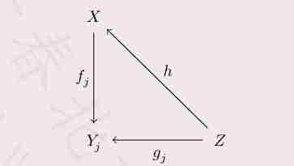
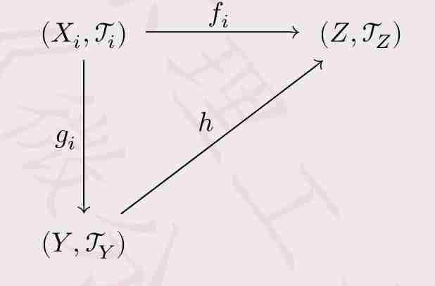
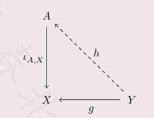

## 8.1 Initial and final topologies | 初始拓扑与终止拓扑

Let $X$ and $Y$ be topological spaces.

* If $A \subseteq X$, what is the most natural topology on $A$?
* What is the most natural topology on the disjoint union $X \sqcup Y$ of $X$ and $Y$?
* What is the most natural topology on the cartesian product $X \times Y$ of $X$ and $Y$?
* What is the most natural topology on $\mathbb{S}^1$, given a map $\pi: \mathbb{R} \to \mathbb{S}^1$ with $\pi(x) = e^{ix}$?
* What is the most natural topology on $\mathbb{R}^2$ making all polynomials continuous?

[点击展开翻译]

设 $X$ 和 $Y$ 为拓扑空间。

* 若 $A \subseteq X$，则 $A$ 上最自然的拓扑是什么？
* 在 $X$ 与 $Y$ 的不相交并 $X \sqcup Y$ 上，最自然的拓扑是什么？
* 在 $X$ 与 $Y$ 的笛卡尔积 $X \times Y$ 上，最自然的拓扑是什么？
* 给定映射 $\pi: \mathbb{R} \to \mathbb{S}^1$ 且 $\pi(x) = e^{ix}$，$\mathbb{S}^1$ 上最自然的拓扑是什么？
* 使所有多项式都连续的 $\mathbb{R}^2$ 上最自然的拓扑是什么？

### 8.1.1 Initial topology | 初始拓扑

::: {.callout-note appearance="simple"}
**8.1.1.1 Definition:** Let $X$ be a set, $\{(Y_j, \mathcal{T}_j)\}_{j \in J}$ be a family of topological spaces, and $\mathcal{F} = \{f_j: X \to Y_j\}_{j \in J}$ be a family of maps. Taking the intersection among the topologies $\mathcal{T}$ on $X$ such that for any $j \in J$, the map $f_j: (X, \mathcal{T}) \to (Y_j, \mathcal{T}_j)$ is continuous, $\mathcal{T}_{\mathcal{F}} = \bigcap_{\mathcal{T}} \mathcal{T}$ is called the *initial topology* on $X$ induced by $\mathcal{F}$ from $\{\mathcal{T}_j\}_{j \in J}$.

[点击展开翻译]
**8.1.1.1 定义**：设 $X$ 为一个集合，$\{(Y_j, \mathcal{T}_j)\}_{j \in J}$ 为一族拓扑空间，且 $\mathcal{F} = \{f_j: X \to Y_j\}_{j \in J}$ 为一族映射。取 $X$ 上所有使得对任意 $j \in J$，映射 $f_j: (X, \mathcal{T}) \to (Y_j, \mathcal{T}_j)$ 均连续的拓扑 $\mathcal{T}$ 的交集，称 $\mathcal{T}_{\mathcal{F}} = \bigcap_{\mathcal{T}} \mathcal{T}$ 为由 $\mathcal{F}$ 从 $\{\mathcal{T}_j\}_{j \in J}$ 诱导在 $X$ 上的**初始拓扑**。

:::

::: {.callout-caution appearance="simple"}
**8.1.1.2 Remark:** The initial topology $\mathcal{T}_{\mathcal{F}}$ is the coarsest topology on $X$ under which $\mathcal{F}$ consists of continuous maps. It is indeed a topology on $X$ by the following theorem.

[点击展开翻译]
**8.1.1.2 备注**：初始拓扑 $\mathcal{T}_{\mathcal{F}}$ 是使得 $\mathcal{F}$ 中所有映射均连续的 $X$ 上最粗糙的拓扑。根据以下定理，它确实是 $X$ 上的一个拓扑。

:::

::: {.callout-tip appearance="simple"}
**8.1.1.3 Theorem:** Let $\mathcal{F} = \{f_j: X \to Y_j\}_{j \in J}$ be a family of maps from a set $X$ to topological spaces $(Y_j, \mathcal{T}_j)$. The initial topology induced by $\mathcal{F}$ is a topology on $X$ generated by the subbase $\mathcal{S}_{\mathcal{F}} = \{f_j^{-1}(V) \subseteq X : j \in J, V \in \mathcal{T}_j\}$.

[点击展开翻译]
**8.1.1.3 定理**：设 $\mathcal{F} = \{f_j: X \to Y_j\}_{j \in J}$ 是从集合 $X$ 到拓扑空间 $(Y_j, \mathcal{T}_j)$ 的一族映射。由 $\mathcal{F}$ 诱导的初始拓扑是由子基 $\mathcal{S}_{\mathcal{F}} = \{f_j^{-1}(V) \subseteq X : j \in J, V \in \mathcal{T}_j\}$ 生成的 $X$ 上的拓扑。

:::

*Proof:* Being the intersection of topologies, $\mathcal{T}_{\mathcal{F}}$ is a topology on $X$ by Theorem 3.1.5.3 (1). $\blacksquare$

[点击展开翻译]
*证明*：作为拓扑的交集，根据定理 3.1.5.3 (1)，$\mathcal{T}_{\mathcal{F}}$ 是 $X$ 上的一个拓扑。$\blacksquare$

::: {.callout-tip appearance="simple"}
**8.1.1.4 The characteristic property of the initial topology:** Let $X$ be a set, $\{Y_j\}_{j \in J}$ be a family of topological spaces, and $\mathcal{F} = \{f_j: X \to Y_j\}_{j \in J}$ be a family of maps. A topology $\mathcal{T}_X$ on $X$ is the initial topology induced by $\mathcal{F}$ iff for any map $h: Z \to X$ is continuous provided that $g_j = f_j \circ h: Z \to Y_j$ is continuous for any $j \in J$.

[点击展开翻译]
**8.1.1.4 初始拓扑的特征性质**：设 $X$ 为一个集合，$\{Y_j\}_{j \in J}$ 为一族拓扑空间，且 $\mathcal{F} = \{f_j: X \to Y_j\}_{j \in J}$ 为一族映射。$X$ 上的拓扑 $\mathcal{T}_X$ 是由 $\mathcal{F}$ 诱导的初始拓扑，当且仅当对于任何映射 $h: Z \to X$，只要对任意 $j \in J$，$g_j = f_j \circ h: Z \to Y_j$ 均连续，则 $h$ 连续。

:::

*Proof:* Suppose $\mathcal{T}_X$ is the initial topology $\mathcal{T}_{\mathcal{F}}$. For any $U = f_j^{-1}(V_j) \in \mathcal{S}_{\mathcal{F}}$ where $j \in J$ and $V_j \in \mathcal{T}_j$ if $g_j$ is known continuous, then the preimage $W = g_j^{-1}(V_j) \in \mathcal{T}_Z$. Now that $W = h^{-1}(U)$ we conclude that $h$ is continuous.
Suppose the continuity of $g_j = f_j \circ h$ for all $j \in J$ implies that of $h$. We let $Z = X$ and $h = \text{id}_X$. Then $\mathcal{T}_Z$ is a topology making $g_j = f_j: (X, \mathcal{T}_Z) \to (Y_j, \mathcal{T}_j)$ continuous for any $j \in J$, and then the continuity of $h$ implies that $\mathcal{T}_Z$ is finer than $\mathcal{T}_X$. Therefore, $\mathcal{T}_X$ is the coarsest among them, which is the initial topology $\mathcal{T}_{\mathcal{F}}$ by definition. $\blacksquare$

[点击展开翻译]
*证明*：假设 $\mathcal{T}_X$ 是初始拓扑 $\mathcal{T}_{\mathcal{F}}$。对于任意 $U = f_j^{-1}(V_j) \in \mathcal{S}_{\mathcal{F}}$（其中 $j \in J$ 且 $V_j \in \mathcal{T}_j$），若已知 $g_j$ 连续，则原像 $W = g_j^{-1}(V_j) \in \mathcal{T}_Z$。由于 $W = h^{-1}(U)$，我们断定 $h$ 连续。
反之，假设对所有 $j \in J$，$g_j = f_j \circ h$ 的连续性蕴含了 $h$ 的连续性。令 $Z = X$ 且 $h = \text{id}_X$。则 $\mathcal{T}_Z$ 是使得 $g_j = f_j: (X, \mathcal{T}_Z) \to (Y_j, \mathcal{T}_j)$ 对任意 $j \in J$ 均连续的一种拓扑，此时 $h$ 的连续性意味着 $\mathcal{T}_Z$ 比 $\mathcal{T}_X$ 更细。因此，$\mathcal{T}_X$ 是这些拓扑中最粗糙的一个，根据定义，它就是初始拓扑 $\mathcal{T}_{\mathcal{F}}$。$\blacksquare$

::: {.callout-important appearance="simple"}
**8.1.1.5 Proposition:** The initial topology on a set $X$ induced by the empty map $\emptyset \to X$ is the trivial topology.

[点击展开翻译]
**8.1.1.5 命题**：在集合 $X$ 上由空映射 $\emptyset \to X$ 诱导的初始拓扑是平凡拓扑（即平凡拓扑）。

:::

### 8.1.2 Final topology | 终止拓扑

::: {.callout-note appearance="simple"}
**8.1.2.1 Definition:** Let $Y$ be a set, $\{(X_i, \mathcal{T}_i)\}_{i \in I}$ be a family of topological spaces, and $\mathcal{G} = \{f_i: X_i \to Y\}_{i \in I}$ be a family of maps. Taking the union among the topologies $\mathcal{T}$ on $Y$ such that for any $i \in I$, the map $f_i: (X_i, \mathcal{T}_i) \to (Y, \mathcal{T})$ is continuous, $\mathcal{T}_{\mathcal{G}} = \bigcup_{\mathcal{T}} \mathcal{T}$ is called the *final topology* on $Y$ induced by $\mathcal{G}$ from $\{\mathcal{T}_i\}_{i \in I}$.

[点击展开翻译]
**8.1.2.1 定义**：设 $Y$ 为一个集合，$\{(X_i, \mathcal{T}_i)\}_{i \in I}$ 为一族拓扑空间，且 $\mathcal{G} = \{f_i: X_i \to Y\}_{i \in I}$ 为一族映射。取 $Y$ 上所有使得对任意 $i \in I$，映射 $f_i: (X_i, \mathcal{T}_i) \to (Y, \mathcal{T})$ 均连续的拓扑 $\mathcal{T}$ 的并集，称 $\mathcal{T}_{\mathcal{G}} = \bigcup_{\mathcal{T}} \mathcal{T}$ 为由 $\mathcal{G}$ 从 $\{\mathcal{T}_i\}_{i \in I}$ 诱导在 $Y$ 上的**终止拓扑**。

:::

::: {.callout-caution appearance="simple"}
**8.1.2.2 Remark:** The final topology $\mathcal{T}_{\mathcal{G}}$ is the finest topology on $Y$ under which $\mathcal{G}$ consists of continuous maps. It is indeed a topology on $Y$ by the following theorem.

[点击展开翻译]
**8.1.2.2 备注**：终止拓扑 $\mathcal{T}_{\mathcal{G}}$ 是使得 $\mathcal{G}$ 中所有映射均连续的 $Y$ 上最精细的拓扑。根据以下定理，它确实是 $Y$ 上的一个拓扑。

:::

::: {.callout-tip appearance="simple"}
**8.1.2.3 Theorem:** Let $\mathcal{G} = \{f_i: X_i \to Y\}_{i \in I}$ be a family of maps from topological spaces $(X_i, \mathcal{T}_i)$ to a set $Y$. The final topology induced by $\mathcal{G}$ is a topology on $Y$ given by
$$\mathcal{T}_{\mathcal{G}} = \{V \subseteq Y : (\forall i \in I)(g_i^{-1}(V) \in \mathcal{T}_i)\}. \tag{77}$$

[点击展开翻译]
**8.1.2.3 定理**：设 $\mathcal{G} = \{f_i: X_i \to Y\}_{i \in I}$ 是从拓扑空间 $(X_i, \mathcal{T}_i)$ 到集合 $Y$ 的一族映射。由 $\mathcal{G}$ 诱导的终止拓扑是 $Y$ 上的一个拓扑，由下式给出：
$$\mathcal{T}_{\mathcal{G}} = \{V \subseteq Y : (\forall i \in I)(g_i^{-1}(V) \in \mathcal{T}_i)\}。 \tag{77}$$

:::

::: {.callout-tip appearance="simple"}
**8.1.2.4 The characteristic property of the final topology:** Let $Y$ be a set, $\{(X_i, \mathcal{T}_i)\}_{i \in I}$ be a family of topological spaces, and $\mathcal{G} = \{f_i: X_i \to Y\}_{i \in I}$ be a family of maps. A topology $\mathcal{T}_Y$ on $Y$ is the final topology induced by $\mathcal{G}$ iff for any map $h: (Y, \mathcal{T}_Y) \to (Z, \mathcal{T}_Z)$ is continuous provided that $f_i = h \circ g_i: (X_i, \mathcal{T}_i) \to (Z, \mathcal{T}_Z)$ is continuous for any $i \in I$.

[点击展开翻译]
**8.1.2.4 终止拓扑的特征性质**：设 $Y$ 为一个集合，$\{(X_i, \mathcal{T}_i)\}_{i \in I}$ 为一族拓扑空间，且 $\mathcal{G} = \{f_i: X_i \to Y\}_{i \in I}$ 为一族映射。$Y$ 上的拓扑 $\mathcal{T}_Y$ 是由 $\mathcal{G}$ 诱导的终止拓扑，当且仅当对于任何映射 $h: (Y, \mathcal{T}_Y) \to (Z, \mathcal{T}_Z)$，只要对任意 $i \in I$，$f_i = h \circ g_i: (X_i, \mathcal{T}_i) \to (Z, \mathcal{T}_Z)$ 均连续，则 $h$ 连续。

:::

*Proof:* Suppose $\mathcal{T}_X$ is the final topology $\mathcal{T}_{\mathcal{G}}$. For any $W \in \mathcal{T}_Z$ if $f_i$ is known continuous, then the preimage $U_i = f_i^{-1}(W) \in \mathcal{T}_i$. Now that $U_i = g_i^{-1}(V) \in \mathcal{T}_i$ where $V = h^{-1}(W)$ we have $V \in \mathcal{T}_{\mathcal{G}}$. We conclude that $h$ is continuous.
Suppose the continuity of $f_i = h \circ g_i$ for all $i \in I$ implies that of $h$. We let $Z = Y$ and $h = \text{id}_Y$. Then $\mathcal{T}_Z$ is a topology making $f_i = g_i: (X_i, \mathcal{T}_i) \to (Y, \mathcal{T}_Z)$ continuous for any $i \in I$, and then the continuity of $h$ implies that $\mathcal{T}_Z$ is coarser than $\mathcal{T}_Y$. Therefore, $\mathcal{T}_Y$ is the finest among them, which is the final topology $\mathcal{T}_{\mathcal{G}}$ by definition. $\blacksquare$

[点击展开翻译]
*证明*：假设 $\mathcal{T}_X$ 是终止拓扑 $\mathcal{T}_{\mathcal{G}}$。对于任意 $W \in \mathcal{T}_Z$，若已知 $f_i$ 连续，则原像 $U_i = f_i^{-1}(W) \in \mathcal{T}_i$。由于 $U_i = g_i^{-1}(V) \in \mathcal{T}_i$（其中 $V = h^{-1}(W)$），我们得到 $V \in \mathcal{T}_{\mathcal{G}}$。由此断定 $h$ 连续。
反之，假设对所有 $i \in I$，$f_i = h \circ g_i$ 的连续性蕴含了 $h$ 的连续性。令 $Z = Y$ 且 $h = \text{id}_Y$。则 $\mathcal{T}_Z$ 是使得 $f_i = g_i: (X_i, \mathcal{T}_i) \to (Y, \mathcal{T}_Z)$ 对任意 $i \in I$ 均连续的一种拓扑，此时 $h$ 的连续性意味着 $\mathcal{T}_Z$ 比 $\mathcal{T}_Y$ 更粗。因此，$\mathcal{T}_Y$ 是这些拓扑中最精细的一个，根据定义，它就是终止拓扑 $\mathcal{T}_{\mathcal{G}}$。$\blacksquare$

::: {.callout-important appearance="simple"}
**8.1.2.5 Proposition:** The final topology on a set $X$ induced by the constant map $X \to *$ is the discrete topology.

[点击展开翻译]
**8.1.2.5 命题**：在集合 $X$ 上由常数映射 $X \to *$ 诱导的终止拓扑是离散拓扑。

:::

### 8.1.3 Weak topologies | 弱拓扑

Let $\mathbb{K}$ be a topological field as in Definition 28.2.1.1, namely a field with a compatible topology. We will mostly consider $\mathbb{K}$ as $\mathbb{R}$ or $\mathbb{C}$ with their standard topologies.
Recall the weak and weak\* topologies in Functional Analysis on a topological vector space $(X, \mathcal{T}_X)$ (Definition 28.2.2.1) over a topological field $\mathbb{K}$, or in particular, a normed vector space, and its continuous dual $X^*$ (Definition 28.2.2.4), or the space of continuous $\mathbb{K}$-linear functionals. These topologies will be defined as initial topologies and related to product topologies.

[点击展开翻译]
设 $\mathbb{K}$ 为定义 28.2.1.1 中的拓扑域，即具有相容拓扑的域。我们主要将 $\mathbb{K}$ 视为具有标准拓扑的 $\mathbb{R}$ 或 $\mathbb{C}$。
回想泛函分析中，在拓扑域 $\mathbb{K}$ 上的拓扑向量空间 $(X, \mathcal{T}_X)$（定义 28.2.2.1）——特别是赋范向量空间及其连续对偶空间 $X^*$（定义 28.2.2.4），即连续 $\mathbb{K}$-线性泛函空间——上的弱拓扑和弱\*拓扑。这些拓扑将被定义为初始拓扑，并与乘积拓扑相关联。

There is a canonical pairing $\langle \cdot, \cdot \rangle : X \times X^* \to \mathbb{K}$ defined by $\langle x, \alpha \rangle = \alpha(x)$ for all $x \in X$ and $\alpha \in X^*$.

[点击展开翻译]
存在正则配对 $\langle \cdot, \cdot \rangle : X \times X^* \to \mathbb{K}$，定义为对于所有 $x \in X$ 和 $\alpha \in X^*$，$\langle x, \alpha \rangle = \alpha(x)$。

::: {.callout-note appearance="simple"}
**8.1.3.1 Weak and weak\* topologies:** Let $(X, \mathcal{T}_X)$ be a topological vector space and $(X^*, \mathcal{T}_{X^*})$ be its continuous dual. The weak topology on $X$ is the initial topology $\mathcal{T}_{X, X^*}$ on $X$ induced by $X^*$. The weak\* topology on $X^*$ is the initial topology $\mathcal{T}_{X^*, X}$ on $X^*$ induced by $X$ seen as $\text{ev}(X) \subseteq X^{**}$.

[点击展开翻译]
**8.1.3.1 弱拓扑与弱\*拓扑**：设 $(X, \mathcal{T}_X)$ 为拓扑向量空间，$(X^*, \mathcal{T}_{X^*})$ 为其连续对偶空间。$X$ 上的**弱拓扑**是由 $X^*$ 诱导在 $X$ 上的初始拓扑 $\mathcal{T}_{X, X^*}$。$X^*$ 上的**弱\*拓扑**是由视为 $\text{ev}(X) \subseteq X^{**}$ 的 $X$ 诱导在 $X^*$ 上的初始拓扑 $\mathcal{T}_{X^*, X}$。

:::

::: {.callout-important appearance="simple"}
**8.1.3.2 Proposition:** The *weak topology* $\mathcal{T}_{X, X^*}$ on $X$ is the coarsest topology making all maps $\alpha: X \to \mathbb{K}$ continuous for $\alpha \in X^*$. The *weak\* topology* $\mathcal{T}_{X^*, X}$ on $X^*$ is the coarsest topology making all maps $\text{ev}_x: X^* \to \mathbb{K}$ continuous for $x \in X$.

[点击展开翻译]
**8.1.3.2 命题**：$X$ 上的**弱拓扑** $\mathcal{T}_{X, X^*}$ 是使得所有映射 $\alpha: X \to \mathbb{K}$（对于 $\alpha \in X^*$）均连续的最粗糙拓扑。$X^*$ 上的**弱\*拓扑** $\mathcal{T}_{X^*, X}$ 是使得所有映射 $\text{ev}_x: X^* \to \mathbb{K}$（对于 $x \in X$）均连续的最粗糙拓扑。

:::

::: {.callout-important appearance="simple"}
**8.1.3.3 Proposition:** If $Y$ is a vector space of linear functionals on $X$, then the continuous dual of $X$ with respect to the topology $\sigma(X, Y)$ is precisely equal to $Y$.

[点击展开翻译]
**8.1.3.3 命题**：若 $Y$ 是 $X$ 上线性泛函的向量空间，则 $X$ 关于拓扑 $\sigma(X, Y)$ 的连续对偶空间恰好等于 $Y$。

:::

If $\mathcal{T}_X$ comes from a norm $\|\cdot\|_X$ (Definition 28.2.3.1), then $X^*$ is also induced by a norm $\|\cdot\|_{X^*}$, called the dual norm to $\|\cdot\|_X$, defined by
$$\|\alpha\|_{X^*} = \sup_{\|x\|_X \leq 1} |\langle x, \alpha \rangle|. \tag{79}$$
The norm $\|\cdot\|_{X^*}$ induces the *strong topology* $\mathcal{T}_{X^*}$ on $X^*$ (Definition 28.2.3.1), which yields a normed vector space $(X^*, \mathcal{T}_{X^*})$. The continuous dual $X^{**}$ to $(X^*, \mathcal{T}_{X^*})$ is called the *double dual*, with a norm $\|\cdot\|_{X^{**}}$ which induces a strong topology $\mathcal{T}_{X^{**}}$ defined in an analogous way as $\|\cdot\|_{X^*}$ and $\mathcal{T}_{X^*}$. There is a continuous linear embedding, called the *evaluation map* $\text{ev}: X \to X^{**}$, $x \mapsto \text{ev}_x$ defined by $\text{ev}_x(\alpha) = \alpha(x) = \langle x, \alpha \rangle$.

[点击展开翻译]
若 $\mathcal{T}_X$ 源自范数 $\|\cdot\|_X$，则 $X^*$ 也由一个范数 $\|\cdot\|_{X^*}$ 诱导，称为 $\|\cdot\|_X$ 的对偶范数，定义为：
$$\|\alpha\|_{X^*} = \sup_{\|x\|_X \leq 1} |\langle x, \alpha \rangle|。$$
范数 $\|\cdot\|_{X^*}$ 在 $X^*$ 上诱导了**强拓扑** $\mathcal{T}_{X^*}$，从而产生赋范向量空间 $(X^*, \mathcal{T}_{X^*})$。$(X^*, \mathcal{T}_{X^*})$ 的连续对偶空间 $X^{**}$ 称为**二阶对偶**，其范数 $\|\cdot\|_{X^{**}}$ 以与 $\|\cdot\|_{X^*}$ 类似的方式诱导强拓扑 $\mathcal{T}_{X^{**}}$。存在一个连续线性嵌入，称为**赋值映射** $\text{ev}: X \to X^{**}$，$x \mapsto \text{ev}_x$，定义为 $\text{ev}_x(\alpha) = \alpha(x) = \langle x, \alpha \rangle$。

::: {.callout-caution appearance="simple"}
**8.1.3.4 Remark:** On $X^*$ there is also a weak topology $\mathcal{T}_{X^*, X^{**}}$ on $X^*$ induced by $X^{**}$. Since $X \subseteq X^{**}$, the weak\* topology is coarser than the weak topology. If $X$ is *reflexive*, in the sense that $\text{ev}: X \to X^{**}$ is an isomorphism, the weak\* topology coincides with the weak topology.

[点击展开翻译]
**8.1.3.4 备注**：在 $X^*$ 上还存在一个由 $X^{**}$ 诱导的弱拓扑 $\mathcal{T}_{X^*, X^{**}}$。由于 $X \subseteq X^{**}$，弱\*拓扑比弱拓扑更粗。若 $X$ 是**自反的**（即 $\text{ev}: X \to X^{**}$ 是同构），则弱\*拓扑与弱拓扑重合。

:::

A topological space is more likely to be compact as the topology be coarser. In an infinite-dimensional normed space $(X, \|\cdot\|_X)$, the closed unit ball $\mathbb{B}_X$ is never compact in the strong topology $\mathcal{T}_X$, nor in the weak topology $\mathcal{T}_{X, X^*}$ unless $X$ is reflexive. However, the closed unit ball $\mathbb{B}_{X^*}$ in $X^*$ is always weak\* compact.

[点击展开翻译]
拓扑越粗，拓扑空间就越有可能是紧的。在无穷维赋范空间 $(X, \|\cdot\|_X)$ 中，闭单位球 $\mathbb{B}_X$ 在强拓扑 $\mathcal{T}_X$ 中绝不是紧的，在弱拓扑 $\mathcal{T}_{X, X^*}$ 中也不是紧的（除非 $X$ 是自反的）。然而，$X^*$ 中的闭单位球 $\mathbb{B}_{X^*}$ 总是弱\*紧的。

::: {.callout-important appearance="simple"}
**8.1.3.5 Proposition:** For example, a closed ball in any infinite-dimensional normed vector space is never compact. Let $X$ be a normed vector space. Then the closed unit ball $\mathbb{B}_X$ is compact in the weak topology $\mathcal{T}_{X, X^*}$ iff $X$ is reflexive.

[点击展开翻译]
**8.1.3.5 命题**：例如，任何无穷维赋范向量空间中的闭球都绝不是紧的。设 $X$ 为赋范向量空间，则闭单位球 $\mathbb{B}_X$ 在弱拓扑 $\mathcal{T}_{X, X^*}$ 中是紧的当且仅当 $X$ 是自反的。

:::

::: {.callout-tip appearance="simple"}
**8.1.3.6 Banach–Alaoglu:** Let $X$ be a normed vector space. Then the closed unit ball $\mathbb{B}_{X^*}$ is compact in the weak\* topology $\mathcal{T}_{X^*, X}$.

[点击展开翻译]
**8.1.3.6 Banach–Alaoglu 定理**：设 $X$ 为赋范向量空间。则闭单位球 $\mathbb{B}_{X^*}$ 在弱\*拓扑 $\mathcal{T}_{X^*, X}$ 中是紧的。

:::

::: {.callout-tip appearance="simple"}
**8.1.3.7 Heine–Borel for normed vector spaces:** Let $X$ be a normed vector space. A subset $A$ of $X^*$ is weak* compact iff it is weak* closed and bounded.

[点击展开翻译]

**8.1.3.7 赋范向量空间的 Heine–Borel 定理：** 设 $X$ 为赋范向量空间。$X^*$ 的子集 $A$ 是弱*紧的，当且仅当它是弱*闭且有界的。

:::

::: {.callout-caution appearance="simple"}
**8.1.3.8 Remark:** If $X$ is an infinite-dimensional normed space, even though the closed unit ball $\overline{\mathbb{B}}_{X^*}$ is compact, $(X^*, \mathcal{T}_{X^*, X})$ is not locally compact (Definition 13.4.2.2). The reason is that the any nonempty open subset of $(X^*, \mathcal{T}_{X^*, X})$ is unbounded and is not contained in $\overline{\mathbb{B}}_{X^*}$.

[点击展开翻译]

**8.1.3.8 备注：** 如果 $X$ 是无限维赋范空间，尽管闭单位球 $\overline{\mathbb{B}}_{X^*}$ 是紧的，$(X^*, \mathcal{T}_{X^*, X})$ 却不是局部紧的（定义 13.4.2.2）。原因是 $(X^*, \mathcal{T}_{X^*, X})$ 的任何非空开子集都是无界的，且不包含于 $\overline{\mathbb{B}}_{X^*}$ 中。

:::

::: {.callout-note appearance="simple"}
**8.1.3.9 Weak and weak* convergences:** Let $x_\bullet: (I, \preceq) \to X$ be a net (Definition 7.6.0.3) in a topological vector space $X$ over $\mathbb{K}$. It *converges* (Definition 7.6.0.6) in $\mathcal{T}_{X, X^*}$ or *converges weakly* to $y \in X$ iff $\alpha(x_\bullet) \to \alpha(x)$ in $\mathbb{K}$ for any $\alpha \in X^*$, denoted by $x_\bullet \xrightarrow{w} y$, $x_\bullet \rightharpoonup y$, or $\text{w-}\lim_{i \in I} x_i \to y$.

Let $\alpha_\bullet: (I, \preceq) \to X^*$ be a net in the continuous dual space $X^*$. It *converges* (Definition 7.6.0.6) in $\mathcal{T}_{X, X^*}$ to $y \in X$ iff $\alpha_\bullet(x) \to \alpha(x)$ in $\mathbb{K}$ for any $\alpha \in X^*$, denoted by $\alpha_\bullet \xrightarrow{w^*} y$, $\alpha_\bullet \stackrel{*}{\rightharpoonup} y$, or $\text{w}^*\text{-}\lim_{i \in I} \alpha_i \to y$.

[点击展开翻译]

**8.1.3.9 弱收敛与弱*收敛：** 
设 $x_\bullet: (I, \preceq) \to X$ 为 $\mathbb{K}$ 上拓扑向量空间 $X$ 中的网（定义 7.6.0.3）。它在 $\mathcal{T}_{X, X^*}$ 中*收敛*（定义 7.6.0.6）或*弱收敛*于 $y \in X$，当且仅当对于任意 $\alpha \in X^*$，$\alpha(x_\bullet) \to \alpha(x)$ 在 $\mathbb{K}$ 中成立，记作 $x_\bullet \xrightarrow{w} y$，$x_\bullet \rightharpoonup y$，或 $\text{w-}\lim_{i \in I} x_i \to y$。

设 $\alpha_\bullet: (I, \preceq) \to X^*$ 为连续对偶空间 $X^*$ 中的网。它在 $\mathcal{T}_{X, X^*}$ 中*收敛*（定义 7.6.0.6）于 $y \in X$，当且仅当对于任意 $\alpha \in X^*$，$\alpha_\bullet(x) \to \alpha(x)$ 在 $\mathbb{K}$ 中成立，记作 $\alpha_\bullet \xrightarrow{w^*} y$，$\alpha_\bullet \stackrel{*}{\rightharpoonup} y$，或 $\text{w}^*\text{-}\lim_{i \in I} \alpha_i \to y$。

:::

The weak/weak* topology is characterized by the weak/weak* convergence. We could also define the weak/weak* convergence of sequences but they are not sufficient to characterize the weak/weak* topology in general Remark 3.3.0.8 and Remark 3.3.0.9.

::: {.callout-note appearance="simple"}
**8.1.3.10 Weak and weak* convergences of sequences:** Let $x$ be a sequence in a topological vector space $X$ over $\mathbb{K}$. It *converges* in $\mathcal{T}_{X, X^*}$ or *converges weakly* to $y \in X$ iff $\alpha(x_n) \to \alpha(x)$ in $\mathbb{K}$ for any $\alpha \in X^*$, denoted by $x_\bullet \xrightarrow{w} y$, $x_\bullet \rightharpoonup y$, or $\text{w-}\lim_{n \to \infty} x_n \to y$.

Let $\alpha$ be a sequence in the continuous dual space $X^*$. It *converges* in $\mathcal{T}_{X, X^*}$ to $y \in X$ iff $\alpha_n(x) \to \alpha(x)$ in $\mathbb{K}$ for any $\alpha \in X^*$, denoted by $\alpha_n \xrightarrow{w^*} y$, $\alpha_n \stackrel{*}{\rightharpoonup} y$, or $\text{w}^*\text{-}\lim_{n \to \infty} \alpha_n \to y$.

[点击展开翻译]

**8.1.3.10 序列的弱收敛与弱*收敛：** 
设 $x$ 为 $\mathbb{K}$ 上拓扑向量空间 $X$ 中的序列。它在 $\mathcal{T}_{X, X^*}$ 中*收敛*或*弱收敛*于 $y \in X$，当且仅当对于任意 $\alpha \in X^*$，$\alpha(x_n) \to \alpha(x)$ 在 $\mathbb{K}$ 中成立，记作 $x_\bullet \xrightarrow{w} y$，$x_\bullet \rightharpoonup y$，或 $\text{w-}\lim_{n \to \infty} x_n \to y$。

设 $\alpha$ 为连续对偶空间 $X^*$ 中的序列。它在 $\mathcal{T}_{X, X^*}$ 中*收敛*于 $y \in X$，当且仅当对于任意 $\alpha \in X^*$，$\alpha_n(x) \to \alpha(x)$ 在 $\mathbb{K}$ 中成立，记作 $\alpha_n \xrightarrow{w^*} y$，$\alpha_n \stackrel{*}{\rightharpoonup} y$，或 $\text{w}^*\text{-}\lim_{n \to \infty} \alpha_n \to y$。

:::

## 8.2 Subspace topology.

### 8.2.1 Subspaces of topological spaces.

::: {.callout-note appearance="simple"}
**8.2.1.1 Definition:** For any subset $A$ of $X$, the injection $\iota_{A,X}: A \to X$, $p \mapsto p$, is the *inclusion map* of $A$ into $X$.

[点击展开翻译]

**8.2.1.1 定义：** 对于 $X$ 的任意子集 $A$，单射 $\iota_{A,X}: A \to X, p \mapsto p$ 称为 $A$ 到 $X$ 的*包含映射*。

:::

::: {.callout-important appearance="simple"}
**8.2.1.2 Proposition:** Let $A$ be a subset of a topological space $(X, \mathcal{T}_X)$. Then the *subspace topology* $\mathcal{T}_A$ on $A$ in $X$ is the initial topology induced by $\{\iota_{A,X}\}$, and then $(A, \mathcal{T}_A)$ is a *topological subspace* of $(X, \mathcal{T}_X)$.

[点击展开翻译]

**8.2.1.2 命题：** 设 $A$ 为拓扑空间 $(X, \mathcal{T}_X)$ 的子集。则 $X$ 中 $A$ 上的*子空间拓扑* $\mathcal{T}_A$ 是由 $\{\iota_{A,X}\}$ 诱导的初始拓扑，此时 $(A, \mathcal{T}_A)$ 是 $(X, \mathcal{T}_X)$ 的*拓扑子空间*。

:::

::: {.callout-tip appearance="simple"}
**8.2.1.3 The universal property of the subspace topology:** The subspace topology on $A$ is characterized by the following property. For any topological space $Y$ and a map $h: Y \to A$, $h$ is continuous iff $g = \iota_{A,X} \circ h: Y \to X$ is continuous.

[点击展开翻译]
**8.2.1.3 子空间拓扑的普遍性质**：子空间拓扑在 $A$ 上的特征性质如下：对于任何拓扑空间 $Y$ 和映射 $h: Y \to A$，$h$ 连续当且仅当 $g = \iota_{A,X} \circ h: Y \to X$ 连续。

:::

### 8.2.2 Embeddings | 嵌入

Observe that a map $f: (Z, \mathcal{T}_Z) \to (X, \mathcal{T}_X)$ is continuous iff $\mathcal{T}_Z$ is finer than the initial topology on $Z$ induced by $\{f\}$.

[点击展开翻译]
观察到映射 $f: (Z, \mathcal{T}_Z) \to (X, \mathcal{T}_X)$ 连续，当且仅当 $\mathcal{T}_Z$ 比由 $\{f\}$ 在 $Z$ 上诱导的初始拓扑更细。

::: {.callout-note appearance="simple"}
**8.2.2.1 Definition:** An injection $f: (Z, \mathcal{T}_Z) \to (X, \mathcal{T}_X)$ is an *embedding* iff $\mathcal{T}_Z$ equals the initial topology on $Z$ induced by $\{f\}$. The space $Z$ is *embeddable* into $X$ if there is an embedding $f: Z \to X$.

[点击展开翻译]
**8.2.2.1 定义**：单射 $f: (Z, \mathcal{T}_Z) \to (X, \mathcal{T}_X)$ 是一个**嵌入**，当且仅当 $\mathcal{T}_Z$ 等于由 $\{f\}$ 在 $Z$ 上诱导的初始拓扑。如果存在嵌入 $f: Z \to X$，则称空间 $Z$ 可**嵌入**到 $X$ 中。

:::

::: {.callout-important appearance="simple"}
**8.2.2.2 Proposition:** A continuous injection $f: Z \to X$ is an embedding iff for any open $W$ in $Z$ there is an open $U$ in $X$ such that $W = f^{-1}(U)$.

[点击展开翻译]
**8.2.2.2 命题**：连续单射 $f: Z \to X$ 是嵌入，当且仅当对于 $Z$ 中的任何开集 $W$，在 $X$ 中都存在一个开集 $U$ 使得 $W = f^{-1}(U)$。

:::

Compare Proposition 8.2.2.2 with these definitions. A map $f: Z \to X$ between topological spaces is
- continuous iff for any open $W$ in $Z$ there is an open $U$ in $X$ such that $W = f^{-1}(U)$;
- open iff for any open $W$ in $Z$ there is an open $U$ in $X$ such that $\iota(W) = U$;
- closed iff for any closed $C$ in $Z$ there is a closed $A$ in $X$ such that $f(C) = A$.

[点击展开翻译]
将命题 8.2.2.2 与以下定义进行比较。拓扑空间之间的映射 $f: Z \to X$ 是：
- 连续的，当且仅当对于 $Z$ 中的任何开集 $W$，在 $X$ 中都存在一个开集 $U$ 使得 $W = f^{-1}(U)$；
- 开的，当且仅当对于 $Z$ 中的任何开集 $W$，在 $X$ 中都存在一个开集 $U$ 使得 $\iota(W) = U$；
- 闭的，当且仅当对于 $Z$ 中的任何闭集 $C$，在 $X$ 中都存在一个闭集 $A$ 使得 $f(C) = A$。

::: {.callout-important appearance="simple"}
**8.2.2.3 Proposition:** A map $f: Z \to X$ between topological spaces is an embedding iff $f|_{Z,f(Z)}$ is a homeomorphism.

[点击展开翻译]
**8.2.2.3 命题**：拓扑空间之间的映射 $f: Z \to X$ 是嵌入，当且仅当其限制映射 $f|_{Z,f(Z)}$ 是一个同胚。

:::

::: {.callout-note appearance="simple"}
**8.2.2.4 The universal property of embeddings:** An injection $f: Z \to X$ between topological spaces is an embedding iff for any map $h: Y \to Z$, it is continuous iff the composition $g = f \circ h: Y \to X$ is continuous.

[点击展开翻译]

**8.2.2.4 嵌入的泛性质：** 拓扑空间之间的单射 $f: Z \to X$ 是嵌入，当且仅当对于任何映射 $h: Y \to Z$，$h$ 连续当且仅当复合映射 $g = f \circ h: Y \to X$ 连续。

:::

*Proof:* For the necessary condition, if $f$ is an embedding, then any $W \subseteq Z$ is open iff there is an open $U \subseteq X$ such that $f(W) = U \cap f(Z)$. If $h$ is continuous, then $g = f \circ h$ is continuous being the composition of two continuous maps. Suppose $g$ is continuous, let $W \subseteq Z$ open, and let $U \subseteq X$ with $f^{-1}(U) = W$. Then $h^{-1}(W) = h^{-1} \circ f^{-1}(U) = g^{-1}(U)$ is open and then $h$ is continuous.

For the sufficient condition, letting $h = \text{id}_Z$ we obtain the continuity of $f$. Then, let $h = (f|_{Z,f(Z)})^{-1} : f(Z) \to X$ and then $g$ becomes the inclusion of $f(Z)$ into $X$. Since $g$ is continuous, we have that $h$ is continuous but then $f|_{Z,f(Z)}$ is an homeomorphism and $f$ is an embedding. ■

::: {.callout-important appearance="simple"}
**8.2.2.5 Proposition:** "Being embeddable into" satisfies reflexivity and transitivity among topological spaces.

[点击展开翻译]

**8.2.2.5 命题：** 在拓扑空间之间，“可嵌入”关系满足自反性和传递性。

:::

**8.2.2.6 Question:** Is embeddability antisymmetric among homeomorphism classes of topological spaces? In other words, are there topological spaces embeddable into each other but are not homeomorphic?

::: {.callout-important appearance="simple"}
**8.2.2.7 Proposition:** A section is an embedding.

[点击展开翻译]

**8.2.2.7 命题：** 截面（section）是嵌入。

:::

::: {.callout-important appearance="simple"}
**8.2.2.8 Proposition:** A bijective embedding is a homeomorphism.

[点击展开翻译]

**8.2.2.8 命题：** 双射嵌入是同胚。

:::

::: {.callout-important appearance="simple"}
**8.2.2.9 Proposition:** Let $f$ be a continuous injection. Then the following are equivalent.

* The map $f$ is an embedding.
* The map $f$ sends open sets to relatively open sets.
* The map $f$ sends closed sets to relatively closed sets.

[点击展开翻译]

**8.2.2.9 命题：** 设 $f$ 是连续单射。则以下各项等价：

* 映射 $f$ 是嵌入。
* 映射 $f$ 将开集映射为相对开集。
* 映射 $f$ 将闭集映射为相对闭集。

:::

::: {.callout-note appearance="simple"}
**8.2.2.10 Corollary:** An open or closed continuous injection is an embedding.

[点击展开翻译]

**8.2.2.10 推论：** 开或闭的连续单射是嵌入。

:::

::: {.callout-important appearance="simple"}
**8.2.2.11 Proposition:** An embedding may not be open or closed.

[点击展开翻译]

**8.2.2.11 命题：** 嵌入不一定是开映射或闭映射。

:::

::: {.callout-tip appearance="simple"}
**8.2.2.12 Theorem:** An embedding is open iff it has open image, or it is closed iff it has closed image.

[点击展开翻译]

**8.2.2.12 定理：** 嵌入是开映射当且仅当它的像（image）是开集，或者，嵌入是闭映射当且仅当它的像是闭集。

:::

### 8.2.3 Exercises

8.2.3.1 Show that Definition 8.2.2.1 of embeddings is equivalent to Definition 5.2.3.1.

8.2.3.2 Show that an open continuous injection is an embedding. Show that a closed continuous injection is an embedding.

8.2.3.3 Find non-homeomorphic topological spaces $X$ and $Y$ which embed each other.

---

## 8.3 Product topology | 乘积拓扑

### 8.3.1 Products of two topological spaces | 两个拓扑空间的乘积

Recall for two sets $X$ and $Y$, their is the set of pairs, $X \times Y = \{(p, q) : p \in X, q \in Y\}$ and natural projection maps $\text{pr}_X: X \times Y \to X$ and $\text{pr}_Y: X \times Y \to Y$, sending $(p, q)$ to $x$ and $y$ respectively.

::: {.callout-note appearance="simple"}
**8.3.1.1 Definition:** Let $(X, \mathcal{T}_X)$ and $(Y, \mathcal{T}_Y)$ be topological spaces. Then the *product topology* on $X \times Y$ is the initial topology $\mathcal{T}_{X \times Y}$ induced by $\{\text{pr}_X, \text{pr}_Y\}$, and $(X \times Y, \mathcal{T}_{X \times Y})$ is called the *product space* of $(X, \mathcal{T}_X)$ by $(Y, \mathcal{T}_Y)$.

[点击展开翻译]

**8.3.1.1 定义：** 设 $(X, \mathcal{T}_X)$ 和 $(Y, \mathcal{T}_Y)$ 为拓扑空间。则 $X \times Y$ 上的**乘积拓扑**（product topology）是由 $\{\text{pr}_X, \text{pr}_Y\}$ 诱导的初始拓扑 $\mathcal{T}_{X \times Y}$，且 $(X \times Y, \mathcal{T}_{X \times Y})$ 称为 $(X, \mathcal{T}_X)$ 与 $(Y, \mathcal{T}_Y)$ 的**乘积空间**。

:::

::: {.callout-caution appearance="simple"}
**8.3.1.2 Remark:** The default topology on the product $X \times Y$ of two topological spaces $X$ and $Y$ is the product topology.

[点击展开翻译]

**8.3.1.2 备注：** 两个拓扑空间 $X$ 和 $Y$ 的乘积 $X \times Y$ 上的默认拓扑即为乘积拓扑。

:::

::: {.callout-important appearance="simple"}
**8.3.1.3 Proposition:** Let $(X, \mathcal{T}_X)$ and $(Y, \mathcal{T}_Y)$ be topological spaces. Their product topology $\mathcal{T}_{X \times Y}$ has a subbase
$$ \mathcal{S}_{X \times Y} = \{U \times Y : U \in \mathcal{T}_X\} \cup \{X \times V : V \in \mathcal{T}_Y\} $$
and a base
$$ \mathcal{B}_{X \times Y} = \{U \times V : U \in \mathcal{T}_X, V \in \mathcal{T}_Y\}. $$

[点击展开翻译]

**8.3.1.3 命题：** 设 $(X, \mathcal{T}_X)$ 和 $(Y, \mathcal{T}_Y)$ 为拓扑空间。它们的乘积拓扑 $\mathcal{T}_{X \times Y}$ 拥有子基
$$ \mathcal{S}_{X \times Y} = \{U \times Y : U \in \mathcal{T}_X\} \cup \{X \times V : V \in \mathcal{T}_Y\} $$
以及基
$$ \mathcal{B}_{X \times Y} = \{U \times V : U \in \mathcal{T}_X, V \in \mathcal{T}_Y\}. $$

:::

::: {.callout-note appearance="simple"}
**8.3.1.4 The universal property of the product topology of two spaces:** The product topology on $X \times Y$ is characterized by the following property. For any topological space $Z$ and a map $h: Z \to X \times Y$, $h$ is continuous iff $g_X = \text{pr}_X \circ h: Z \to X$ and $g_Y = \text{pr}_Y \circ h: Z \to Y$ are continuous.

[点击展开翻译]

**8.3.1.4 两个空间乘积拓扑的泛性质：** $X \times Y$ 上的乘积拓扑由以下性质刻画：对于任何拓扑空间 $Z$ 及映射 $h: Z \to X \times Y$，$h$ 连续当且仅当 $g_X = \text{pr}_X \circ h: Z \to X$ 且 $g_Y = \text{pr}_Y \circ h: Z \to Y$ 均连续。

:::

The product topology is also called the *Tychonoff topology*. The universal property can be understood as the following "continuity via components" lemma.

::: {.callout-note appearance="simple"}
**8.3.1.5 Lemma:** Let $X_1$ and $X_2$ be topological spaces with their product space $X_1 \times X_2$. Let $F = (f_1, f_2): Y \to X_1 \times X_2$ a map with components $f_1: Y \to X_1$ and $f_2: Y \to X_2$ given by $(f_1(q), f_2(q)) = f(q)$ for $q \in Y$. Then $f$ is continuous iff both components $f_1$ and $f_2$ are continuous.

[点击展开翻译]

**8.3.1.5 引理：** 设 $X_1$ 和 $X_2$ 为拓扑空间，其乘积空间为 $X_1 \times X_2$。设 $F = (f_1, f_2): Y \to X_1 \times X_2$ 是一个分量为 $f_1: Y \to X_1$ 和 $f_2: Y \to X_2$ 的映射，定义为对 $q \in Y$ 有 $(f_1(q), f_2(q)) = f(q)$。则 $f$ 连续当且仅当两个分量 $f_1$ 和 $f_2$ 均连续。

:::

::: {.callout-important appearance="simple"}
**8.3.1.6 Proposition:** Let $A$ and $B$ be subsets of topological spaces $X$ and $Y$; then

* $A \times B$ is open if both $A$ and $B$ are open;
* $A \times B$ is closed if both $A$ and $B$ are closed.

[点击展开翻译]

**8.3.1.6 命题：** 设 $A$ 和 $B$ 分别是拓扑空间 $X$ 和 $Y$ 的子集；则：

* 若 $A$ 和 $B$ 均为开集，则 $A \times B$ 是开集；
* 若 $A$ 和 $B$ 均为闭集，则 $A \times B$ 是闭集。

:::

*Proof:* We the second bullet as am example. The complement of the product of the subsets $(A \times B)^c = (A^c \times Y) \cup (X \times B^c)$ is open in $X \times Y$. ■

::: {.callout-important appearance="simple"}
**8.3.1.7 Proposition:** Let $A$ and $B$ be subsets of topological spaces $X$ and $Y$; then

* if $A \times B$ is open and $B$ (or $A$) is nonempty then $A$ (or $B$) is open;
* if $A \times B$ is closed and $B$ (or $A$) is nonempty then $A$ (or $B$) is closed.

[点击展开翻译]

**8.3.1.7 命题：** 设 $A$ 和 $B$ 分别是拓扑空间 $X$ 和 $Y$ 的子集；则：

* 若 $A \times B$ 是开集且 $B$（或 $A$）非空，则 $A$（或 $B$）是开集；
* 若 $A \times B$ 是闭集且 $B$（或 $A$）非空，则 $A$（或 $B$）是闭集。

:::

::: {.callout-important appearance="simple"}
**8.3.1.8 Proposition:** Let $X$ and $Y$ be topological spaces with $X \times Y$ their product space. For any $A \subseteq X$ and $B \subseteq Y$ we have

* $(A \times B)^- = A^- \times B^-$;
* $(A \times B)^\circ = A^\circ \times B^\circ$; and
* the Leibniz rule $(A \times B)^b = (A^b \times B) \cup (A \times B^b) \cup (A^b \times B^b)$.

[点击展开翻译]

**8.3.1.8 命题：** 设 $X, Y$ 为拓扑空间，$X \times Y$ 为其乘积空间。对于任何 $A \subseteq X$ 和 $B \subseteq Y$，我们有：

* $(A \times B)^- = A^- \times B^-$（闭包）；
* $(A \times B)^\circ = A^\circ \times B^\circ$（内部）；以及
* 莱布尼茨法则 $(A \times B)^b = (A^b \times B) \cup (A \times B^b) \cup (A^b \times B^b)$（边界）。

:::

*Proof:* By the definition of the product topology, $A^\circ \times B^\circ$ is open in $X \times Y$ and therefore is contained in $(A \times B)^\circ$. On the other hand, any basic open set in $X \times Y$ that is contained in $A \times B$ is an open rectangle $U \times V$ with open sides $U \subseteq A$ and $V \subseteq B$ and then $U \subseteq A^\circ$ and $V \subseteq B^\circ$. Therefore, as a union of basic open sets, any open subset of $A \times B$ which is contained in $A^\circ \times B^\circ$.

::: {.callout-tip appearance="simple"}
**8.3.1.9 Theorem:** The coordinate projection $\text{pr}_X: X \times Y \to (X, \mathcal{T}_X)$ is an open map.

[点击展开翻译]

**8.3.1.9 定理：** 坐标投影 $\text{pr}_X: X \times Y \to (X, \mathcal{T}_X)$ 是开映射。

:::

*Proof:* It is enough to show that the image of basic open sets are open, which is straightforward. ■

Let $f_1: X_1 \to Y_1$ and $f_2: X_2 \to Y_2$ be maps between sets. Their *cartesian product* or *direct product* is the map
$$f_1 \times f_2: X_1 \times X_2 \to Y_1 \times Y_2, \quad (p_1, p_2) \mapsto (f_1(p_1), f_2(p_2)). \quad (82)$$

::: {.callout-important appearance="simple"}
**8.3.1.10 Proposition:** Let $f_i: X_i \to Y_i, i \in \{1, 2\}$ be maps between topological spaces, and their product be $f_1 \times f_2: X_1 \times X_2 \to Y_1 \times Y_2$.

* The product map $f_1 \times f_2$ is continuous if both $f_1$ and $f_2$ are continuous.
* The product map $f_1 \times f_2$ is open if both $f_1$ and $f_2$ are open.
* The product map $f_1 \times f_2$ is closed if both $f_1$ and $f_2$ are closed.

[点击展开翻译]

**8.3.1.10 命题：** 设 $f_i: X_i \to Y_i, i \in \{1, 2\}$ 为拓扑空间之间的映射，其乘积映射为 $f_1 \times f_2: X_1 \times X_2 \to Y_1 \times Y_2$。

* 若 $f_1$ 和 $f_2$ 均连续，则乘积映射 $f_1 \times f_2$ 连续。
* 若 $f_1$ 和 $f_2$ 均是开映射，则乘积映射 $f_1 \times f_2$ 是开映射。
* 若 $f_1$ 和 $f_2$ 均是闭映射，则乘积映射 $f_1 \times f_2$ 是闭映射。

:::

---

### 8.3.2 Products of topological spaces | 拓扑空间的乘积

The definition and universal property of product spaces be generalized to the product of finitely many and further to arbitrarily many spaces. Let $\{X_i\}_{i \in I}$ be a family of sets, their *cartesian product* is the set
$$\prod_{i \in I} X_i = \left\{ p: I \to \bigsqcup_{i \in I} X_i : (\forall i \in I)(p(i) \in X_i) \right\}, \quad (83)$$
and with the *coordinate projections*
$$\text{pr}_i: \prod_{j \in I} X_j \to X_i, \quad p \mapsto p(i). \quad (84)$$

Denote the $i$-th *component* by $p_i = p(i)$. For a family $\{(X_i, \mathcal{T}_i)\}_{i \in I}$ of topological spaces, the *product topology* on $\prod_{i \in I} X_i$ is the initial topology $\mathcal{T}_{\prod_{i \in I} X_i}$ induced by $\{\text{pr}_i\}_{i \in I}$. We denote their *product space* by $\prod_{i \in I} (X_i, \mathcal{T}_i) = \left( \prod_{i \in I} X_i, \mathcal{T}_{\prod_{i \in I} X_i} \right)$.

::: {.callout-important appearance="simple"}
**8.3.2.1 Proposition:** If $\{(X_i, \mathcal{T}_i)\}_{i \in I}$ is a family of topological spaces with $\mathcal{S}_i$ a subbase for $\mathcal{T}_i$, then their product topology $\mathcal{T}_{\prod_{i \in I} X_i}$ has a subbase
$$\mathcal{S} = \left\{ U_i \times \prod_{j \in I \setminus \{i\}} X_j : i \in I, U_i \in \mathcal{S}_i \right\}. \quad (85)$$

[点击展开翻译]

**8.3.2.1 命题：** 若 $\{(X_i, \mathcal{T}_i)\}_{i \in I}$ 是一族拓扑空间，且 $\mathcal{S}_i$ 是 $\mathcal{T}_i$ 的子基，则它们的乘积拓扑 $\mathcal{T}_{\prod_{i \in I} X_i}$ 拥有子基：
$$\mathcal{S} = \left\{ U_i \times \prod_{j \in I \setminus \{i\}} X_j : i \in I, U_i \in \mathcal{S}_i \right\}。$$

:::

::: {.callout-important appearance="simple"}
**8.3.2.2 Proposition:** If $\{(X_i, \mathcal{T}_i)\}_{i \in I}$ is a family of topological spaces, then their product topology $\mathcal{T}_{\prod_{i \in I} X_i}$ has a base
$$\begin{aligned} \mathcal{B}_{\prod_{i \in I} X_i} &= \left\{ \prod_{j \in J} U_j \times \prod_{j \in I \setminus J} X_j : J \subseteq I, |J| < \infty, (\forall j \in J)(U_j \in \mathcal{T}_j) \right\} \\ &= \left\{ \prod_{i \in I} U_i : (\forall i \in I)(U_i \in \mathcal{T}_i), |\{i \in I : U_i \neq X_i\}| < \infty \right\}. \end{aligned} \quad (86)$$

[点击展开翻译]

**8.3.2.2 命题：** 若 $\{(X_i, \mathcal{T}_i)\}_{i \in I}$ 是一族拓扑空间，则它们的乘积拓扑 $\mathcal{T}_{\prod_{i \in I} X_i}$ 拥有基：
$$\begin{aligned} \mathcal{B}_{\prod_{i \in I} X_i} &= \left\{ \prod_{j \in J} U_j \times \prod_{j \in I \setminus J} X_j : J \subseteq I, |J| < \infty, (\forall j \in J)(U_j \in \mathcal{T}_j) \right\} \\ &= \left\{ \prod_{i \in I} U_i : (\forall i \in I)(U_i \in \mathcal{T}_i), |\{i \in I : U_i \neq X_i\}| < \infty \right\}。 \end{aligned}$$

:::

::: {.callout-tip appearance="simple"}
**8.3.2.3 Theorem:** If $\{X_i\}_{i \in I}$ is a family of topological spaces with $A_i \subseteq X_i$, then the product topology on $\prod_{i \in I} A_i$ of the subspace topologies on $A_i$ in $X_i$ coincides with its subspace topology in $\prod_{i \in I} X_i$.

[点击展开翻译]

**8.3.2.3 定理：** 设 $\{X_i\}_{i \in I}$ 是一族拓扑空间且 $A_i \subseteq X_i$，则 $A_i$ 在 $X_i$ 中的子空间拓扑的乘积拓扑 $\prod_{i \in I} A_i$，与 $\prod_{i \in I} X_i$ 在其子空间 $\prod_{i \in I} A_i$ 上诱导的子空间拓扑是一致的。

:::

::: {.callout-note appearance="simple"}
**8.3.2.4 The universal property of the product topology:** The product topology on $\prod_{i \in I} X_i$ is characterized by the following property. For any topological space $Z$ and a map $h: Z \to \prod_{i \in I} X_i$, $h$ is continuous iff $g_i = \text{pr}_i \circ h: Z \to X_i$ is continuous for any $i \in I$.

[点击展开翻译]

**8.3.2.4 乘积拓扑的泛性质：** $\prod_{i \in I} X_i$ 上的乘积拓扑由以下性质刻画：对于任何拓扑空间 $Z$ 及映射 $h: Z \to \prod_{i \in I} X_i$，$h$ 连续当且仅当对任何 $i \in I$，复合映射 $g_i = \text{pr}_i \circ h: Z \to X_i$ 均连续。

:::

Lemma 2.2.3.3 is a special case of Lemma 8.3.2.5.

::: {.callout-note appearance="simple"}
**8.3.2.5 Lemma:** Let $\{f_i : Y \to X_i\}_{i \in I}$ be a family of maps between topological spaces $(Y, \mathcal{T}_Y)$ and $(X_i, \mathcal{T}_i)$. Let $f = (f_i)_{i \in I}: Y \to \prod_{i \in I} X_i$ be given by $f(p)_i = f_i(p)$ for $i \in I$. Then $f$ is continuous iff $f_i$ is continuous for any $i \in I$.

[点击展开翻译]

**8.3.2.5 引理：** 设 $\{f_i : Y \to X_i\}_{i \in I}$ 是拓扑空间 $(Y, \mathcal{T}_Y)$ 与 $(X_i, \mathcal{T}_i)$ 之间的一族映射。设 $f = (f_i)_{i \in I}: Y \to \prod_{i \in I} X_i$ 定义为对 $i \in I$ 有 $f(p)_i = f_i(p)$。则 $f$ 连续当且仅当对任何 $i \in I$，$f_i$ 均连续。

:::

*Proof:* The preimages of sets in the subbase $\mathcal{S}$ as in Proposition 8.3.2.1 of the product topology on $\prod_{i \in I} Y_i$ are exactly the preimages of sets in the subbases $\mathcal{S}_i$ of the topologies $\mathcal{T}_i$ on $Y_i$. ■

::: {.callout-important appearance="simple"}
**8.3.2.6 Proposition:** If $\{X_i\}_{i \in I}$ is a family of topological spaces with closed subsets $A_i \subseteq X_i$, then the product $\prod_{i \in I} A_i$ is closed in the product space $\prod_{i \in I} X_i$.

[点击展开翻译]

**8.3.2.6 命题：** 若 $\{X_i\}_{i \in I}$ 是一族拓扑空间，且 $A_i \subseteq X_i$ 是闭子集，则乘积 $\prod_{i \in I} A_i$ 在乘积空间 $\prod_{i \in I} X_i$ 中是闭集。

:::

*Proof:* The complement of the product of the subsets
$$\left( \prod_{i \in I} A_i \right)^c = \bigcup_{i \in I} \left( A_i^c \times \prod_{j \in I \setminus \{i\}} X_j \right) \quad (87)$$
is open in $\prod_{i \in I} X_i$. ■

::: {.callout-important appearance="simple"}
**8.3.2.7 Proposition:** If $\{(X_i, \mathcal{T}_i)\}_{i \in I}$ is a family of topological spaces with open subsets $A_i \subseteq X_i$, then the product $\prod_{i \in I} A_i$ is open in $\left( \prod_{i \in I} X_i, \mathcal{T}_{\prod_{i \in I} X_i} \right)$ iff either the product is empty or all $A_i$ are open in $X_i$ among which finitely many is a proper subset.

[点击展开翻译]

**8.3.2.7 命题：** 若 $\{(X_i, \mathcal{T}_i)\}_{i \in I}$ 是一族拓扑空间且 $A_i \subseteq X_i$ 是开子集，则乘积 $\prod_{i \in I} A_i$ 在 $\left( \prod_{i \in I} X_i, \mathcal{T}_{\prod_{i \in I} X_i} \right)$ 中是开集，当且仅当该乘积为空，或者所有 $A_i$ 在 $X_i$ 中均为开集且其中只有有限个是真子集。

:::

::: {.callout-caution appearance="simple"}
**8.3.2.8 Remark:** Alert: the open box is not open in the product space of infinitely many components!

[点击展开翻译]

**8.3.2.8 备注：** 注意：在无穷维分量的乘积空间中，“开盒子”（open box，即无穷个开集的笛卡尔积）通常不是开集！

:::

### Box topology | 箱拓扑

::: {.callout-note appearance="simple"}
**8.3.3.1 Definition:** For a family $\{(X_i, \mathcal{T}_i)\}_{i \in I}$ of topological spaces, the *box topology* $\mathcal{T}_{\square_{i \in I} X_i}$ on $\prod_{i \in I} X_i$ is the topology generated by the base
$$\mathcal{B}_{\square_{i \in I} X_i} = \left\{ \prod_{i \in I} U_i : (\forall i \in I)(U_i \in \mathcal{T}_i) \right\}. \quad (88)$$

[点击展开翻译]

**8.3.3.1 定义：** 对于一族拓扑空间 $\{(X_i, \mathcal{T}_i)\}_{i \in I}$，其乘积集合 $\prod_{i \in I} X_i$ 上的**箱拓扑**（box topology）$\mathcal{T}_{\square_{i \in I} X_i}$ 是由以下基生成的拓扑：
$$\mathcal{B}_{\square_{i \in I} X_i} = \left\{ \prod_{i \in I} U_i : (\forall i \in I)(U_i \in \mathcal{T}_i) \right\}。$$

:::

::: {.callout-important appearance="simple"}
**8.3.3.2 Proposition:** For a family $\{(X_i, \mathcal{T}_i)\}_{i \in I}$ of topological spaces with $\mathcal{S}_i$ is subbase for $\mathcal{T}_i$, the box topology $\mathcal{T}_{\square_{i \in I} X_i}$ on $\prod_{i \in I} X_i$ is the topology generated by the subbase
$$\mathcal{S}_{\square_{i \in I} X_i} = \left\{ \prod_{i \in I} U_i : (\forall i \in I)(U_i \in \mathcal{S}_i) \right\}. \quad (89)$$

[点击展开翻译]

**8.3.3.2 命题：** 对于一族拓扑空间 $\{(X_i, \mathcal{T}_i)\}_{i \in I}$，设 $\mathcal{S}_i$ 是 $\mathcal{T}_i$ 的子基，则其乘积集合 $\prod_{i \in I} X_i$ 上的箱拓扑 $\mathcal{T}_{\square_{i \in I} X_i}$ 是由以下子基生成的拓扑：
$$\mathcal{S}_{\square_{i \in I} X_i} = \left\{ \prod_{i \in I} U_i : (\forall i \in I)(U_i \in \mathcal{S}_i) \right\}。$$

:::

::: {.callout-important appearance="simple"}
**8.3.3.3 Proposition:** The box topology on $\{(X_i, \mathcal{T}_i)\}_{i \in I}$ is strictly finer than the product topology, and hence it does not enjoy the universal property of the product topology, when $I$ is infinite (and more than finitely many of $\mathcal{T}_i$ is nontrivial, of course), and coincides with the product topology when $I$ is finite. Therefore, if the function $f = (f_i)_{i \in I}: (Y, \mathcal{T}_Y) \to \left(\prod_{i \in I} X_i, \mathcal{T}_{\square_{i \in I} X_i}\right)$ is continuous then $f_i: (Y, \mathcal{T}_Y) \to (X_i, \mathcal{T}_i)$ is continuous for any $i \in I$, but not necessarily the other way around.

[点击展开翻译]

**8.3.3.3 命题：** 当指数集 $I$ 为无限集时（当然，且有超过有限个 $\mathcal{T}_i$ 是非平凡的），箱拓扑比乘积拓扑严格更细，因此它不满足乘积拓扑的泛性质；当 $I$ 为有限集时，箱拓扑与乘积拓扑重合。因此，如果函数 $f = (f_i)_{i \in I}: (Y, \mathcal{T}_Y) \to \left(\prod_{i \in I} X_i, \mathcal{T}_{\square_{i \in I} X_i}\right)$ 连续，那么对于任何 $i \in I$，$f_i: (Y, \mathcal{T}_Y) \to (X_i, \mathcal{T}_i)$ 都连续，但反之则不一定成立。

:::

---

### 8.3.4 Slice topology | 切片拓扑

Given a map **from** a product space, like $f: \prod_{i \in I} X_i \to Y$, one could consider its slices.

::: {.callout-note appearance="simple"}
**8.3.4.1 Definition:** Let $\{X_i\}_{i \in I}$ be a family of sets. The *slice* of $\prod_{i \in I} X_i$ at $p_{\hat{i}} = (p_j)_{j \in I \setminus \{i\}}$ is $p_{\hat{i}} \times X_i$ for $i \in I$, the image of the inclusion
$$\iota_{p_{\hat{i}}} : X_i \to \prod_{i \in I} X_i, \quad p_i \mapsto p \text{ where } p = (p_j)_{j \in I}. \quad (90)$$
Let $f: \prod_{i \in I} X_i \to Y$ be a map. The *slices* of $f$ at $p_{\hat{i}}$ is
$$f_{p_{\hat{i}}} = f \circ \iota_{p_{\hat{i}}} : X_i \to Y, \quad p_i \mapsto f(p) \text{ where } p = (p_j)_{j \in I}. \quad (91)$$

[点击展开翻译]

**8.3.4.1 定义：** 设 $\{X_i\}_{i \in I}$ 为一族集合。$\prod_{i \in I} X_i$ 在 $p_{\hat{i}} = (p_j)_{j \in I \setminus \{i\}}$ 处的**切片**（slice）定义为 $p_{\hat{i}} \times X_i$，即包含映射 $\iota_{p_{\hat{i}}}$ 的像：
$$\iota_{p_{\hat{i}}} : X_i \to \prod_{i \in I} X_i, \quad p_i \mapsto p \text{ 其中 } p = (p_j)_{j \in I}。$$
设 $f: \prod_{i \in I} X_i \to Y$ 是一个映射。$f$ 在 $p_{\hat{i}}$ 处的**切片**定义为：
$$f_{p_{\hat{i}}} = f \circ \iota_{p_{\hat{i}}} : X_i \to Y, \quad p_i \mapsto f(p) \text{ 其中 } p = (p_j)_{j \in I}。$$

:::

::: {.callout-note appearance="simple"}
**8.3.4.2 Definition:** For a family $\{(X_i, \mathcal{T}_i)\}_{i \in I}$ of topological spaces, the *slice topology* $\mathcal{T}_{\text{slice}}$ on $\prod_{i \in I} X_i$ is the final topology induced by the slice inclusions
$$\left\{ (\iota_{p_{\hat{i}}} : X_i \to \prod_{i \in I} X_i) : i \in I, p_{\hat{i}} \in \prod_{j \in I \setminus \{i\}} X_j \right\}. \quad (92)$$

[点击展开翻译]

**8.3.4.2 定义：** 对于一族拓扑空间 $\{(X_i, \mathcal{T}_i)\}_{i \in I}$，$\prod_{i \in I} X_i$ 上的**切片拓扑**（slice topology） $\mathcal{T}_{\text{slice}}$ 是由以下所有切片包含映射诱导的终拓扑：
$$\left\{ (\iota_{p_{\hat{i}}} : X_i \to \prod_{i \in I} X_i) : i \in I, p_{\hat{i}} \in \prod_{j \in I \setminus \{i\}} X_j \right\}。$$

:::

## 8.4 Quotient topology | 商拓扑

### 8.4.1 Quotients of topological spaces | 拓扑空间的商

::: {.callout-note appearance="simple"}
**8.4.1.1 Definition:** A *partition* of a set $X$ is a collection $\Gamma \subseteq \mathcal{P}(X)$ of pairwise disjoint nonempty subsets of $X$ whose union equals $X$.

[点击展开翻译]

**8.4.1.1 定义：** 集合 $X$ 的一个**划分**（partition）是 $X$ 的一族两两不交的非空子集 $\Gamma \subseteq \mathcal{P}(X)$，其并集等于 $X$。

:::

::: {.callout-note appearance="simple"}
**8.4.1.2 Definition:** For any partition $\Gamma$ of $X$, the surjection $\pi_{X,\Gamma}: X \to \Gamma, p \mapsto [p]$, is the *classification map* of $X$ onto $\Gamma$.

[点击展开翻译]

**8.4.1.2 定义：** 对于 $X$ 的任何划分 $\Gamma$，满射 $\pi_{X,\Gamma}: X \to \Gamma, p \mapsto [p]$ 称为 $X$ 到 $\Gamma$ 上的**分类映射**（classification map）。

:::

::: {.callout-note appearance="simple"}
**8.4.1.3 Definition:** Let $\Gamma$ be a partition of a topological space $(X, \mathcal{T}_X)$. Then the *quotient topology* on $\Gamma$ is the final topology $\mathcal{T}_{\Gamma}$ on $\Gamma$ induced by $\{\pi_{X,\Gamma}\}$, and then $(\Gamma, \mathcal{T}_{\Gamma})$ is a *quotient space* of $(X, \mathcal{T}_X)$.

[点击展开翻译]

**8.4.1.3 定义：** 设 $\Gamma$ 是拓扑空间 $(X, \mathcal{T}_X)$ 的一个划分。则 $\Gamma$ 上的**商拓扑**（quotient topology）是由 $\{\pi_{X,\Gamma}\}$ 诱导的终拓扑 $\mathcal{T}_{\Gamma}$，此时 $(\Gamma, \mathcal{T}_{\Gamma})$ 称为 $(X, \mathcal{T}_X)$ 的一个**商空间**。

:::

::: {.callout-note appearance="simple"}
**8.4.1.4 The universal property of the quotient topology:** The quotient topology on $Y$ is characterized by the following property. For any topological space $Z$ and a map $h: Y \to Z$, $h$ is continuous iff $g = h \circ \pi: X \to Z$ is continuous.

[点击展开翻译]

**8.4.1.4 商拓扑的泛性质：** $Y$ 上的商拓扑由以下性质刻画：对于任何拓扑空间 $Z$ 及映射 $h: Y \to Z$，$h$ 连续当且仅当 $g = h \circ \pi: X \to Z$ 连续。

:::

---

### 8.4.2 Quotient maps | 商映射

Observe that a map $g: (X, \mathcal{T}_X) \to (Y, \mathcal{T}_Y)$ is continuous iff $\mathcal{T}_Y$ is coarser than the final topology on $Y$ induced by $\{g\}$.

::: {.callout-note appearance="simple"}
**8.4.2.1 Definition:** A surjection $g: (X, \mathcal{T}_X) \to (Y, \mathcal{T}_Y)$ is a *quotient map* iff $\mathcal{T}_Y$ equals the final topology on $Y$ induced by $\{g\}$. The space $Y$ is *quotientable* from $X$ if there is a quotient map $g: X \to Y$.

[点击展开翻译]

**8.4.2.1 定义：** 满射 $g: (X, \mathcal{T}_X) \to (Y, \mathcal{T}_Y)$ 是**商映射**（quotient map），当且仅当 $\mathcal{T}_Y$ 等于 $Y$ 上由 $\{g\}$ 诱导的终拓扑。若存在商映射 $g: X \to Y$，则称空间 $Y$ 是从 $X$ **可商的**（quotientable）。

:::

::: {.callout-important appearance="simple"}
**8.4.2.2 Proposition:** A continuous surjection $g: X \to Y$ is a quotient map iff for any open $U$ in $X$ if there is a subset $V$ of $Y$ such that $U = g^{-1}(V)$ then $V$ is open.

[点击展开翻译]

**8.4.2.2 命题：** 连续满射 $g: X \to Y$ 是商映射，当且仅当对于 $X$ 中的任何开集 $U$，若存在 $Y$ 的子集 $V$ 使得 $U = g^{-1}(V)$，则 $V$ 是开集。

:::

Compare Proposition 8.4.2.2 with these definitions. A map $g: X \to Y$ between topological spaces is

* continuous iff for any open $V$ in $Y$ there is an open $U$ in $X$ such that $U = g^{-1}(V)$;
* open iff for any open $U$ in $X$ there is an open $V$ in $Y$ such that $g(U) = V$;
* closed iff for any closed $A$ in $X$ there is a closed $B$ in $Y$ such that $g(A) = B$.

::: {.callout-important appearance="simple"}
**8.4.2.3 Proposition:** A map $g: X \to Y$ between topological spaces is a quotient map iff $\tilde{g}$ is a homeomorphism where $\tilde{g}: \Gamma_g \to Y$ is defined as $\tilde{g}([q]) \to g(q)$.

[点击展开翻译]

**8.4.2.3 命题：** 拓扑空间之间的映射 $g: X \to Y$ 是商映射，当且仅当 $\tilde{g}$ 是同胚，其中 $\tilde{g}: \Gamma_g \to Y$ 定义为 $\tilde{g}([q]) \to g(q)$。

:::

::: {.callout-note appearance="simple"}
**8.4.2.4 The universal property of quotient maps:** An surjection $g: X \to Y$ between topological spaces is a quotient map iff for any map $h: Y \to Z$, it is continuous iff the composition $f = h \circ g: X \to Z$ is continuous.

[点击展开翻译]

**8.4.2.4 商映射的泛性质：** 拓扑空间之间的满射 $g: X \to Y$ 是商映射，当且仅当对于任何映射 $h: Y \to Z$，$h$ 连续当且仅当复合映射 $f = h \circ g: X \to Z$ 连续。

:::

::: {.callout-important appearance="simple"}
**8.4.2.5 Proposition:** If $\mathcal{T}_Y$ is the quotient topology on $Y$ generated by $\pi$, then $\mathcal{T}_Y = \{V \in \mathcal{P}(Y) : \pi^{-1}(V) \in \mathcal{T}_X\}$.

[点击展开翻译]

**8.4.2.5 命题：** 若 $\mathcal{T}_Y$ 是由 $\pi$ 生成的 $Y$ 上的商拓扑，则 $\mathcal{T}_Y = \{V \in \mathcal{P}(Y) : \pi^{-1}(V) \in \mathcal{T}_X\}$。

:::

::: {.callout-important appearance="simple"}
**8.4.2.6 Proposition:** "Being quotient of" satisfies reflexivity and transitivity among topological spaces.

[点击展开翻译]

**8.4.2.6 命题：** 在拓扑空间之间，“作为...的商”关系满足自反性和传递性。

:::

**8.4.2.7 Question:** Is quotientability antisymmetric among homeomorphism classes of topological spaces? In other words, are there topological spaces $X$ and $Y$ quotients of each other but are not homeomorphic?

::: {.callout-important appearance="simple"}
**8.4.2.8 Proposition:** A retraction is a quotient map.

[点击展开翻译]

**8.4.2.8 命题：** 回缩（retraction）是商映射。

:::

::: {.callout-important appearance="simple"}
**8.4.2.9 Proposition:** A bijective quotient map is a homeomorphism.

[点击展开翻译]

**8.4.2.9 命题：** 双射商映射是同胚。

:::

::: {.callout-note appearance="simple"}
**8.4.2.10 Definition:** Let $f: X \to Y$ be a map between sets. The *fiber* of $f$ at $y \in Y$ is a set $f^{-1}(y)$. The *f-saturation* of a set $A \subseteq X$ is the set $f^{-1}(f(A))$. The set $A$ is *f-saturated* iff $A = f^{-1}(f(A))$ iff $A$ consists of fibers of $f$.

[点击展开翻译]

**8.4.2.10 定义：** 设 $f: X \to Y$ 是集合之间的映射。$f$ 在 $y \in Y$ 处的**纤维**（fiber）是集合 $f^{-1}(y)$。集合 $A \subseteq X$ 的 **$f$-饱和**（f-saturation）是集合 $f^{-1}(f(A))$。集合 $A$ 是 **$f$-饱和的**，当且仅当 $A = f^{-1}(f(A))$，即当且仅当 $A$ 由 $f$ 的纤维组成。

:::

::: {.callout-important appearance="simple"}
**8.4.2.11 Proposition:** Let $g: X \to Y$ be a continuous surjection. Then the following are equivalent.

* The map $g$ is a quotient map.
* The map $g$ sends saturated open sets to open sets.
* The map $g$ sends saturated closed sets to closed sets.

[点击展开翻译]

**8.4.2.11 命题：** 设 $g: X \to Y$ 是连续满射。则以下各项等价：

* 映射 $g$ 是商映射。
* 映射 $g$ 将饱和开集映射为开集。
* 映射 $g$ 将饱和闭集映射为闭集。

:::

::: {.callout-note appearance="simple"}
**8.4.2.12 Corollary:** An open or closed continuous surjection is a quotient map.

[点击展开翻译]

**8.4.2.12 推论：** 开或闭的连续满射是商映射。

:::

::: {.callout-important appearance="simple"}
**8.4.2.13 Proposition:** A quotient map may not be open or closed.

[点击展开翻译]

**8.4.2.13 命题：** 商映射不一定是开映射或闭映射。

:::

*Proof:* It is not the case that a quotient map is necessarily open. Indeed, the identification map $g_0: [0, 1] \sqcup * \to \mathbb{S}^1$, where the endpoints of $[0, 1]$ are identified with $*$, takes the open point $*$ of the domain to a non-open point in $\mathbb{S}^1$.
Nor is it the case that a quotient map is necessarily a closed map; the classic example is the first projection map $\text{pr}_1: \mathbb{R}^2 \to \mathbb{R}$, which projects the closed locus $xy = 1$ onto a non-closed subset of $\mathbb{R}$. ■

::: {.callout-important appearance="simple"}
**8.4.2.14 Proposition:** Let $g: X \to Y$ be a quotient map between topological spaces and let $A \subseteq X$ be $g$-saturated. The submap $g|_{A,g(A)}$ is a quotient map if $A$ is either open or closed in $X$, or if $g$ is either open or closed.

[点击展开翻译]

**8.4.2.14 命题：** 设 $g: X \to Y$ 为拓扑空间之间的商映射，且令 $A \subseteq X$ 是 $g$-饱和的。如果 $A$ 在 $X$ 中是开集或闭集，或者 $g$ 本身是开映射或闭映射，则子映射 $g|_{A,g(A)}$ 也是商映射。

:::

---

### 8.4.3 Partitions and equivalence relations | 划分与等价关系

::: {.callout-note appearance="simple"}
**8.4.3.1 Definition:** An *equivalence relation* on a set $X$ is a relation $R \subseteq X^2$ on $X$ that is reflexive, symmetric, and transitive.

[点击展开翻译]

**8.4.3.1 定义：** 集合 $X$ 上的**等价关系**（equivalence relation）是 $X$ 上的一个满足自反性、对称性和传递性的关系 $R \subseteq X^2$。

:::

::: {.callout-caution appearance="simple"}
**8.4.3.2 Remark:** Surjections from a set $X$, partitions of $X$ and equivalence relations on $X$ are equivalent in some sense.
Let $f: X \to Y$ be a surjection. Then $\Gamma_f = \{f^{-1}(q) : q \in Y\}$ is a partition of $X$, and $p_1 \sim p_2 \iff f(p_1) = f(p_2)$ is an equivalence relation on $X$.
Let $\Gamma$ be a partition of $X$. Then $p_1 \sim_\Gamma p_2 \iff (\exists A \in \Gamma)(p_1 \in A \land p_2 \in A)$ is an equivalence relation on $X$, and $\pi_\Gamma: X \to \Gamma, p \mapsto A \ni p$ is a surjection.
Let $\sim$ be an equivalence relation on $X$. Then the quotient set $X/\sim$ as the collection of equivalence classes of $\sim$ is a partition of $X$, and $\pi_\sim: X \to X/\sim, p \mapsto [p]$ is a surjection.

[点击展开翻译]

**8.4.3.2 备注：** 从某种意义上说，集合 $X$ 的满射、划分以及等价关系是等价的。
设 $f: X \to Y$ 是一个满射。则 $\Gamma_f = \{f^{-1}(q) : q \in Y\}$ 是 $X$ 的一个划分，且 $p_1 \sim p_2 \iff f(p_1) = f(p_2)$ 是 $X$ 上的一个等价关系。
设 $\Gamma$ 是 $X$ 的一个划分。则 $p_1 \sim_\Gamma p_2 \iff (\exists A \in \Gamma)(p_1 \in A \land p_2 \in A)$ 是 $X$ 上的一个等价关系，且 $\pi_\Gamma: X \to \Gamma, p \mapsto A \ni p$ 是一个满射。
设 $\sim$ 是 $X$ 上的一个等价关系。则作为 $\sim$ 的等价类集合的商集 $X/\sim$ 是 $X$ 的一个划分，且 $\pi_\sim: X \to X/\sim, p \mapsto [p]$ 是一个满射。

:::

By the above remark, it is possible to define the quotient topology on the partition $\Gamma$ given it or an equivalence relation. Some results or examples are easier describe in those ways.

::: {.callout-note appearance="simple"}
**8.4.3.3 Definition:** The *quotient space* of a topological space $X$ with respect to a partition $\Gamma$ is the quotient space $(\Gamma, \mathcal{T}_\Gamma)$ of $X$ generated by $\pi_\Gamma$.

[点击展开翻译]

**8.4.3.3 定义：** 拓扑空间 $X$ 关于划分 $\Gamma$ 的**商空间**是由 $\pi_\Gamma$ 生成的 $X$ 的商空间 $(\Gamma, \mathcal{T}_\Gamma)$。

:::

::: {.callout-important appearance="simple"}
**8.4.3.5 Proposition:** If $(\Gamma, \mathcal{T}_{\Gamma})$ is the quotient space of a topological space $(X, \mathcal{T}_X)$ with respect to a partition $\Gamma$ then
$$\mathcal{T}_{\Gamma} = \left\{ \mathcal{U} \subseteq \Gamma : \bigcup_{U \in \mathcal{U}} U \in \mathcal{T}_X \right\}. \quad (94)$$

[点击展开翻译]

**8.4.3.5 命题：** 若 $(\Gamma, \mathcal{T}_{\Gamma})$ 是拓扑空间 $(X, \mathcal{T}_X)$ 关于划分 $\Gamma$ 的商空间，则
$$\mathcal{T}_{\Gamma} = \left\{ \mathcal{U} \subseteq \Gamma : \bigcup_{U \in \mathcal{U}} U \in \mathcal{T}_X \right\}。$$

:::

---

## 8.5 Coproduct topology | 上积拓扑 (余积拓扑)

### 8.5.1 Coproducts of two topological spaces | 两个拓扑空间的余积

Recall for two sets $X$ and $Y$, their *disjoint union* is the set of elements in both sets, without identifying duplications, $X \sqcup Y = X \times \{1\} \cup Y \times \{2\}$. There are natural inclusions $\iota_X: X \to X \sqcup Y$ and $\iota_Y: Y \to X \sqcup Y$, sending $x$ to $(x, 1)$ and $y$ to $(y, 2)$ respectively.

::: {.callout-note appearance="simple"}
**8.5.1.1 Definition:** Let $(X, \mathcal{T}_X)$ and $(Y, \mathcal{T}_Y)$ be topological spaces. Then the *coproduct topology* or the *disjoint union topology* on $X \sqcup Y$ is the final topology $\mathcal{T}_{X \sqcup Y}$ induced by $\{\iota_X, \iota_Y\}$, and $(X \sqcup Y, \mathcal{T}_{X \sqcup Y})$ is called the *coproduct space*, or the *topological sum* of $(X, \mathcal{T}_X)$ by $(Y, \mathcal{T}_Y)$.

[点击展开翻译]

**8.5.1.1 定义：** 设 $(X, \mathcal{T}_X)$ 和 $(Y, \mathcal{T}_Y)$ 为拓扑空间。则 $X \sqcup Y$ 上的**余积拓扑**（coproduct topology）或**不交并拓扑**（disjoint union topology）是由 $\{\iota_X, \iota_Y\}$ 诱导的终拓扑 $\mathcal{T}_{X \sqcup Y}$，且 $(X \sqcup Y, \mathcal{T}_{X \sqcup Y})$ 称为 $(X, \mathcal{T}_X)$ 与 $(Y, \mathcal{T}_Y)$ 的**余积空间**或**拓扑和**。

:::

::: {.callout-note appearance="simple"}
**8.5.1.2 The universal property of the coproduct topology of two spaces:** The coproduct topology on $X \sqcup Y$ is characterized by the following property. For any topological space $Z$ and a map $h: X \sqcup Y \to Z$, $h$ is continuous iff $f_X = h \circ \iota_X: X \to Z$ and $f_Y = h \circ \iota_Y: Y \to Z$ are continuous.

[点击展开翻译]

**8.5.1.2 两个空间余积拓扑的泛性质：** $X \sqcup Y$ 上的余积拓扑由以下性质刻画：对于任何拓扑空间 $Z$ 及映射 $h: X \sqcup Y \to Z$，$h$ 连续当且仅当 $f_X = h \circ \iota_X: X \to Z$ 且 $f_Y = h \circ \iota_Y: Y \to Z$ 均连续。

:::

---

### 8.5.2 Coproducts of topological spaces | 拓扑空间的余积

The definition and universal property of coproduct spaces be generalized to the coproduct of finitely many and further to arbitrarily many spaces. Let $\{X_i\}_{i \in I}$ be a family of sets; there is the set
$$\bigsqcup_{i \in I} X_i = \bigcup_{i \in I} X_i \times \{i\}, \quad (96) \text{}$$
and with the inclusions
$$\iota_i: X_i \to \bigsqcup_{i \in I} X_i, \quad p_i \mapsto (p_i, i). \quad (97) \text{}$$

For a family $\{(X_i, \mathcal{T}_i)\}_{i \in I}$ of topological spaces, the *coproduct topology* on $\coprod_{i \in I} X_i$ is the final topology $\mathcal{T}_{\sqcup_{i \in I} X_i}$ induced by $\{\iota_i\}_{i \in I}$. We denote their *coproduct space* by $\sqcup_{i \in I} (X_i, \mathcal{T}_i) = \left( \sqcup_{i \in I} X_i, \mathcal{T}_{\sqcup_{i \in I} X_i} \right)$.

::: {.callout-important appearance="simple"}
**8.5.2.1 Proposition:** If $\{(X_i, \mathcal{T}_i)\}_{i \in I}$ is a family of topological spaces with $\mathcal{S}_i$ a subbase for $\mathcal{T}_i$, then their coproduct topology $\mathcal{T}_{\sqcup_{i \in I} X_i}$ has a subbase
$$\mathcal{S}_{\sqcup_{i \in I} X_i} = \bigsqcup_{i \in I} \mathcal{S}_i. \quad (98) \text{}$$

[点击展开翻译]

**8.5.2.1 命题：** 若 $\{(X_i, \mathcal{T}_i)\}_{i \in I}$ 是一族拓扑空间，且 $\mathcal{S}_i$ 是 $\mathcal{T}_i$ 的子基，则它们的余积拓扑 $\mathcal{T}_{\sqcup_{i \in I} X_i}$ 拥有子基：
$$\mathcal{S}_{\sqcup_{i \in I} X_i} = \bigsqcup_{i \in I} \mathcal{S}_i。$$

:::

::: {.callout-note appearance="simple"}
**8.5.2.2 The universal property of the coproduct topology:** The coproduct topology on $\bigsqcup_{i \in I} X_i$ is characterized by the following property. For any topological space $Z$ and a map $h: \bigsqcup_{i \in I} X_i \to Z$, $h$ is continuous iff $f_i = h \circ \iota_i: X_i \to Z$ is continuous for any $i \in I$.

[点击展开翻译]

**8.5.2.2 余积拓扑的泛性质：** $\bigsqcup_{i \in I} X_i$ 上的余积拓扑由以下性质刻画：对于任何拓扑空间 $Z$ 及映射 $h: \bigsqcup_{i \in I} X_i \to Z$，$h$ 连续当且仅当对任何 $i \in I$，复合映射 $f_i = h \circ \iota_i: X_i \to Z$ 均连续。

:::

::: {.callout-important appearance="simple"}
**8.5.2.3 Proposition:** The coproduct of point spaces is a discrete space.

[点击展开翻译]

**8.5.2.3 命题：** 点空间的余积是一个离散空间。

:::
